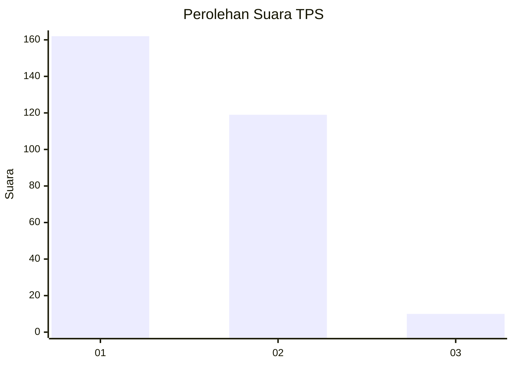
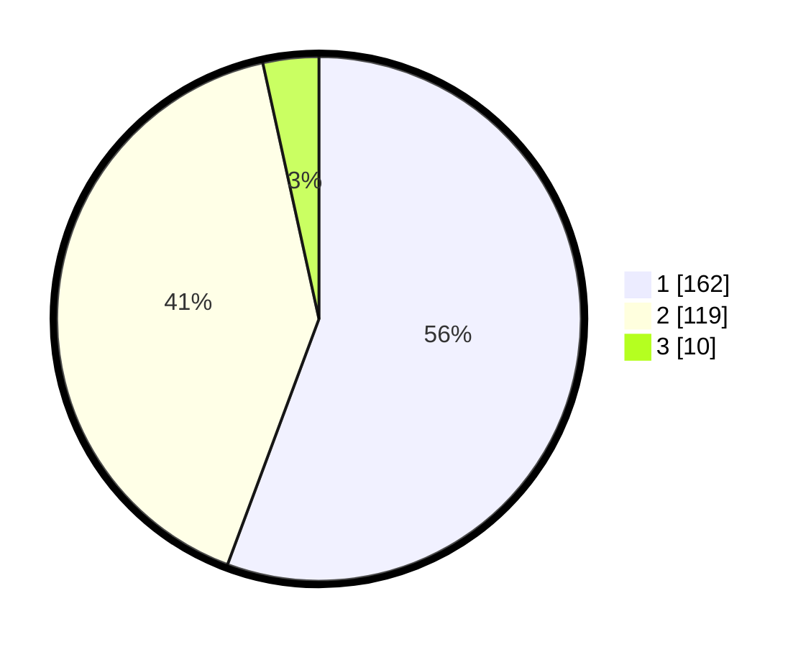

# Hasil

## Grafik

## Tabel

| No. | Nama Paslon    | Suara | Suara (raw) | Persentase |
|:--- |:-------------- | -----:| -----------:| ----------:|
| 1   | ANIES MUHAIMIN | 162   | [162][p-1]  | 55,67      |
| 2   | PRABOWO GIBRAN | 119   | [119][p-2]  | 40,89      |
| 3   | GANJAR MAHFUD  | 10    | [10][p-3]   | 3,44       |

[p-1]: https://github.com/gigit-pemilu/pemilu-2024/blob/main/pilpres/hitung-suara/sub/35-jawa-timur/sub/28-pamekasan/sub/11-batumarmar/sub/2007-kapong/sub/005-tps/sub/paslon-1.txt
[p-2]: https://github.com/gigit-pemilu/pemilu-2024/blob/main/pilpres/hitung-suara/sub/35-jawa-timur/sub/28-pamekasan/sub/11-batumarmar/sub/2007-kapong/sub/005-tps/sub/paslon-2.txt
[p-3]: https://github.com/gigit-pemilu/pemilu-2024/blob/main/pilpres/hitung-suara/sub/35-jawa-timur/sub/28-pamekasan/sub/11-batumarmar/sub/2007-kapong/sub/005-tps/sub/paslon-3.txt

## Foto C Plano

https://sirekap-obj-formc.kpu.go.id/d70c/pemilu/ppwp/35/28/11/20/07/3528112007005-20240214-230115--50dff987-a76c-4727-b745-24bca8b91169.jpg

https://sirekap-obj-formc.kpu.go.id/d70c/pemilu/ppwp/35/28/11/20/07/3528112007005-20240215-003103--289766d7-0103-4d29-86fb-142304d15de1.jpg

https://sirekap-obj-formc.kpu.go.id/d70c/pemilu/ppwp/35/28/11/20/07/3528112007005-20240215-003429--895c16d2-7e05-4fe5-a59f-384bdd290236.jpg

## Metadata

| Key        | Value               |
| ---------- | ------------------- |
| Time Stamp | 2024-02-17 17:30:00 |

