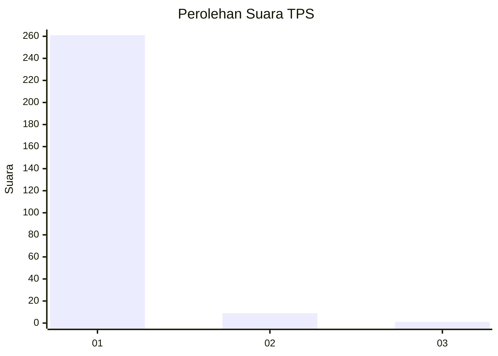
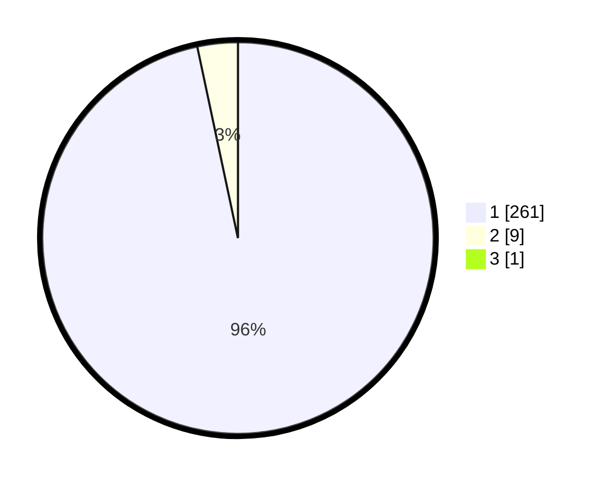

# Hasil

## Grafik

## Tabel

| No. | Nama Paslon    | Suara | Suara (raw) | Persentase |
|:--- |:-------------- | -----:| -----------:| ----------:|
| 1   | ANIES MUHAIMIN | 261   | [261][p-1]  | 96,31      |
| 2   | PRABOWO GIBRAN | 9     | [9][p-2]    | 3,32       |
| 3   | GANJAR MAHFUD  | 1     | [1][p-3]    | 0,37       |

[p-1]: https://github.com/gigit-pemilu/pemilu-2024-35-jawa-timur/blob/main/pilpres/hitung-suara/sub/35-jawa-timur/sub/28-pamekasan/sub/11-batumarmar/sub/2008-lesong-daja/sub/002-tps/sub/paslon-1.txt
[p-2]: https://github.com/gigit-pemilu/pemilu-2024-35-jawa-timur/blob/main/pilpres/hitung-suara/sub/35-jawa-timur/sub/28-pamekasan/sub/11-batumarmar/sub/2008-lesong-daja/sub/002-tps/sub/paslon-2.txt
[p-3]: https://github.com/gigit-pemilu/pemilu-2024-35-jawa-timur/blob/main/pilpres/hitung-suara/sub/35-jawa-timur/sub/28-pamekasan/sub/11-batumarmar/sub/2008-lesong-daja/sub/002-tps/sub/paslon-3.txt

## Foto C Plano

https://sirekap-obj-formc.kpu.go.id/9dbc/pemilu/ppwp/35/28/11/20/08/3528112008002-20240215-162021--e8bc500c-feb4-4ce6-bd5d-d11be6605537.jpg

https://sirekap-obj-formc.kpu.go.id/9dbc/pemilu/ppwp/35/28/11/20/08/3528112008002-20240215-135644--e76f4d2c-ce72-44fc-923a-891d2eeb51be.jpg

https://sirekap-obj-formc.kpu.go.id/9dbc/pemilu/ppwp/35/28/11/20/08/3528112008002-20240215-153001--0416c645-d3b5-4b64-963d-008597a19fc2.jpg

## Metadata

| Key        | Value               |
| ---------- | ------------------- |
| Time Stamp | 2024-02-17 12:00:00 |

