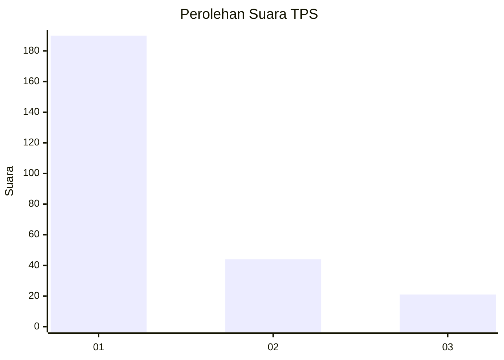
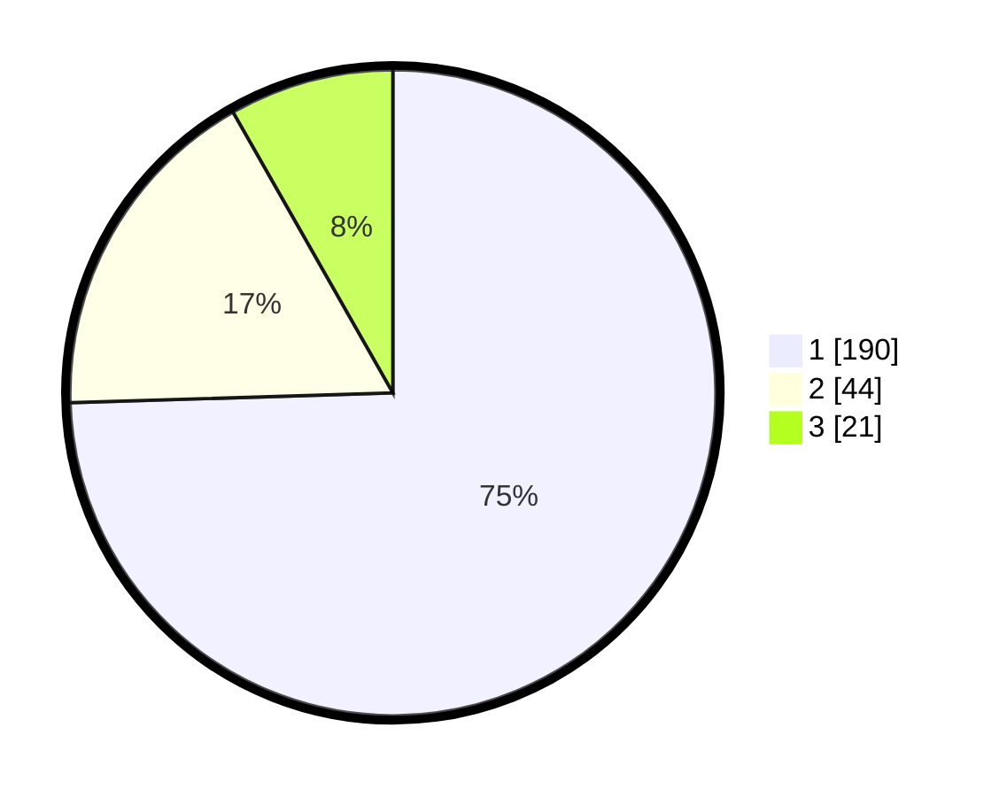

# Hasil

## Grafik

## Tabel

| No. | Nama Paslon    | Suara | Suara (raw) | Persentase |
|:--- |:-------------- | -----:| -----------:| ----------:|
| 1   | ANIES MUHAIMIN | 190   | [190][p-1]  | 74,51      |
| 2   | PRABOWO GIBRAN | 44    | [44][p-2]   | 17,25      |
| 3   | GANJAR MAHFUD  | 21    | [21][p-3]   | 8,24       |

[p-1]: https://github.com/gigit-pemilu/pemilu-2024/blob/main/pilpres/hitung-suara/sub/35-jawa-timur/sub/28-pamekasan/sub/11-batumarmar/sub/2008-lesong-daja/sub/003-tps/sub/paslon-1.txt
[p-2]: https://github.com/gigit-pemilu/pemilu-2024/blob/main/pilpres/hitung-suara/sub/35-jawa-timur/sub/28-pamekasan/sub/11-batumarmar/sub/2008-lesong-daja/sub/003-tps/sub/paslon-2.txt
[p-3]: https://github.com/gigit-pemilu/pemilu-2024/blob/main/pilpres/hitung-suara/sub/35-jawa-timur/sub/28-pamekasan/sub/11-batumarmar/sub/2008-lesong-daja/sub/003-tps/sub/paslon-3.txt

## Foto C Plano

https://sirekap-obj-formc.kpu.go.id/0d06/pemilu/ppwp/35/28/11/20/08/3528112008003-20240215-141343--d6bbe0f5-cf63-4c60-9505-0ecd79f12595.jpg

https://sirekap-obj-formc.kpu.go.id/0d06/pemilu/ppwp/35/28/11/20/08/3528112008003-20240215-141431--2a8904e8-1102-4e16-b96e-4a8895d7eec6.jpg

https://sirekap-obj-formc.kpu.go.id/0d06/pemilu/ppwp/35/28/11/20/08/3528112008003-20240215-141516--ee5c1c58-0d49-4408-99b6-e91e6492ae98.jpg

## Metadata

| Key        | Value               |
| ---------- | ------------------- |
| Time Stamp | 2024-02-17 17:30:00 |

