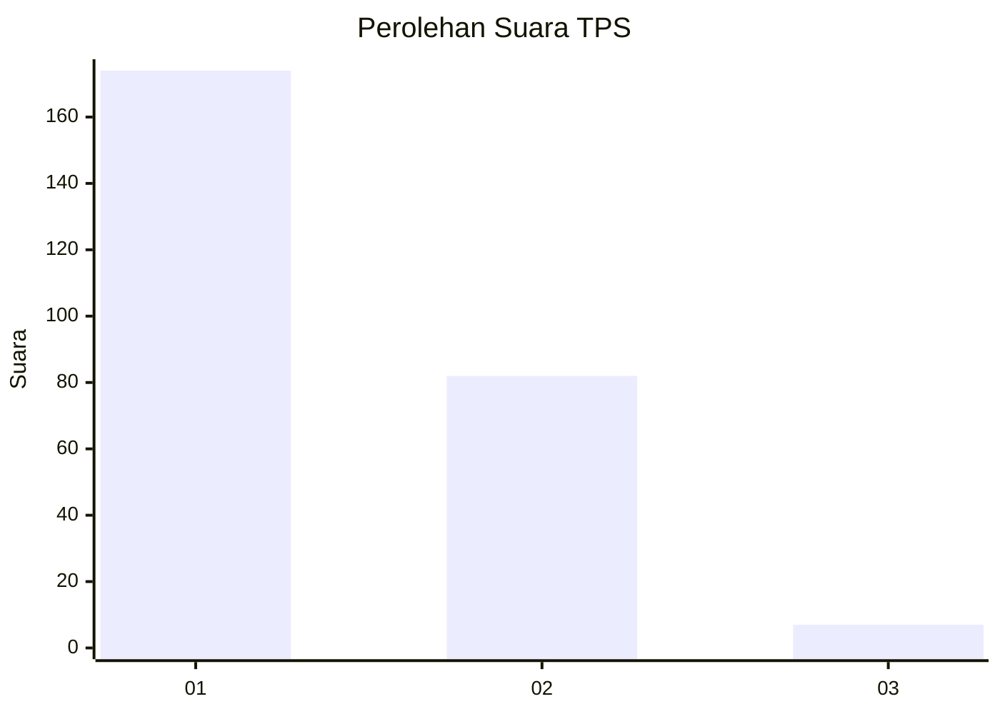
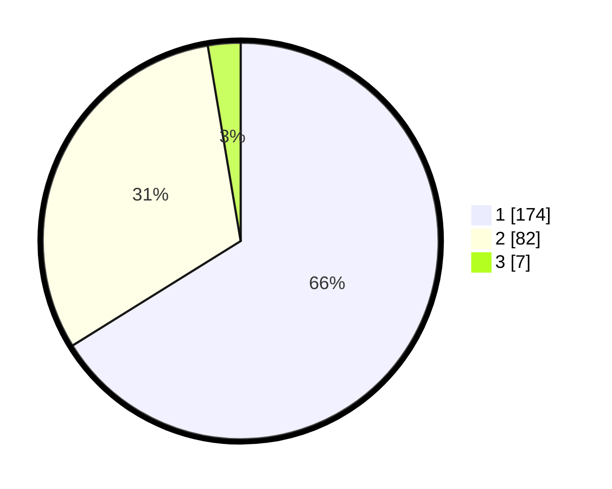

# Hasil

## Grafik

## Tabel

| No. | Nama Paslon    | Suara | Suara (raw) | Persentase |
|:--- |:-------------- | -----:| -----------:| ----------:|
| 1   | ANIES MUHAIMIN | 174   | [174][p-1]  | 66,16      |
| 2   | PRABOWO GIBRAN | 82    | [82][p-2]   | 31,18      |
| 3   | GANJAR MAHFUD  | 7     | [7][p-3]    | 2,66       |

[p-1]: https://github.com/gigit-pemilu/pemilu-2024/blob/main/pilpres/hitung-suara/sub/35-jawa-timur/sub/28-pamekasan/sub/11-batumarmar/sub/2008-lesong-daja/sub/004-tps/sub/paslon-1.txt
[p-2]: https://github.com/gigit-pemilu/pemilu-2024/blob/main/pilpres/hitung-suara/sub/35-jawa-timur/sub/28-pamekasan/sub/11-batumarmar/sub/2008-lesong-daja/sub/004-tps/sub/paslon-2.txt
[p-3]: https://github.com/gigit-pemilu/pemilu-2024/blob/main/pilpres/hitung-suara/sub/35-jawa-timur/sub/28-pamekasan/sub/11-batumarmar/sub/2008-lesong-daja/sub/004-tps/sub/paslon-3.txt

## Foto C Plano

https://sirekap-obj-formc.kpu.go.id/1ee8/pemilu/ppwp/35/28/11/20/08/3528112008004-20240215-105618--8489b2d1-e859-4112-aa7f-022293231dfb.jpg

https://sirekap-obj-formc.kpu.go.id/1ee8/pemilu/ppwp/35/28/11/20/08/3528112008004-20240215-105807--459c5860-97db-4173-808e-6bd29a3c0164.jpg

https://sirekap-obj-formc.kpu.go.id/1ee8/pemilu/ppwp/35/28/11/20/08/3528112008004-20240215-105841--f1c4b77d-e83d-4461-8d73-57df52ea247d.jpg

## Metadata

| Key        | Value               |
| ---------- | ------------------- |
| Time Stamp | 2024-02-17 12:00:00 |

