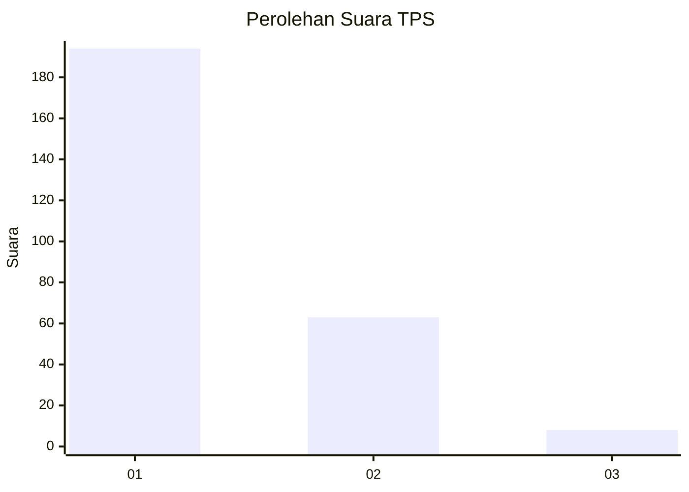
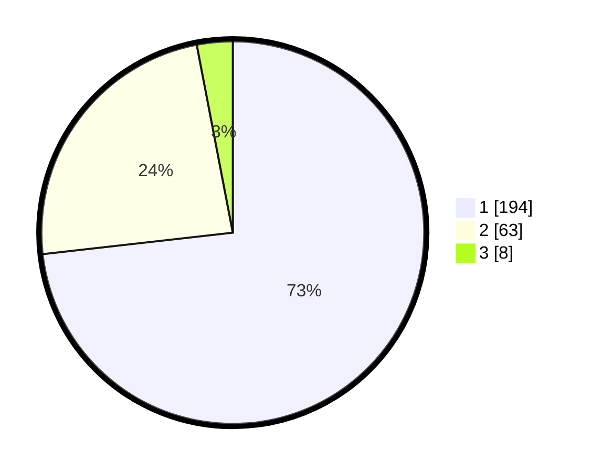

# Hasil

## Grafik

## Tabel

| No. | Nama Paslon    | Suara | Suara (raw) | Persentase |
|:--- |:-------------- | -----:| -----------:| ----------:|
| 1   | ANIES MUHAIMIN | 194   | [194][p-1]  | 73,21      |
| 2   | PRABOWO GIBRAN | 63    | [63][p-2]   | 23,77      |
| 3   | GANJAR MAHFUD  | 8     | [8][p-3]    | 3,02       |

[p-1]: https://github.com/gigit-pemilu/pemilu-2024/blob/main/pilpres/hitung-suara/sub/35-jawa-timur/sub/28-pamekasan/sub/11-batumarmar/sub/2008-lesong-daja/sub/005-tps/sub/paslon-1.txt
[p-2]: https://github.com/gigit-pemilu/pemilu-2024/blob/main/pilpres/hitung-suara/sub/35-jawa-timur/sub/28-pamekasan/sub/11-batumarmar/sub/2008-lesong-daja/sub/005-tps/sub/paslon-2.txt
[p-3]: https://github.com/gigit-pemilu/pemilu-2024/blob/main/pilpres/hitung-suara/sub/35-jawa-timur/sub/28-pamekasan/sub/11-batumarmar/sub/2008-lesong-daja/sub/005-tps/sub/paslon-3.txt

## Foto C Plano

https://sirekap-obj-formc.kpu.go.id/a200/pemilu/ppwp/35/28/11/20/08/3528112008005-20240215-144204--347040d7-1e3a-4319-8e22-e32cdcfa62d3.jpg

https://sirekap-obj-formc.kpu.go.id/a200/pemilu/ppwp/35/28/11/20/08/3528112008005-20240215-161955--84478161-5fcd-4522-9c73-9ccbebc7f65a.jpg

https://sirekap-obj-formc.kpu.go.id/a200/pemilu/ppwp/35/28/11/20/08/3528112008005-20240215-144322--4925c288-ee25-4d35-835a-b385e4ae122a.jpg

## Metadata

| Key        | Value               |
| ---------- | ------------------- |
| Time Stamp | 2024-02-17 17:30:00 |

