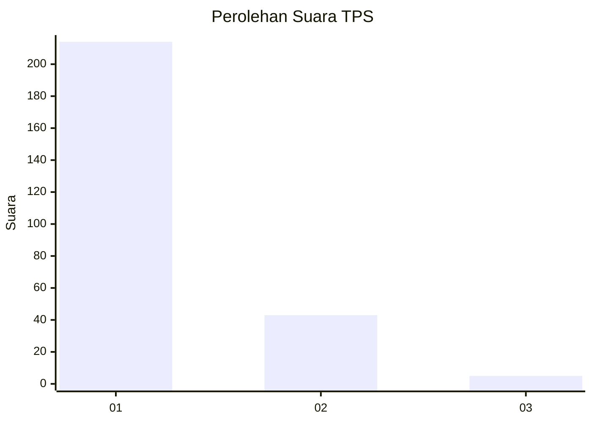
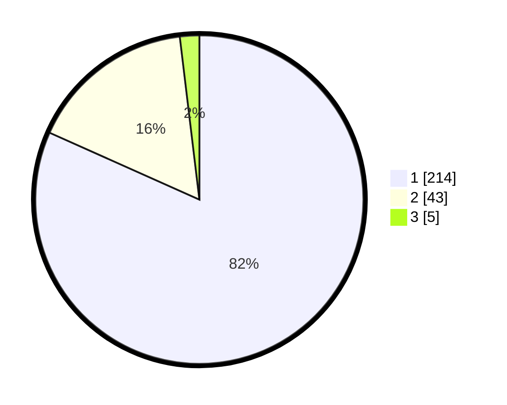

# Hasil

## Grafik

## Tabel

| No. | Nama Paslon    | Suara | Suara (raw) | Persentase |
|:--- |:-------------- | -----:| -----------:| ----------:|
| 1   | ANIES MUHAIMIN | 214   | [214][p-1]  | 81,68      |
| 2   | PRABOWO GIBRAN | 43    | [43][p-2]   | 16,41      |
| 3   | GANJAR MAHFUD  | 5     | [5][p-3]    | 1,91       |

[p-1]: https://github.com/gigit-pemilu/pemilu-2024/blob/main/pilpres/hitung-suara/sub/35-jawa-timur/sub/28-pamekasan/sub/11-batumarmar/sub/2008-lesong-daja/sub/006-tps/sub/paslon-1.txt
[p-2]: https://github.com/gigit-pemilu/pemilu-2024/blob/main/pilpres/hitung-suara/sub/35-jawa-timur/sub/28-pamekasan/sub/11-batumarmar/sub/2008-lesong-daja/sub/006-tps/sub/paslon-2.txt
[p-3]: https://github.com/gigit-pemilu/pemilu-2024/blob/main/pilpres/hitung-suara/sub/35-jawa-timur/sub/28-pamekasan/sub/11-batumarmar/sub/2008-lesong-daja/sub/006-tps/sub/paslon-3.txt

## Foto C Plano

https://sirekap-obj-formc.kpu.go.id/e369/pemilu/ppwp/35/28/11/20/08/3528112008006-20240215-110102--c1a62e44-893f-4fc9-908c-f8f4608a3de7.jpg

https://sirekap-obj-formc.kpu.go.id/e369/pemilu/ppwp/35/28/11/20/08/3528112008006-20240215-150640--bdc0e32f-58d7-43f7-a493-a028f2ac35df.jpg

https://sirekap-obj-formc.kpu.go.id/e369/pemilu/ppwp/35/28/11/20/08/3528112008006-20240215-111105--eb8ece73-3001-4707-a931-f63338c14aa1.jpg

## Metadata

| Key        | Value               |
| ---------- | ------------------- |
| Time Stamp | 2024-02-15 18:00:26 |

