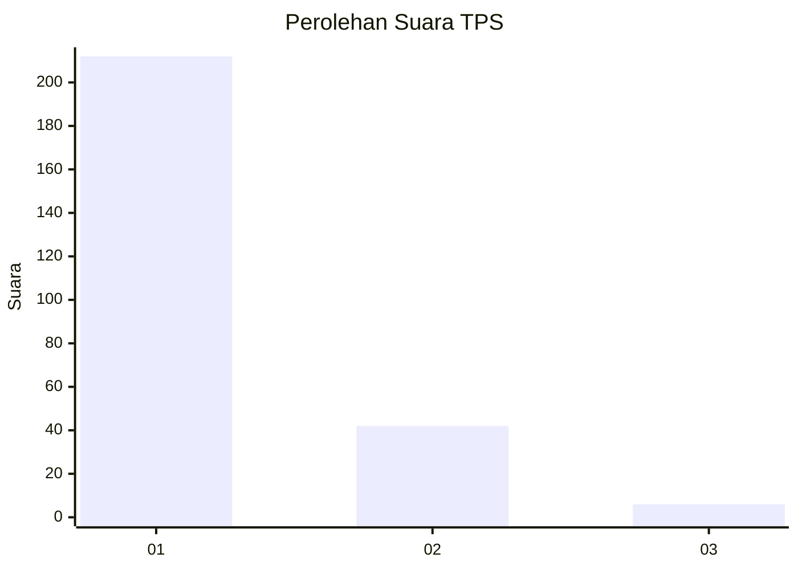
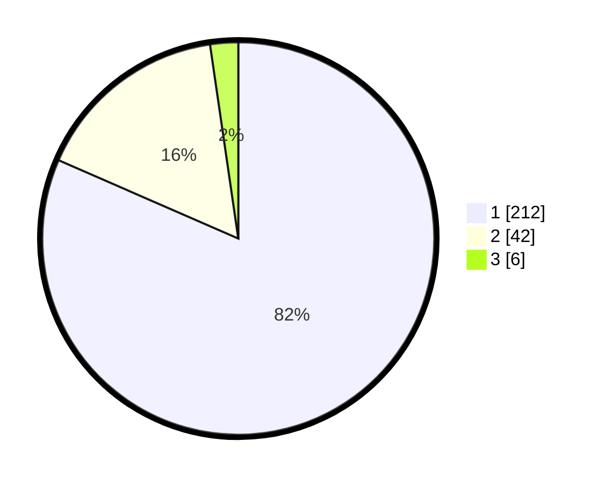

# Hasil

## Grafik

## Tabel

| No. | Nama Paslon    | Suara | Suara (raw) | Persentase |
|:--- |:-------------- | -----:| -----------:| ----------:|
| 1   | ANIES MUHAIMIN | 212   | [212][p-1]  | 81,54      |
| 2   | PRABOWO GIBRAN | 42    | [42][p-2]   | 16,15      |
| 3   | GANJAR MAHFUD  | 6     | [6][p-3]    | 2,31       |

[p-1]: https://github.com/gigit-pemilu/pemilu-2024/blob/main/pilpres/hitung-suara/sub/35-jawa-timur/sub/28-pamekasan/sub/11-batumarmar/sub/2008-lesong-daja/sub/007-tps/sub/paslon-1.txt
[p-2]: https://github.com/gigit-pemilu/pemilu-2024/blob/main/pilpres/hitung-suara/sub/35-jawa-timur/sub/28-pamekasan/sub/11-batumarmar/sub/2008-lesong-daja/sub/007-tps/sub/paslon-2.txt
[p-3]: https://github.com/gigit-pemilu/pemilu-2024/blob/main/pilpres/hitung-suara/sub/35-jawa-timur/sub/28-pamekasan/sub/11-batumarmar/sub/2008-lesong-daja/sub/007-tps/sub/paslon-3.txt

## Foto C Plano

https://sirekap-obj-formc.kpu.go.id/12b4/pemilu/ppwp/35/28/11/20/08/3528112008007-20240215-133423--66e18d45-b6c3-42e6-a315-4dafa35a5ded.jpg

https://sirekap-obj-formc.kpu.go.id/12b4/pemilu/ppwp/35/28/11/20/08/3528112008007-20240215-133500--d08078d8-2869-4a83-bc6d-563332a82909.jpg

https://sirekap-obj-formc.kpu.go.id/12b4/pemilu/ppwp/35/28/11/20/08/3528112008007-20240215-133532--31a3c000-fc4d-4856-8937-4025f7e4db5b.jpg

## Metadata

| Key        | Value               |
| ---------- | ------------------- |
| Time Stamp | 2024-02-17 12:00:00 |

