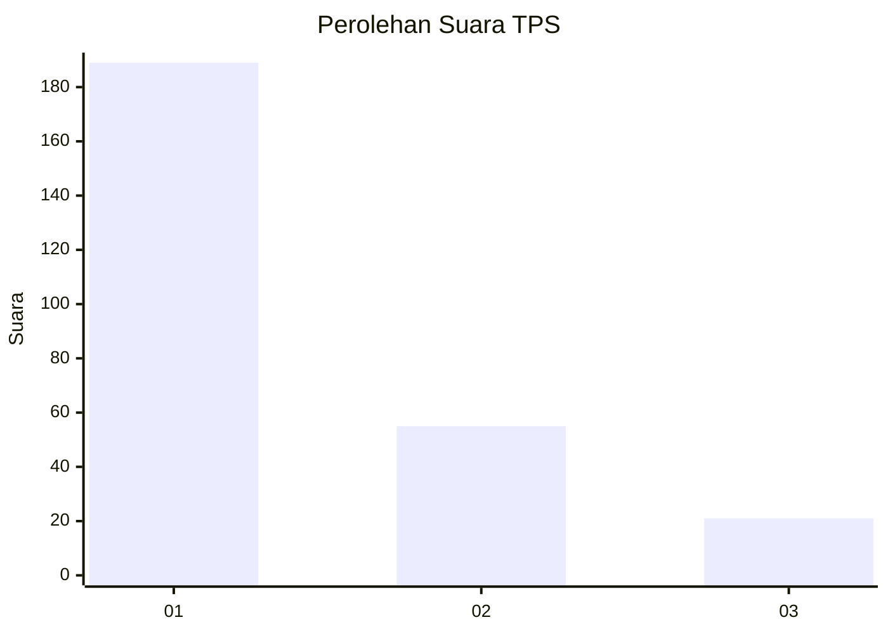
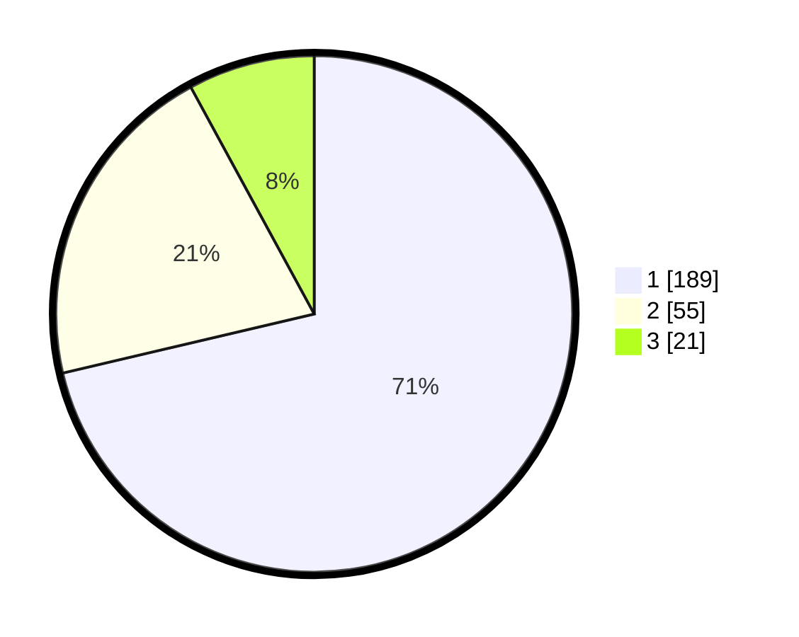

# Hasil

## Grafik

## Tabel

| No. | Nama Paslon    | Suara | Suara (raw) | Persentase |
|:--- |:-------------- | -----:| -----------:| ----------:|
| 1   | ANIES MUHAIMIN | 189   | [189][p-1]  | 71,32      |
| 2   | PRABOWO GIBRAN | 55    | [55][p-2]   | 20,75      |
| 3   | GANJAR MAHFUD  | 21    | [21][p-3]   | 7,92       |

[p-1]: https://github.com/gigit-pemilu/pemilu-2024-35-jawa-timur/blob/main/pilpres/hitung-suara/sub/35-jawa-timur/sub/28-pamekasan/sub/11-batumarmar/sub/2008-lesong-daja/sub/008-tps/sub/paslon-1.txt
[p-2]: https://github.com/gigit-pemilu/pemilu-2024-35-jawa-timur/blob/main/pilpres/hitung-suara/sub/35-jawa-timur/sub/28-pamekasan/sub/11-batumarmar/sub/2008-lesong-daja/sub/008-tps/sub/paslon-2.txt
[p-3]: https://github.com/gigit-pemilu/pemilu-2024-35-jawa-timur/blob/main/pilpres/hitung-suara/sub/35-jawa-timur/sub/28-pamekasan/sub/11-batumarmar/sub/2008-lesong-daja/sub/008-tps/sub/paslon-3.txt

## Foto C Plano

https://sirekap-obj-formc.kpu.go.id/4964/pemilu/ppwp/35/28/11/20/08/3528112008008-20240215-142107--b35591a4-b03f-4edc-9baa-3904316b5a69.jpg

https://sirekap-obj-formc.kpu.go.id/4964/pemilu/ppwp/35/28/11/20/08/3528112008008-20240215-142211--6c9e57f9-a466-494e-a652-2f12ca15e7cd.jpg

https://sirekap-obj-formc.kpu.go.id/4964/pemilu/ppwp/35/28/11/20/08/3528112008008-20240215-142252--3b409d45-5a1a-4bdf-85b3-4866dec60a40.jpg

## Metadata

| Key        | Value               |
| ---------- | ------------------- |
| Time Stamp | 2024-02-17 12:00:00 |

