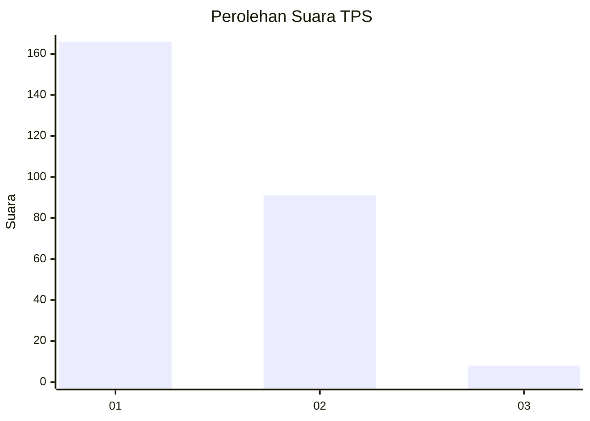
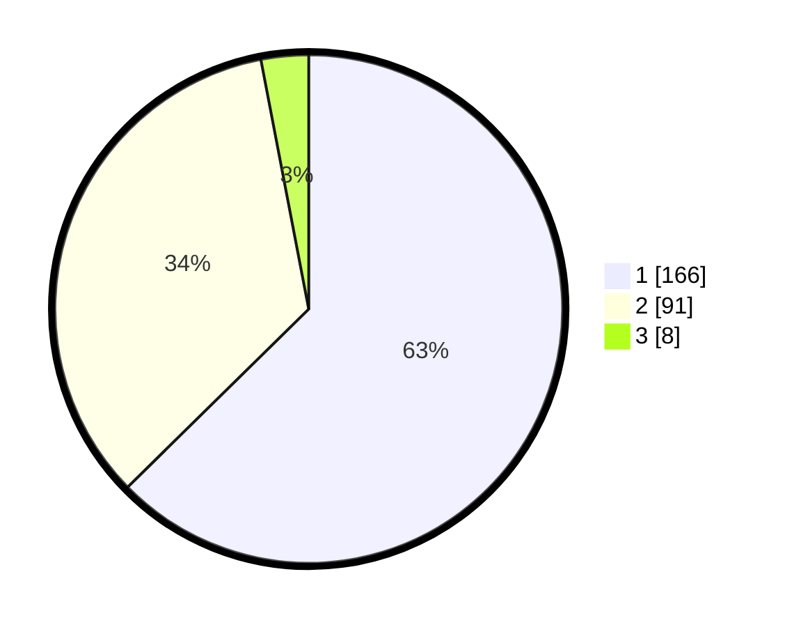

# Hasil

## Grafik

## Tabel

| No. | Nama Paslon    | Suara | Suara (raw) | Persentase |
|:--- |:-------------- | -----:| -----------:| ----------:|
| 1   | ANIES MUHAIMIN | 166   | [166][p-1]  | 62,64      |
| 2   | PRABOWO GIBRAN | 91    | [91][p-2]   | 34,34      |
| 3   | GANJAR MAHFUD  | 8     | [8][p-3]    | 3,02       |

[p-1]: https://github.com/gigit-pemilu/pemilu-2024-35-jawa-timur/blob/main/pilpres/hitung-suara/sub/35-jawa-timur/sub/28-pamekasan/sub/11-batumarmar/sub/2009-batu-bintang/sub/003-tps/sub/paslon-1.txt
[p-2]: https://github.com/gigit-pemilu/pemilu-2024-35-jawa-timur/blob/main/pilpres/hitung-suara/sub/35-jawa-timur/sub/28-pamekasan/sub/11-batumarmar/sub/2009-batu-bintang/sub/003-tps/sub/paslon-2.txt
[p-3]: https://github.com/gigit-pemilu/pemilu-2024-35-jawa-timur/blob/main/pilpres/hitung-suara/sub/35-jawa-timur/sub/28-pamekasan/sub/11-batumarmar/sub/2009-batu-bintang/sub/003-tps/sub/paslon-3.txt

## Foto C Plano

https://sirekap-obj-formc.kpu.go.id/0de5/pemilu/ppwp/35/28/11/20/09/3528112009003-20240214-233058--9c1aa3c2-6185-4df8-a857-e9788879f37c.jpg

https://sirekap-obj-formc.kpu.go.id/0de5/pemilu/ppwp/35/28/11/20/09/3528112009003-20240214-232932--e365572c-e98a-4ae8-a04e-8bc05ab05dab.jpg

https://sirekap-obj-formc.kpu.go.id/0de5/pemilu/ppwp/35/28/11/20/09/3528112009003-20240215-085444--da24dcf0-ae49-4357-b55d-aa912f428e30.jpg

## Metadata

| Key        | Value               |
| ---------- | ------------------- |
| Time Stamp | 2024-02-24 22:31:28 |

