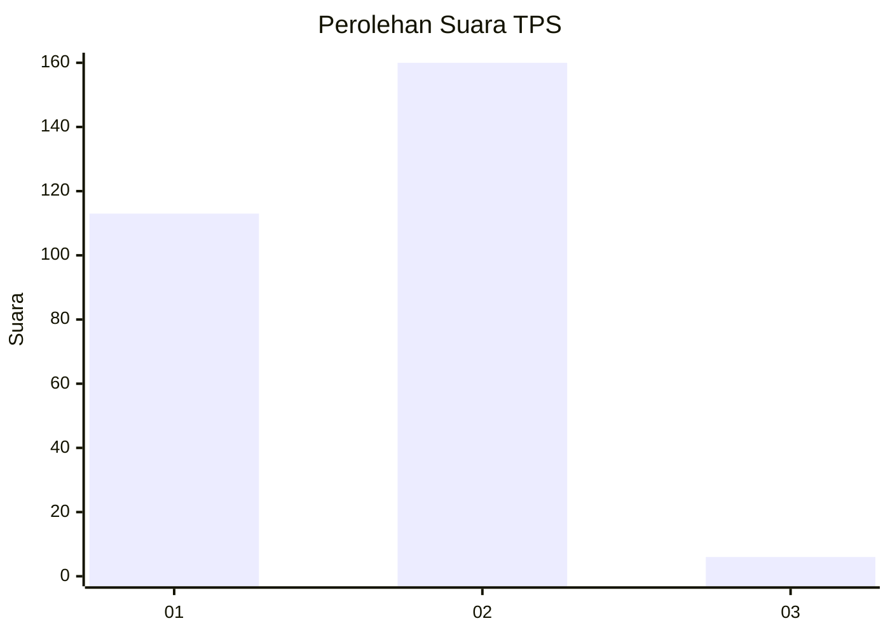
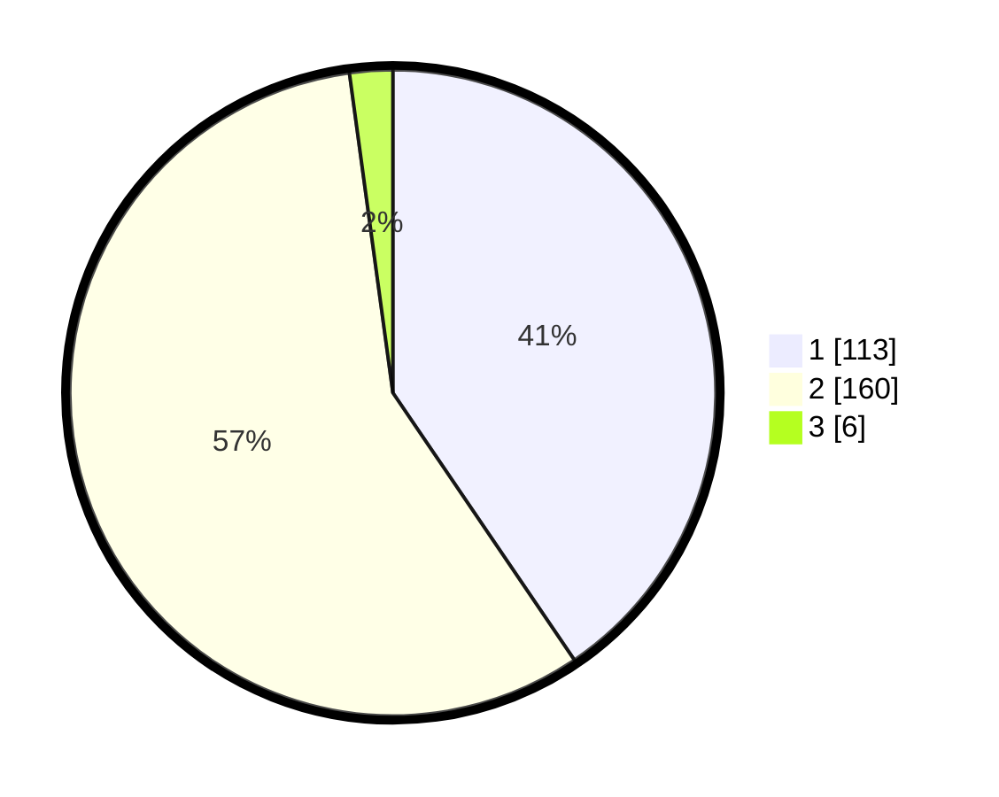

# Hasil

## Grafik

## Tabel

| No. | Nama Paslon    | Suara | Suara (raw) | Persentase |
|:--- |:-------------- | -----:| -----------:| ----------:|
| 1   | ANIES MUHAIMIN | 113   | [113][p-1]  | 40,50      |
| 2   | PRABOWO GIBRAN | 160   | [160][p-2]  | 57,35      |
| 3   | GANJAR MAHFUD  | 6     | [6][p-3]    | 2,15       |

[p-1]: https://github.com/gigit-pemilu/pemilu-2024-35-jawa-timur/blob/main/pilpres/hitung-suara/sub/35-jawa-timur/sub/28-pamekasan/sub/11-batumarmar/sub/2009-batu-bintang/sub/005-tps/sub/paslon-1.txt
[p-2]: https://github.com/gigit-pemilu/pemilu-2024-35-jawa-timur/blob/main/pilpres/hitung-suara/sub/35-jawa-timur/sub/28-pamekasan/sub/11-batumarmar/sub/2009-batu-bintang/sub/005-tps/sub/paslon-2.txt
[p-3]: https://github.com/gigit-pemilu/pemilu-2024-35-jawa-timur/blob/main/pilpres/hitung-suara/sub/35-jawa-timur/sub/28-pamekasan/sub/11-batumarmar/sub/2009-batu-bintang/sub/005-tps/sub/paslon-3.txt

## Foto C Plano

https://sirekap-obj-formc.kpu.go.id/85d5/pemilu/ppwp/35/28/11/20/09/3528112009005-20240214-224606--77fbf686-c97f-418e-afc9-201125b063e9.jpg

https://sirekap-obj-formc.kpu.go.id/85d5/pemilu/ppwp/35/28/11/20/09/3528112009005-20240214-224708--68917b48-d70c-4849-8dc0-4a31a34bb364.jpg

https://sirekap-obj-formc.kpu.go.id/85d5/pemilu/ppwp/35/28/11/20/09/3528112009005-20240214-231711--e963ddea-3e38-4554-943b-26dc7ffbe153.jpg

## Metadata

| Key        | Value               |
| ---------- | ------------------- |
| Time Stamp | 2024-02-24 22:31:28 |

