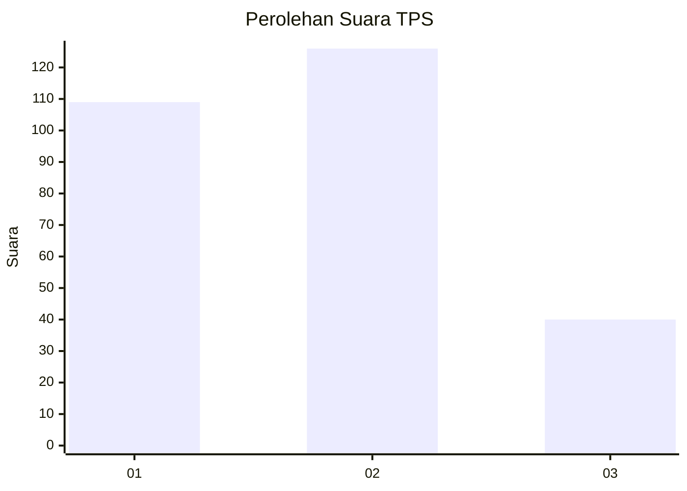
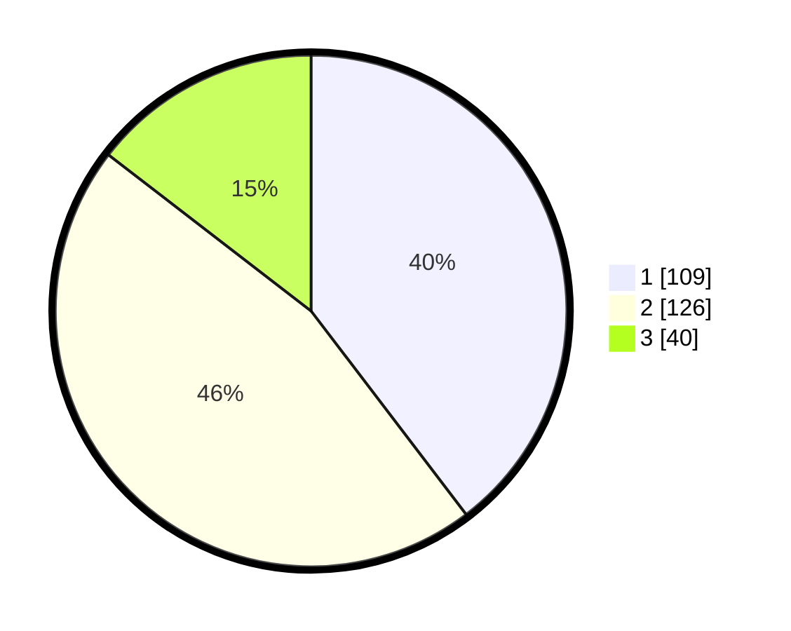

# Hasil

## Grafik

## Tabel

| No. | Nama Paslon    | Suara | Suara (raw) | Persentase |
|:--- |:-------------- | -----:| -----------:| ----------:|
| 1   | ANIES MUHAIMIN | 109   | [109][p-1]  | 39,64      |
| 2   | PRABOWO GIBRAN | 126   | [126][p-2]  | 45,82      |
| 3   | GANJAR MAHFUD  | 40    | [40][p-3]   | 14,55      |

[p-1]: https://github.com/gigit-pemilu/pemilu-2024-35-jawa-timur/blob/main/pilpres/hitung-suara/sub/35-jawa-timur/sub/28-pamekasan/sub/11-batumarmar/sub/2009-batu-bintang/sub/006-tps/sub/paslon-1.txt
[p-2]: https://github.com/gigit-pemilu/pemilu-2024-35-jawa-timur/blob/main/pilpres/hitung-suara/sub/35-jawa-timur/sub/28-pamekasan/sub/11-batumarmar/sub/2009-batu-bintang/sub/006-tps/sub/paslon-2.txt
[p-3]: https://github.com/gigit-pemilu/pemilu-2024-35-jawa-timur/blob/main/pilpres/hitung-suara/sub/35-jawa-timur/sub/28-pamekasan/sub/11-batumarmar/sub/2009-batu-bintang/sub/006-tps/sub/paslon-3.txt

## Foto C Plano

https://sirekap-obj-formc.kpu.go.id/e3c3/pemilu/ppwp/35/28/11/20/09/3528112009006-20240215-062258--dbce80f4-8a26-462f-a5f8-cf31c3477ccd.jpg

https://sirekap-obj-formc.kpu.go.id/e3c3/pemilu/ppwp/35/28/11/20/09/3528112009006-20240215-062339--a7d0c4ec-49f6-48df-9eb6-9493fc0ca5cf.jpg

https://sirekap-obj-formc.kpu.go.id/e3c3/pemilu/ppwp/35/28/11/20/09/3528112009006-20240215-062429--f29724b5-27e6-4ad4-b1ef-c52c0026a816.jpg

## Metadata

| Key        | Value               |
| ---------- | ------------------- |
| Time Stamp | 2024-02-17 17:30:00 |

