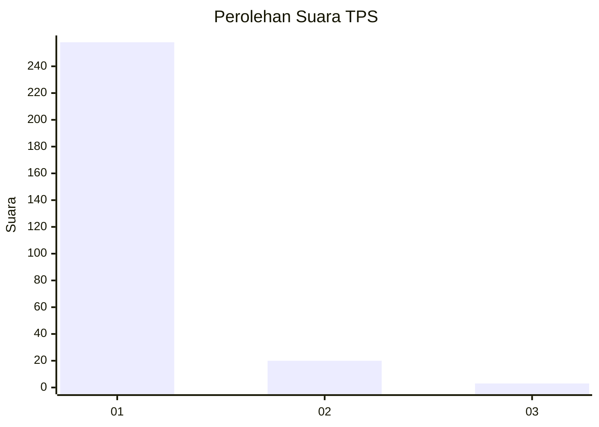
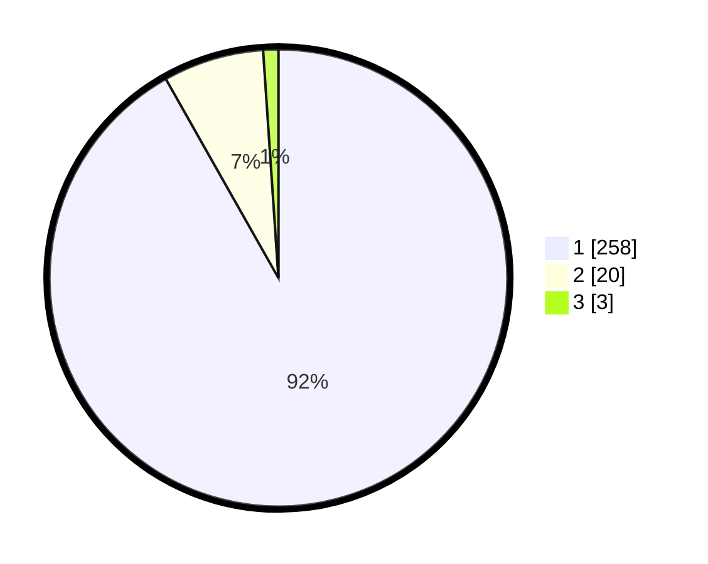

# Hasil

## Grafik

## Tabel

| No. | Nama Paslon    | Suara | Suara (raw) | Persentase |
|:--- |:-------------- | -----:| -----------:| ----------:|
| 1   | ANIES MUHAIMIN | 258   | [258][p-1]  | 91,81      |
| 2   | PRABOWO GIBRAN | 20    | [20][p-2]   | 7,12       |
| 3   | GANJAR MAHFUD  | 3     | [3][p-3]    | 1,07       |

[p-1]: https://github.com/gigit-pemilu/pemilu-2024/blob/main/pilpres/hitung-suara/sub/35-jawa-timur/sub/28-pamekasan/sub/11-batumarmar/sub/2009-batu-bintang/sub/013-tps/sub/paslon-1.txt
[p-2]: https://github.com/gigit-pemilu/pemilu-2024/blob/main/pilpres/hitung-suara/sub/35-jawa-timur/sub/28-pamekasan/sub/11-batumarmar/sub/2009-batu-bintang/sub/013-tps/sub/paslon-2.txt
[p-3]: https://github.com/gigit-pemilu/pemilu-2024/blob/main/pilpres/hitung-suara/sub/35-jawa-timur/sub/28-pamekasan/sub/11-batumarmar/sub/2009-batu-bintang/sub/013-tps/sub/paslon-3.txt

## Foto C Plano

https://sirekap-obj-formc.kpu.go.id/0448/pemilu/ppwp/35/28/11/20/09/3528112009013-20240214-202314--2c85bd80-3110-4ffd-8400-72bb83a2ed9d.jpg

https://sirekap-obj-formc.kpu.go.id/0448/pemilu/ppwp/35/28/11/20/09/3528112009013-20240214-202439--6b2b5046-524f-466f-994e-d385b0fcb560.jpg

## Metadata

| Key        | Value               |
| ---------- | ------------------- |
| Time Stamp | 2024-02-24 22:31:28 |

