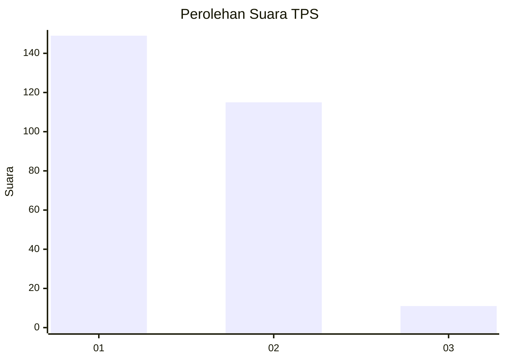
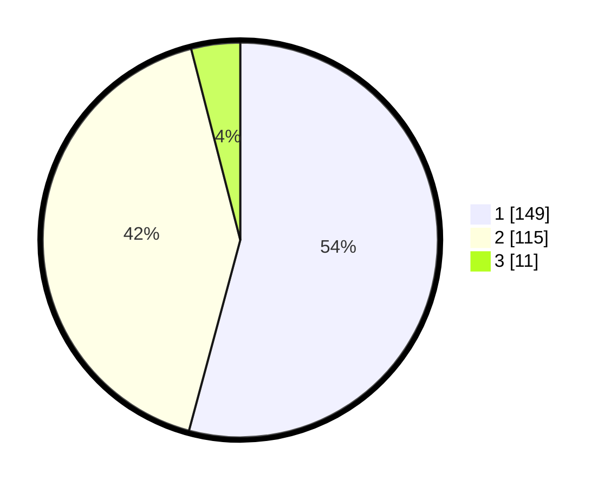

# Hasil

## Grafik

## Tabel

| No. | Nama Paslon    | Suara | Suara (raw) | Persentase |
|:--- |:-------------- | -----:| -----------:| ----------:|
| 1   | ANIES MUHAIMIN | 149   | [149][p-1]  | 54,18      |
| 2   | PRABOWO GIBRAN | 115   | [115][p-2]  | 41,82      |
| 3   | GANJAR MAHFUD  | 11    | [11][p-3]   | 4,00       |

[p-1]: https://github.com/gigit-pemilu/pemilu-2024/blob/main/pilpres/hitung-suara/sub/35-jawa-timur/sub/28-pamekasan/sub/11-batumarmar/sub/2009-batu-bintang/sub/016-tps/sub/paslon-1.txt
[p-2]: https://github.com/gigit-pemilu/pemilu-2024/blob/main/pilpres/hitung-suara/sub/35-jawa-timur/sub/28-pamekasan/sub/11-batumarmar/sub/2009-batu-bintang/sub/016-tps/sub/paslon-2.txt
[p-3]: https://github.com/gigit-pemilu/pemilu-2024/blob/main/pilpres/hitung-suara/sub/35-jawa-timur/sub/28-pamekasan/sub/11-batumarmar/sub/2009-batu-bintang/sub/016-tps/sub/paslon-3.txt

## Foto C Plano

https://sirekap-obj-formc.kpu.go.id/ee32/pemilu/ppwp/35/28/11/20/09/3528112009016-20240215-093647--83dc8933-2f63-4ad2-bcaf-52ae2f520933.jpg

https://sirekap-obj-formc.kpu.go.id/ee32/pemilu/ppwp/35/28/11/20/09/3528112009016-20240215-094201--11242eb1-c7fb-4969-9de3-c720115ea23e.jpg

https://sirekap-obj-formc.kpu.go.id/ee32/pemilu/ppwp/35/28/11/20/09/3528112009016-20240215-094410--007caa05-ca95-4300-af29-88df5a5f8c32.jpg

## Metadata

| Key        | Value               |
| ---------- | ------------------- |
| Time Stamp | 2024-02-17 17:30:00 |

