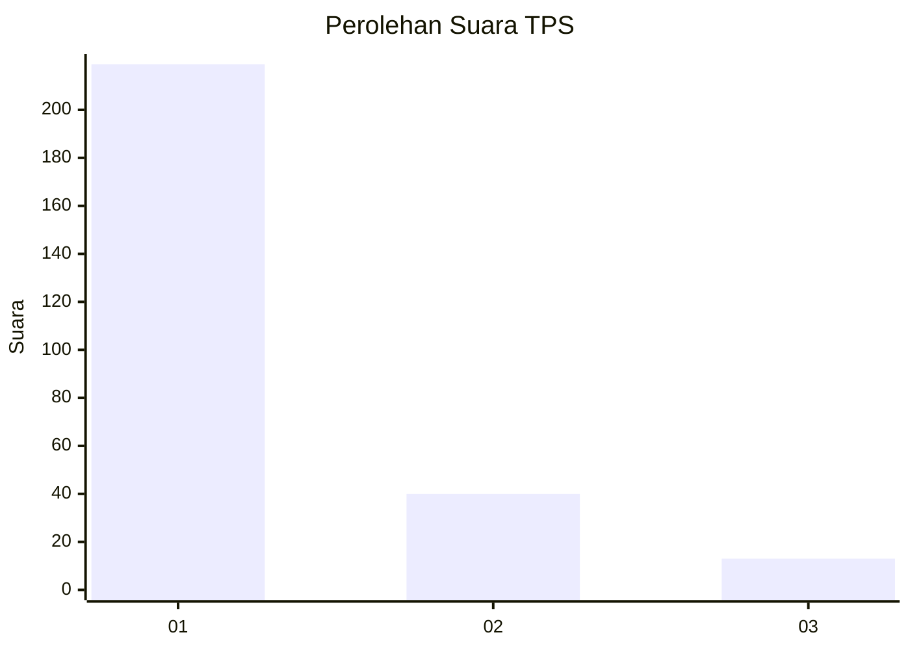
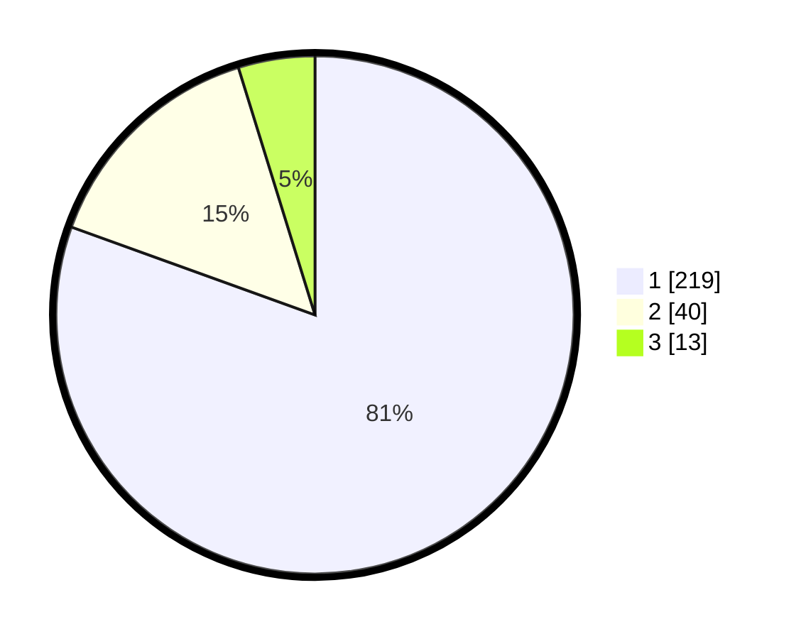

# Hasil

## Grafik

## Tabel

| No. | Nama Paslon    | Suara | Suara (raw) | Persentase |
|:--- |:-------------- | -----:| -----------:| ----------:|
| 1   | ANIES MUHAIMIN | 219   | [219][p-1]  | 80,51      |
| 2   | PRABOWO GIBRAN | 40    | [40][p-2]   | 14,71      |
| 3   | GANJAR MAHFUD  | 13    | [13][p-3]   | 4,78       |

[p-1]: https://github.com/gigit-pemilu/pemilu-2024/blob/main/pilpres/hitung-suara/sub/35-jawa-timur/sub/28-pamekasan/sub/11-batumarmar/sub/2009-batu-bintang/sub/018-tps/sub/paslon-1.txt
[p-2]: https://github.com/gigit-pemilu/pemilu-2024/blob/main/pilpres/hitung-suara/sub/35-jawa-timur/sub/28-pamekasan/sub/11-batumarmar/sub/2009-batu-bintang/sub/018-tps/sub/paslon-2.txt
[p-3]: https://github.com/gigit-pemilu/pemilu-2024/blob/main/pilpres/hitung-suara/sub/35-jawa-timur/sub/28-pamekasan/sub/11-batumarmar/sub/2009-batu-bintang/sub/018-tps/sub/paslon-3.txt

## Foto C Plano

https://sirekap-obj-formc.kpu.go.id/37e4/pemilu/ppwp/35/28/11/20/09/3528112009018-20240215-103942--9252979d-efd0-4a0f-8e75-7b720a3aef05.jpg

https://sirekap-obj-formc.kpu.go.id/37e4/pemilu/ppwp/35/28/11/20/09/3528112009018-20240214-192743--16f18341-219d-4090-8783-83d143e8a3d2.jpg

https://sirekap-obj-formc.kpu.go.id/37e4/pemilu/ppwp/35/28/11/20/09/3528112009018-20240215-104140--b917e41a-59cc-4f79-b5ab-ae152c844a88.jpg

## Metadata

| Key        | Value               |
| ---------- | ------------------- |
| Time Stamp | 2024-02-15 19:30:26 |

