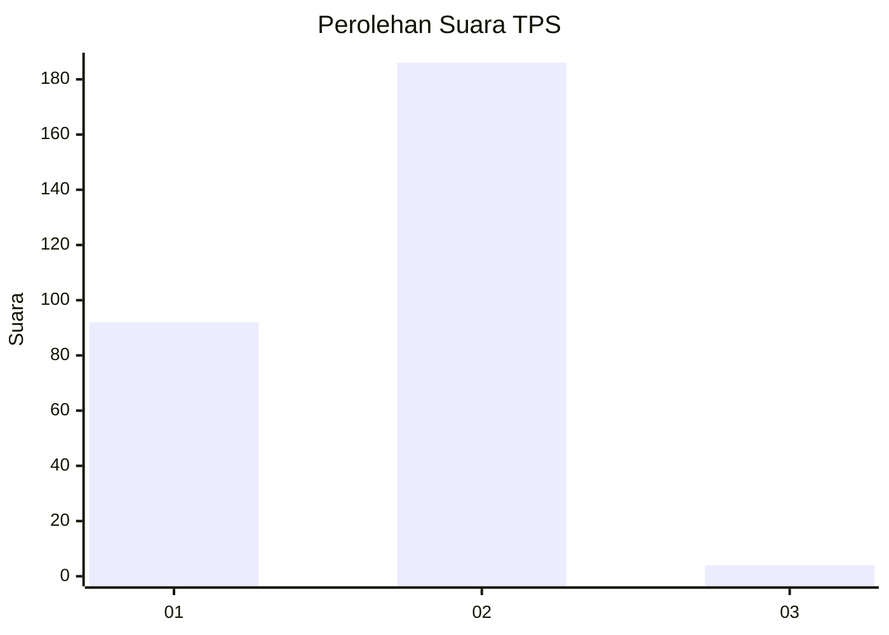
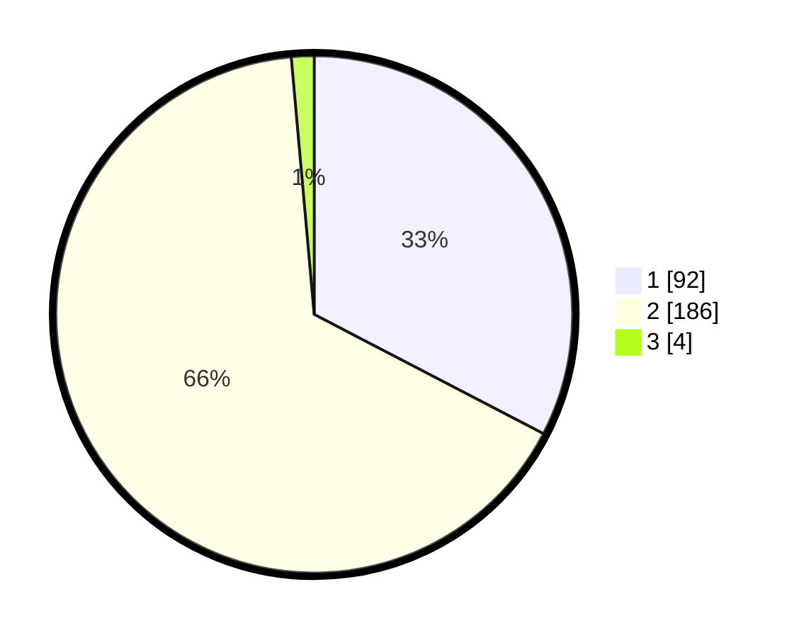

# Hasil

## Grafik

## Tabel

| No. | Nama Paslon    | Suara | Suara (raw) | Persentase |
|:--- |:-------------- | -----:| -----------:| ----------:|
| 1   | ANIES MUHAIMIN | 92    | [92][p-1]   | 32,62      |
| 2   | PRABOWO GIBRAN | 186   | [186][p-2]  | 65,96      |
| 3   | GANJAR MAHFUD  | 4     | [4][p-3]    | 1,42       |

[p-1]: https://github.com/gigit-pemilu/pemilu-2024/blob/main/pilpres/hitung-suara/sub/35-jawa-timur/sub/28-pamekasan/sub/11-batumarmar/sub/2009-batu-bintang/sub/024-tps/sub/paslon-1.txt
[p-2]: https://github.com/gigit-pemilu/pemilu-2024/blob/main/pilpres/hitung-suara/sub/35-jawa-timur/sub/28-pamekasan/sub/11-batumarmar/sub/2009-batu-bintang/sub/024-tps/sub/paslon-2.txt
[p-3]: https://github.com/gigit-pemilu/pemilu-2024/blob/main/pilpres/hitung-suara/sub/35-jawa-timur/sub/28-pamekasan/sub/11-batumarmar/sub/2009-batu-bintang/sub/024-tps/sub/paslon-3.txt

## Foto C Plano

https://sirekap-obj-formc.kpu.go.id/8c92/pemilu/ppwp/35/28/11/20/09/3528112009024-20240215-005704--1c6b02cc-7a01-4ec4-836c-75c915c6377d.jpg

https://sirekap-obj-formc.kpu.go.id/8c92/pemilu/ppwp/35/28/11/20/09/3528112009024-20240215-005952--afaf602a-c5d1-4fbe-8019-edede5dc2694.jpg

https://sirekap-obj-formc.kpu.go.id/8c92/pemilu/ppwp/35/28/11/20/09/3528112009024-20240215-010305--7bd3e9f9-9b99-4e93-bbc1-46dc89410b5f.jpg

## Metadata

| Key        | Value               |
| ---------- | ------------------- |
| Time Stamp | 2024-02-17 12:00:00 |

