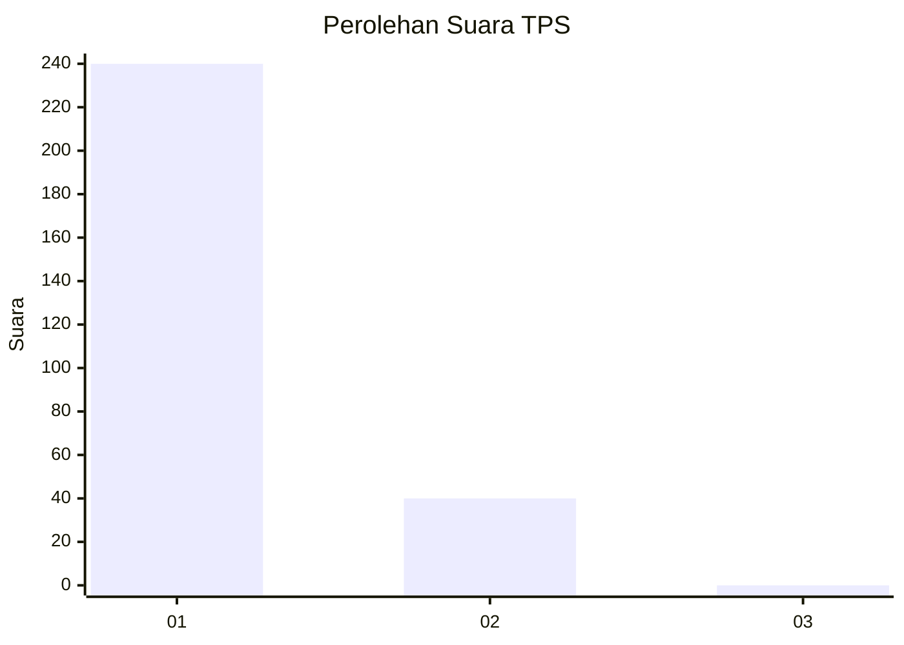
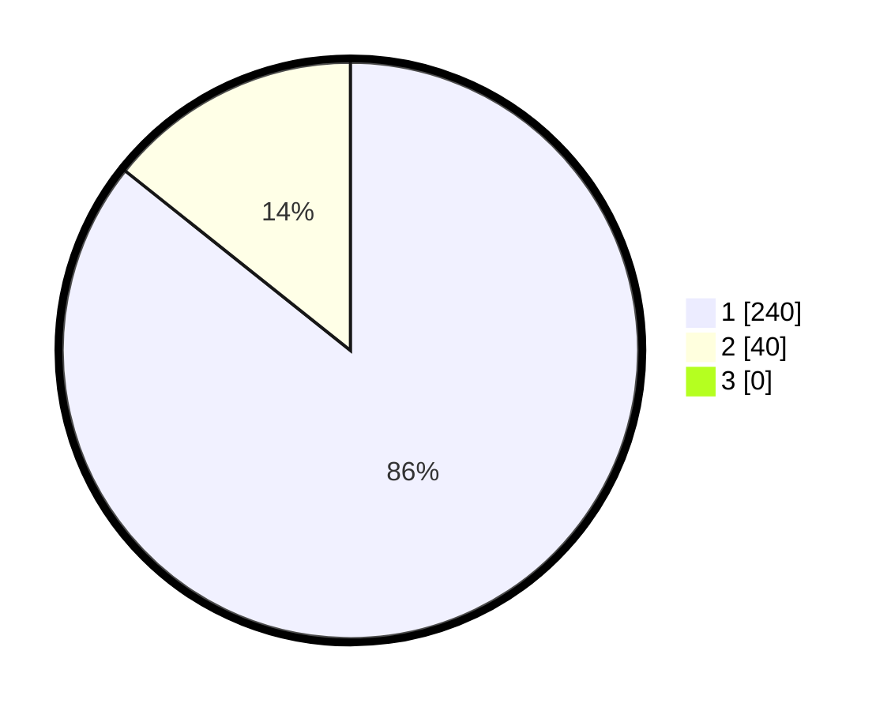

# Hasil

## Grafik

## Tabel

| No. | Nama Paslon    | Suara | Suara (raw) | Persentase |
|:--- |:-------------- | -----:| -----------:| ----------:|
| 1   | ANIES MUHAIMIN | 240   | [240][p-1]  | 85,71      |
| 2   | PRABOWO GIBRAN | 40    | [40][p-2]   | 14,29      |
| 3   | GANJAR MAHFUD  | 0     | [0][p-3]    | 0,00       |

[p-1]: https://github.com/gigit-pemilu/pemilu-2024/blob/main/pilpres/hitung-suara/sub/35-jawa-timur/sub/28-pamekasan/sub/11-batumarmar/sub/2009-batu-bintang/sub/025-tps/sub/paslon-1.txt
[p-2]: https://github.com/gigit-pemilu/pemilu-2024/blob/main/pilpres/hitung-suara/sub/35-jawa-timur/sub/28-pamekasan/sub/11-batumarmar/sub/2009-batu-bintang/sub/025-tps/sub/paslon-2.txt
[p-3]: https://github.com/gigit-pemilu/pemilu-2024/blob/main/pilpres/hitung-suara/sub/35-jawa-timur/sub/28-pamekasan/sub/11-batumarmar/sub/2009-batu-bintang/sub/025-tps/sub/paslon-3.txt

## Foto C Plano

https://sirekap-obj-formc.kpu.go.id/f412/pemilu/ppwp/35/28/11/20/09/3528112009025-20240215-004319--cb274ce9-8bc2-45d9-a562-e96a60edc8b0.jpg

https://sirekap-obj-formc.kpu.go.id/f412/pemilu/ppwp/35/28/11/20/09/3528112009025-20240215-004513--d31f2843-83d4-4809-b8a5-71c1db140732.jpg

https://sirekap-obj-formc.kpu.go.id/f412/pemilu/ppwp/35/28/11/20/09/3528112009025-20240215-000157--8c005c2e-6011-4c6b-ac5c-f9b004c38669.jpg

## Metadata

| Key        | Value               |
| ---------- | ------------------- |
| Time Stamp | 2024-02-25 21:00:00 |

