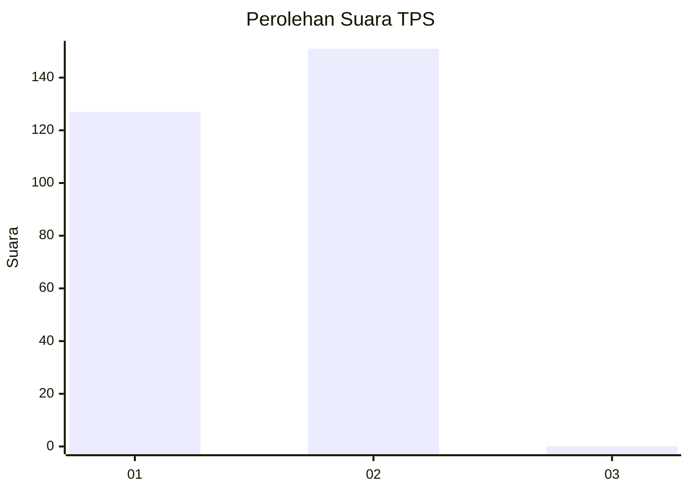
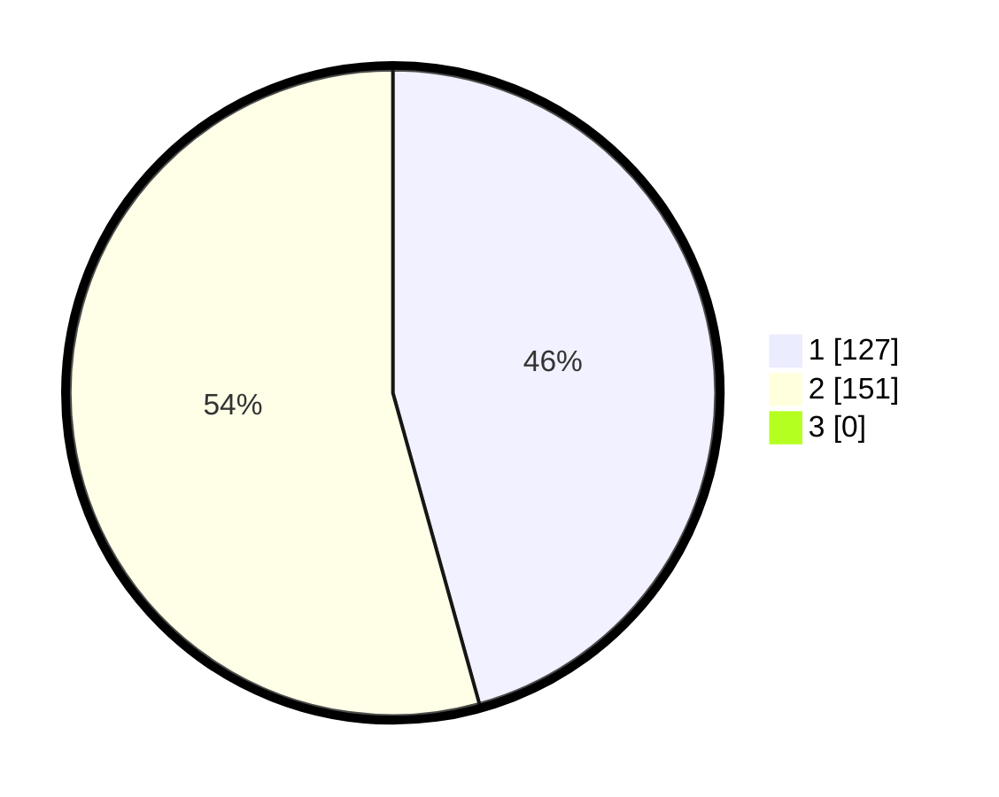

# Hasil

## Grafik

## Tabel

| No. | Nama Paslon    | Suara | Suara (raw) | Persentase |
|:--- |:-------------- | -----:| -----------:| ----------:|
| 1   | ANIES MUHAIMIN | 127   | [127][p-1]  | 45,68      |
| 2   | PRABOWO GIBRAN | 151   | [151][p-2]  | 54,32      |
| 3   | GANJAR MAHFUD  | 0     | [0][p-3]    | 0,00       |

[p-1]: https://github.com/gigit-pemilu/pemilu-2024/blob/main/pilpres/hitung-suara/sub/35-jawa-timur/sub/28-pamekasan/sub/11-batumarmar/sub/2009-batu-bintang/sub/028-tps/sub/paslon-1.txt
[p-2]: https://github.com/gigit-pemilu/pemilu-2024/blob/main/pilpres/hitung-suara/sub/35-jawa-timur/sub/28-pamekasan/sub/11-batumarmar/sub/2009-batu-bintang/sub/028-tps/sub/paslon-2.txt
[p-3]: https://github.com/gigit-pemilu/pemilu-2024/blob/main/pilpres/hitung-suara/sub/35-jawa-timur/sub/28-pamekasan/sub/11-batumarmar/sub/2009-batu-bintang/sub/028-tps/sub/paslon-3.txt

## Foto C Plano

https://sirekap-obj-formc.kpu.go.id/c927/pemilu/ppwp/35/28/11/20/09/3528112009028-20240214-213522--31aeb98d-e34e-4ecc-a0ed-cfbace9570a2.jpg

https://sirekap-obj-formc.kpu.go.id/c927/pemilu/ppwp/35/28/11/20/09/3528112009028-20240214-213615--7d3159d2-bd70-44b7-b336-1239a2914b86.jpg

https://sirekap-obj-formc.kpu.go.id/c927/pemilu/ppwp/35/28/11/20/09/3528112009028-20240214-213731--fdee6791-4660-4ffb-ab32-766fc7e668da.jpg

## Metadata

| Key        | Value               |
| ---------- | ------------------- |
| Time Stamp | 2024-02-15 19:30:26 |

