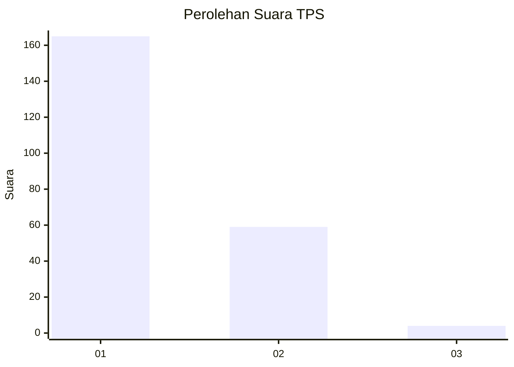
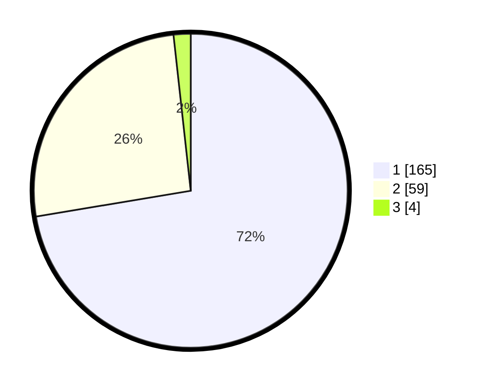

# Hasil

## Grafik

## Tabel

| No. | Nama Paslon    | Suara | Suara (raw) | Persentase |
|:--- |:-------------- | -----:| -----------:| ----------:|
| 1   | ANIES MUHAIMIN | 165   | [165][p-1]  | 72,37      |
| 2   | PRABOWO GIBRAN | 59    | [59][p-2]   | 25,88      |
| 3   | GANJAR MAHFUD  | 4     | [4][p-3]    | 1,75       |

[p-1]: https://github.com/gigit-pemilu/pemilu-2024/blob/main/pilpres/hitung-suara/sub/35-jawa-timur/sub/28-pamekasan/sub/11-batumarmar/sub/2010-blaban/sub/001-tps/sub/paslon-1.txt
[p-2]: https://github.com/gigit-pemilu/pemilu-2024/blob/main/pilpres/hitung-suara/sub/35-jawa-timur/sub/28-pamekasan/sub/11-batumarmar/sub/2010-blaban/sub/001-tps/sub/paslon-2.txt
[p-3]: https://github.com/gigit-pemilu/pemilu-2024/blob/main/pilpres/hitung-suara/sub/35-jawa-timur/sub/28-pamekasan/sub/11-batumarmar/sub/2010-blaban/sub/001-tps/sub/paslon-3.txt

## Foto C Plano

https://sirekap-obj-formc.kpu.go.id/338f/pemilu/ppwp/35/28/11/20/10/3528112010001-20240215-002017--fe90410e-d270-483f-8726-e43cb99fa538.jpg

https://sirekap-obj-formc.kpu.go.id/338f/pemilu/ppwp/35/28/11/20/10/3528112010001-20240215-001556--cb5294a9-9fe0-4375-a3e7-bd50c5e528cb.jpg

https://sirekap-obj-formc.kpu.go.id/338f/pemilu/ppwp/35/28/11/20/10/3528112010001-20240215-001620--3f116085-bb89-41fc-a4ac-4f29b78bba4b.jpg

## Metadata

| Key        | Value               |
| ---------- | ------------------- |
| Time Stamp | 2024-02-17 17:30:00 |

