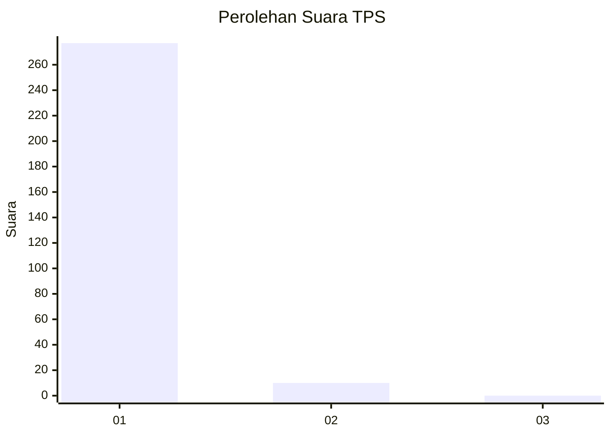
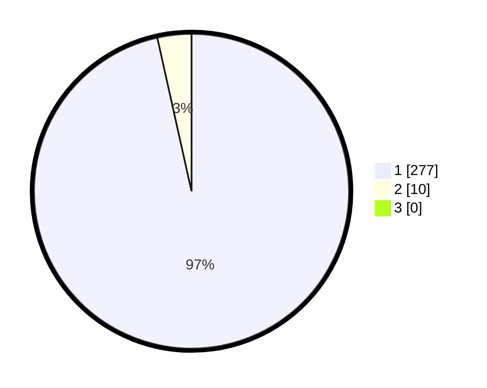

# Hasil

## Grafik

## Tabel

| No. | Nama Paslon    | Suara | Suara (raw) | Persentase |
|:--- |:-------------- | -----:| -----------:| ----------:|
| 1   | ANIES MUHAIMIN | 277   | [277][p-1]  | 96,52      |
| 2   | PRABOWO GIBRAN | 10    | [10][p-2]   | 3,48       |
| 3   | GANJAR MAHFUD  | 0     | [0][p-3]    | 0,00       |

[p-1]: https://github.com/gigit-pemilu/pemilu-2024/blob/main/pilpres/hitung-suara/sub/35-jawa-timur/sub/28-pamekasan/sub/11-batumarmar/sub/2010-blaban/sub/002-tps/sub/paslon-1.txt
[p-2]: https://github.com/gigit-pemilu/pemilu-2024/blob/main/pilpres/hitung-suara/sub/35-jawa-timur/sub/28-pamekasan/sub/11-batumarmar/sub/2010-blaban/sub/002-tps/sub/paslon-2.txt
[p-3]: https://github.com/gigit-pemilu/pemilu-2024/blob/main/pilpres/hitung-suara/sub/35-jawa-timur/sub/28-pamekasan/sub/11-batumarmar/sub/2010-blaban/sub/002-tps/sub/paslon-3.txt

## Foto C Plano

https://sirekap-obj-formc.kpu.go.id/b3b8/pemilu/ppwp/35/28/11/20/10/3528112010002-20240214-205616--4098630b-2d85-4bb7-9f4d-245974ebb252.jpg

https://sirekap-obj-formc.kpu.go.id/b3b8/pemilu/ppwp/35/28/11/20/10/3528112010002-20240214-205750--4cf66a17-9992-4e8c-af42-f971de70ce0f.jpg

https://sirekap-obj-formc.kpu.go.id/b3b8/pemilu/ppwp/35/28/11/20/10/3528112010002-20240214-205912--28d5ccc8-fffe-47e0-81ee-bd29185e3c72.jpg

## Metadata

| Key        | Value               |
| ---------- | ------------------- |
| Time Stamp | 2024-02-15 19:30:26 |

