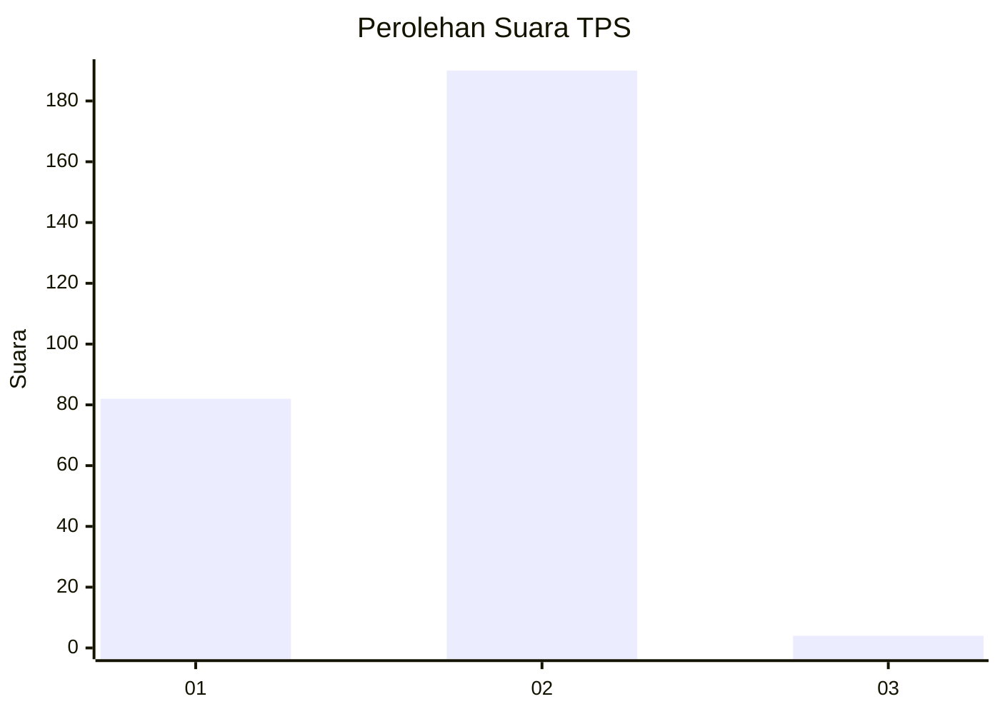
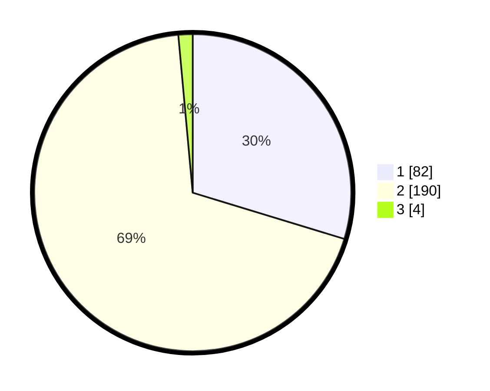

# Hasil

## Grafik

## Tabel

| No. | Nama Paslon    | Suara | Suara (raw) | Persentase |
|:--- |:-------------- | -----:| -----------:| ----------:|
| 1   | ANIES MUHAIMIN | 82    | [82][p-1]   | 29,71      |
| 2   | PRABOWO GIBRAN | 190   | [190][p-2]  | 68,84      |
| 3   | GANJAR MAHFUD  | 4     | [4][p-3]    | 1,45       |

[p-1]: https://github.com/gigit-pemilu/pemilu-2024/blob/main/pilpres/hitung-suara/sub/35-jawa-timur/sub/28-pamekasan/sub/11-batumarmar/sub/2010-blaban/sub/003-tps/sub/paslon-1.txt
[p-2]: https://github.com/gigit-pemilu/pemilu-2024/blob/main/pilpres/hitung-suara/sub/35-jawa-timur/sub/28-pamekasan/sub/11-batumarmar/sub/2010-blaban/sub/003-tps/sub/paslon-2.txt
[p-3]: https://github.com/gigit-pemilu/pemilu-2024/blob/main/pilpres/hitung-suara/sub/35-jawa-timur/sub/28-pamekasan/sub/11-batumarmar/sub/2010-blaban/sub/003-tps/sub/paslon-3.txt

## Foto C Plano

https://sirekap-obj-formc.kpu.go.id/780d/pemilu/ppwp/35/28/11/20/10/3528112010003-20240215-092359--ebf2fabb-5435-4067-b638-8bce249973ee.jpg

https://sirekap-obj-formc.kpu.go.id/780d/pemilu/ppwp/35/28/11/20/10/3528112010003-20240215-093022--67043cbf-7fa2-4a46-9f7f-047e09185ed3.jpg

https://sirekap-obj-formc.kpu.go.id/780d/pemilu/ppwp/35/28/11/20/10/3528112010003-20240215-093244--18dd08d9-6027-4e3d-a9c9-521bd38add23.jpg

## Metadata

| Key        | Value               |
| ---------- | ------------------- |
| Time Stamp | 2024-02-17 17:30:00 |

