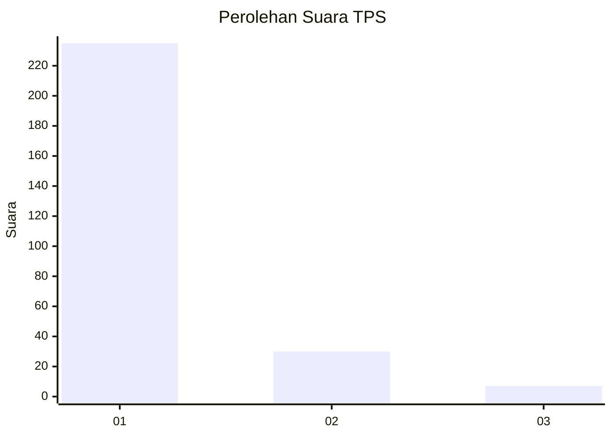
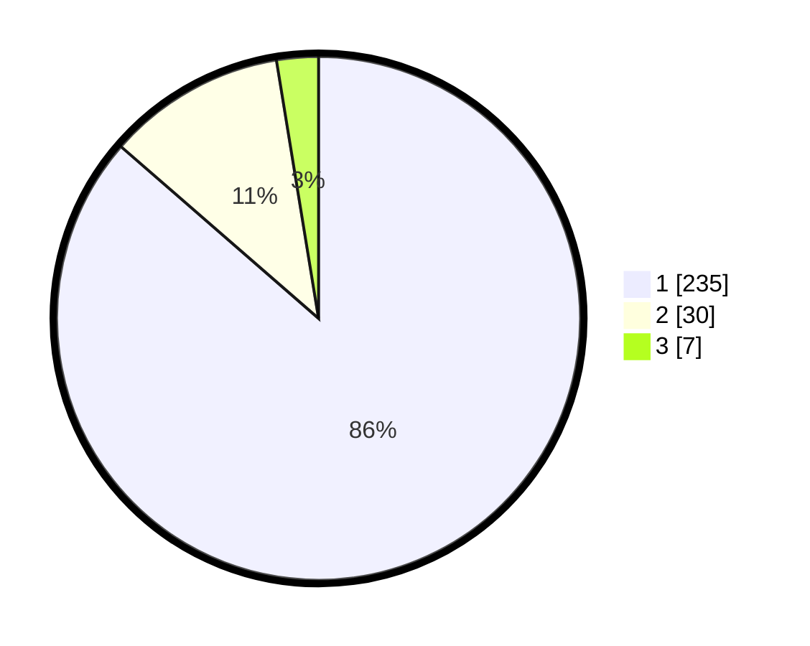

# Hasil

## Grafik

## Tabel

| No. | Nama Paslon    | Suara | Suara (raw) | Persentase |
|:--- |:-------------- | -----:| -----------:| ----------:|
| 1   | ANIES MUHAIMIN | 235   | [235][p-1]  | 86,40      |
| 2   | PRABOWO GIBRAN | 30    | [30][p-2]   | 11,03      |
| 3   | GANJAR MAHFUD  | 7     | [7][p-3]    | 2,57       |

[p-1]: https://github.com/gigit-pemilu/pemilu-2024/blob/main/pilpres/hitung-suara/sub/35-jawa-timur/sub/28-pamekasan/sub/11-batumarmar/sub/2010-blaban/sub/007-tps/sub/paslon-1.txt
[p-2]: https://github.com/gigit-pemilu/pemilu-2024/blob/main/pilpres/hitung-suara/sub/35-jawa-timur/sub/28-pamekasan/sub/11-batumarmar/sub/2010-blaban/sub/007-tps/sub/paslon-2.txt
[p-3]: https://github.com/gigit-pemilu/pemilu-2024/blob/main/pilpres/hitung-suara/sub/35-jawa-timur/sub/28-pamekasan/sub/11-batumarmar/sub/2010-blaban/sub/007-tps/sub/paslon-3.txt

## Foto C Plano

https://sirekap-obj-formc.kpu.go.id/c1ee/pemilu/ppwp/35/28/11/20/10/3528112010007-20240214-221452--a8ed81cd-a1ca-4dd7-9912-906e94ecbb5b.jpg

https://sirekap-obj-formc.kpu.go.id/c1ee/pemilu/ppwp/35/28/11/20/10/3528112010007-20240214-221618--f67cd684-faad-4ccb-be32-cedb9752d891.jpg

## Metadata

| Key        | Value               |
| ---------- | ------------------- |
| Time Stamp | 2024-02-17 12:00:00 |

