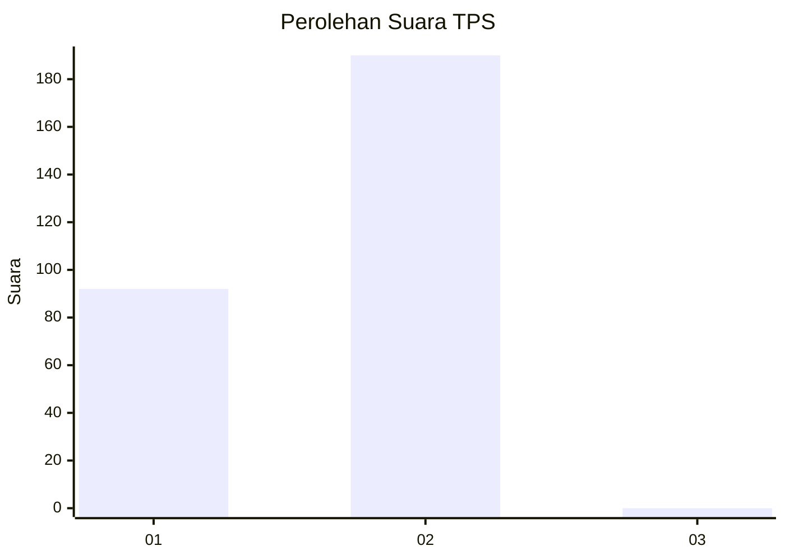
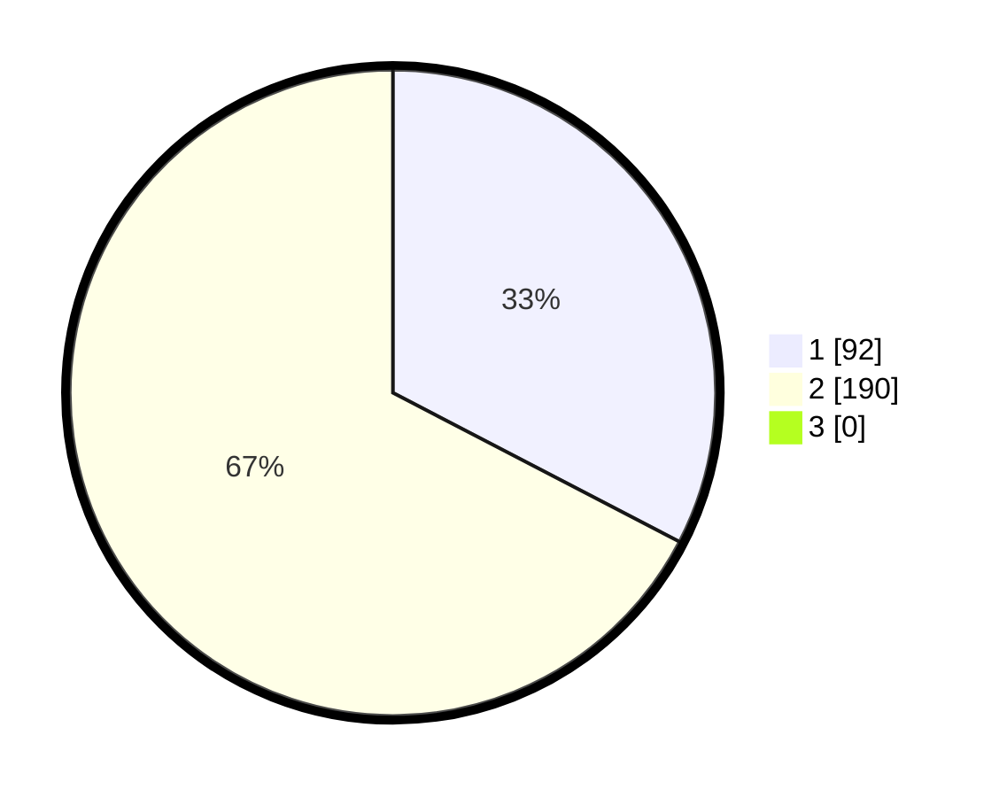

# Hasil

## Grafik

## Tabel

| No. | Nama Paslon    | Suara | Suara (raw) | Persentase |
|:--- |:-------------- | -----:| -----------:| ----------:|
| 1   | ANIES MUHAIMIN | 92    | [92][p-1]   | 32,62      |
| 2   | PRABOWO GIBRAN | 190   | [190][p-2]  | 67,38      |
| 3   | GANJAR MAHFUD  | 0     | [0][p-3]    | 0,00       |

[p-1]: https://github.com/gigit-pemilu/pemilu-2024-35-jawa-timur/blob/main/pilpres/hitung-suara/sub/35-jawa-timur/sub/28-pamekasan/sub/11-batumarmar/sub/2010-blaban/sub/014-tps/sub/paslon-1.txt
[p-2]: https://github.com/gigit-pemilu/pemilu-2024-35-jawa-timur/blob/main/pilpres/hitung-suara/sub/35-jawa-timur/sub/28-pamekasan/sub/11-batumarmar/sub/2010-blaban/sub/014-tps/sub/paslon-2.txt
[p-3]: https://github.com/gigit-pemilu/pemilu-2024-35-jawa-timur/blob/main/pilpres/hitung-suara/sub/35-jawa-timur/sub/28-pamekasan/sub/11-batumarmar/sub/2010-blaban/sub/014-tps/sub/paslon-3.txt

## Foto C Plano

https://sirekap-obj-formc.kpu.go.id/1bdc/pemilu/ppwp/35/28/11/20/10/3528112010014-20240214-215555--08e886f2-b3e1-4e74-8b99-4cf3a008e396.jpg

https://sirekap-obj-formc.kpu.go.id/1bdc/pemilu/ppwp/35/28/11/20/10/3528112010014-20240214-224308--eae325dc-9e92-4570-83be-0b6d8335aa25.jpg

https://sirekap-obj-formc.kpu.go.id/1bdc/pemilu/ppwp/35/28/11/20/10/3528112010014-20240214-224501--c97bea5d-734f-4625-8bea-51c4c0f8708c.jpg

## Metadata

| Key        | Value               |
| ---------- | ------------------- |
| Time Stamp | 2024-02-15 21:01:18 |

