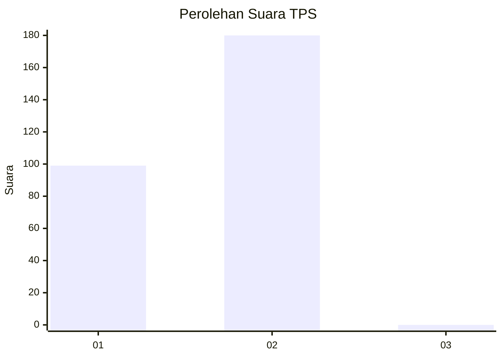
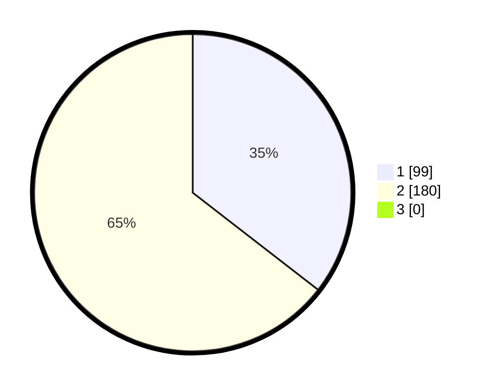

# Hasil

## Grafik

## Tabel

| No. | Nama Paslon    | Suara | Suara (raw) | Persentase |
|:--- |:-------------- | -----:| -----------:| ----------:|
| 1   | ANIES MUHAIMIN | 99    | [99][p-1]   | 35,48      |
| 2   | PRABOWO GIBRAN | 180   | [180][p-2]  | 64,52      |
| 3   | GANJAR MAHFUD  | 0     | [0][p-3]    | 0,00       |

[p-1]: https://github.com/gigit-pemilu/pemilu-2024/blob/main/pilpres/hitung-suara/sub/35-jawa-timur/sub/28-pamekasan/sub/11-batumarmar/sub/2010-blaban/sub/015-tps/sub/paslon-1.txt
[p-2]: https://github.com/gigit-pemilu/pemilu-2024/blob/main/pilpres/hitung-suara/sub/35-jawa-timur/sub/28-pamekasan/sub/11-batumarmar/sub/2010-blaban/sub/015-tps/sub/paslon-2.txt
[p-3]: https://github.com/gigit-pemilu/pemilu-2024/blob/main/pilpres/hitung-suara/sub/35-jawa-timur/sub/28-pamekasan/sub/11-batumarmar/sub/2010-blaban/sub/015-tps/sub/paslon-3.txt

## Foto C Plano

https://sirekap-obj-formc.kpu.go.id/c7be/pemilu/ppwp/35/28/11/20/10/3528112010015-20240215-001038--f20a7dcf-7f03-4901-8419-9b9772f5b332.jpg

https://sirekap-obj-formc.kpu.go.id/c7be/pemilu/ppwp/35/28/11/20/10/3528112010015-20240215-001101--23778899-d9e9-45e2-bb8f-e91307ab7a36.jpg

https://sirekap-obj-formc.kpu.go.id/c7be/pemilu/ppwp/35/28/11/20/10/3528112010015-20240215-001125--c197b3e8-9c4b-4e60-859a-846a3e01b2cf.jpg

## Metadata

| Key        | Value               |
| ---------- | ------------------- |
| Time Stamp | 2024-02-17 17:30:00 |

