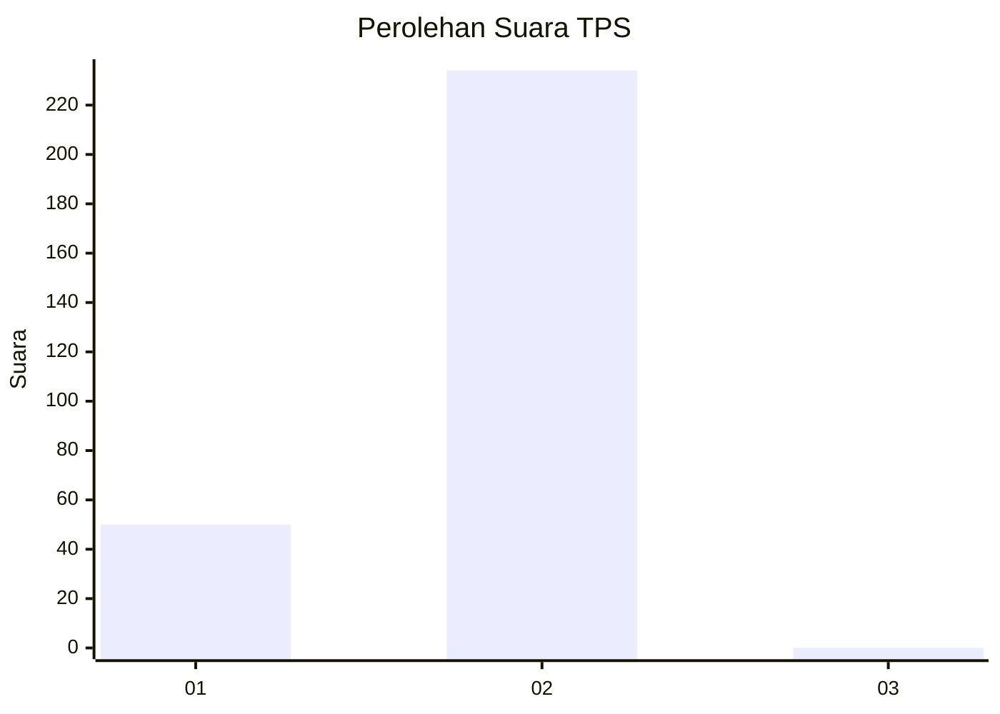
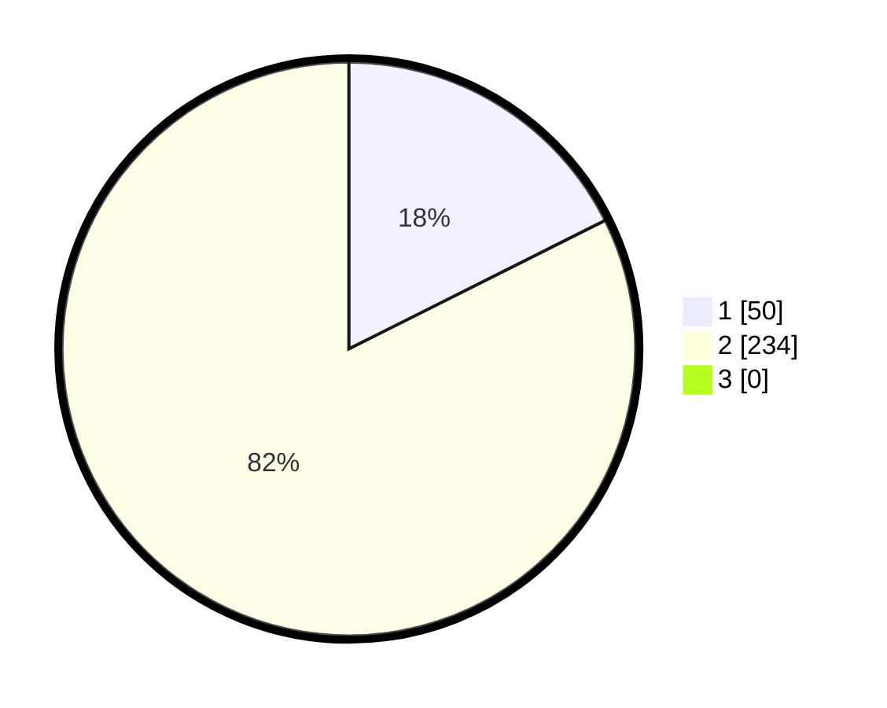

# Hasil

## Grafik

## Tabel

| No. | Nama Paslon    | Suara | Suara (raw) | Persentase |
|:--- |:-------------- | -----:| -----------:| ----------:|
| 1   | ANIES MUHAIMIN | 50    | [50][p-1]   | 17,61      |
| 2   | PRABOWO GIBRAN | 234   | [234][p-2]  | 82,39      |
| 3   | GANJAR MAHFUD  | 0     | [0][p-3]    | 0,00       |

[p-1]: https://github.com/gigit-pemilu/pemilu-2024-35-jawa-timur/blob/main/pilpres/hitung-suara/sub/35-jawa-timur/sub/28-pamekasan/sub/11-batumarmar/sub/2010-blaban/sub/016-tps/sub/paslon-1.txt
[p-2]: https://github.com/gigit-pemilu/pemilu-2024-35-jawa-timur/blob/main/pilpres/hitung-suara/sub/35-jawa-timur/sub/28-pamekasan/sub/11-batumarmar/sub/2010-blaban/sub/016-tps/sub/paslon-2.txt
[p-3]: https://github.com/gigit-pemilu/pemilu-2024-35-jawa-timur/blob/main/pilpres/hitung-suara/sub/35-jawa-timur/sub/28-pamekasan/sub/11-batumarmar/sub/2010-blaban/sub/016-tps/sub/paslon-3.txt

## Foto C Plano

https://sirekap-obj-formc.kpu.go.id/32f6/pemilu/ppwp/35/28/11/20/10/3528112010016-20240215-002449--17085692-27d1-4e6f-9a34-35cd6c0faaad.jpg

https://sirekap-obj-formc.kpu.go.id/32f6/pemilu/ppwp/35/28/11/20/10/3528112010016-20240215-002727--034a45ee-5d60-4653-b15e-a970e14bb014.jpg

https://sirekap-obj-formc.kpu.go.id/32f6/pemilu/ppwp/35/28/11/20/10/3528112010016-20240215-003021--cf5c9fbb-2fc1-4ab7-8470-cca9244f1f63.jpg

## Metadata

| Key        | Value               |
| ---------- | ------------------- |
| Time Stamp | 2024-02-24 22:31:28 |

