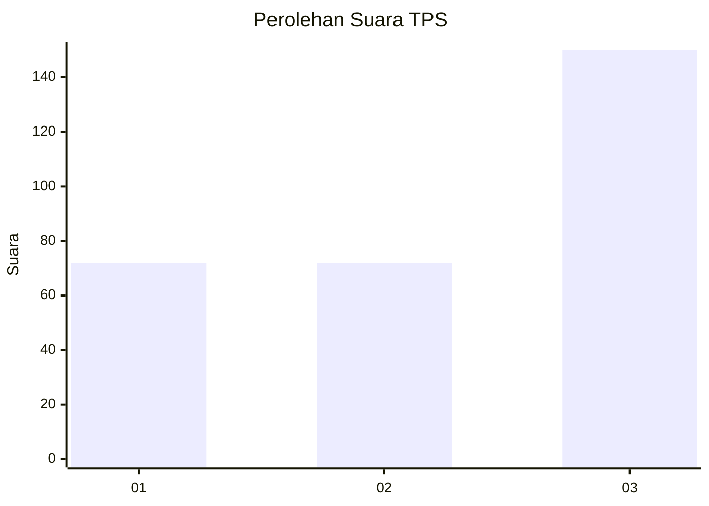
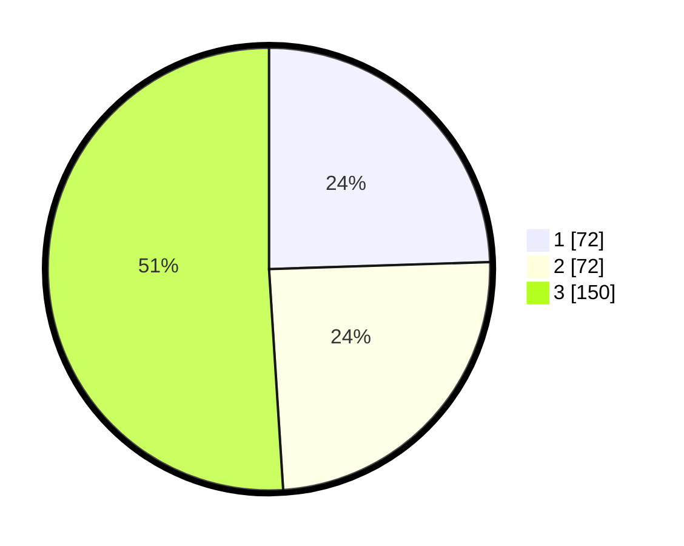

# Hasil

## Grafik

## Tabel

| No. | Nama Paslon    | Suara | Suara (raw) | Persentase |
|:--- |:-------------- | -----:| -----------:| ----------:|
| 1   | ANIES MUHAIMIN | 72    | [72][p-1]   | 24,49      |
| 2   | PRABOWO GIBRAN | 72    | [72][p-2]   | 24,49      |
| 3   | GANJAR MAHFUD  | 150   | [150][p-3]  | 51,02      |

[p-1]: https://github.com/gigit-pemilu/pemilu-2024/blob/main/pilpres/hitung-suara/sub/35-jawa-timur/sub/28-pamekasan/sub/11-batumarmar/sub/2010-blaban/sub/017-tps/sub/paslon-1.txt
[p-2]: https://github.com/gigit-pemilu/pemilu-2024/blob/main/pilpres/hitung-suara/sub/35-jawa-timur/sub/28-pamekasan/sub/11-batumarmar/sub/2010-blaban/sub/017-tps/sub/paslon-2.txt
[p-3]: https://github.com/gigit-pemilu/pemilu-2024/blob/main/pilpres/hitung-suara/sub/35-jawa-timur/sub/28-pamekasan/sub/11-batumarmar/sub/2010-blaban/sub/017-tps/sub/paslon-3.txt

## Foto C Plano

https://sirekap-obj-formc.kpu.go.id/ec31/pemilu/ppwp/35/28/11/20/10/3528112010017-20240214-234210--bf12a9cf-170a-4a5c-ac36-49d1f8bf76ca.jpg

https://sirekap-obj-formc.kpu.go.id/ec31/pemilu/ppwp/35/28/11/20/10/3528112010017-20240214-203355--25f9677d-db28-4ea4-b353-ea8d56b9547e.jpg

https://sirekap-obj-formc.kpu.go.id/ec31/pemilu/ppwp/35/28/11/20/10/3528112010017-20240214-234649--b2607f19-6676-4ed4-aec6-2a8ee0d6f0ce.jpg

## Metadata

| Key        | Value               |
| ---------- | ------------------- |
| Time Stamp | 2024-02-24 22:31:28 |

