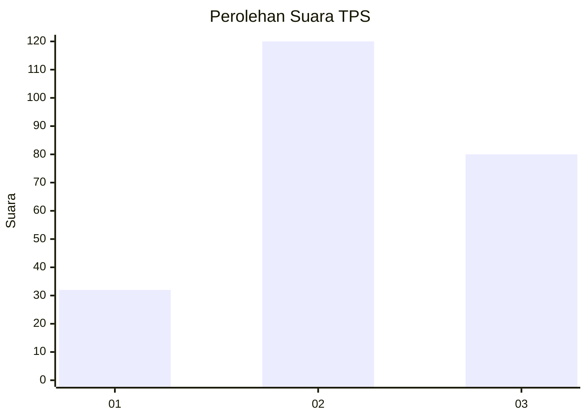
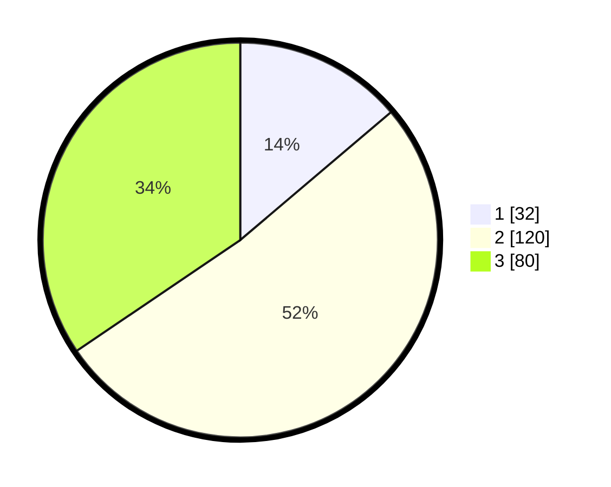

# Hasil

## Grafik

## Tabel

| No. | Nama Paslon    | Suara | Suara (raw) | Persentase |
|:--- |:-------------- | -----:| -----------:| ----------:|
| 1   | ANIES MUHAIMIN | 32    | [32][p-1]   | 13,79      |
| 2   | PRABOWO GIBRAN | 120   | [120][p-2]  | 51,72      |
| 3   | GANJAR MAHFUD  | 80    | [80][p-3]   | 34,48      |

[p-1]: https://github.com/gigit-pemilu/pemilu-2024-35-jawa-timur/blob/main/pilpres/hitung-suara/sub/35-jawa-timur/sub/28-pamekasan/sub/11-batumarmar/sub/2010-blaban/sub/018-tps/sub/paslon-1.txt
[p-2]: https://github.com/gigit-pemilu/pemilu-2024-35-jawa-timur/blob/main/pilpres/hitung-suara/sub/35-jawa-timur/sub/28-pamekasan/sub/11-batumarmar/sub/2010-blaban/sub/018-tps/sub/paslon-2.txt
[p-3]: https://github.com/gigit-pemilu/pemilu-2024-35-jawa-timur/blob/main/pilpres/hitung-suara/sub/35-jawa-timur/sub/28-pamekasan/sub/11-batumarmar/sub/2010-blaban/sub/018-tps/sub/paslon-3.txt

## Foto C Plano

https://sirekap-obj-formc.kpu.go.id/2036/pemilu/ppwp/35/28/11/20/10/3528112010018-20240214-231203--c1337f59-d75a-4970-91a0-303b0c5dd2b5.jpg

https://sirekap-obj-formc.kpu.go.id/2036/pemilu/ppwp/35/28/11/20/10/3528112010018-20240214-231241--2436b062-49e8-44cd-b48c-779e16eb529c.jpg

https://sirekap-obj-formc.kpu.go.id/2036/pemilu/ppwp/35/28/11/20/10/3528112010018-20240214-231310--07493097-405b-46fa-b995-9a642cf629cf.jpg

## Metadata

| Key        | Value               |
| ---------- | ------------------- |
| Time Stamp | 2024-02-17 12:00:00 |

