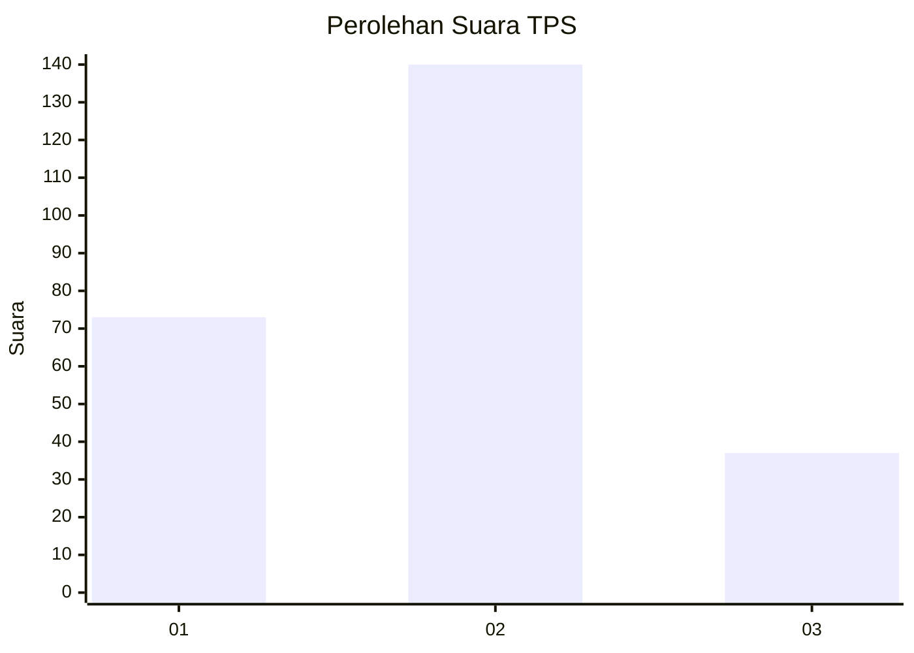
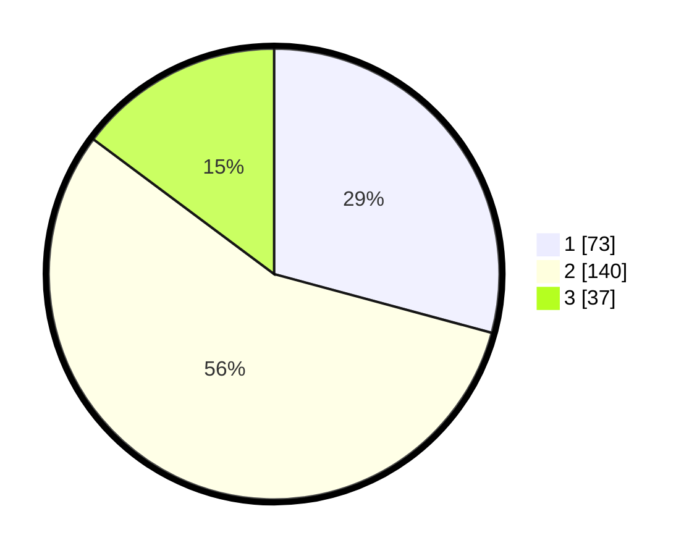

# Hasil

## Grafik

## Tabel

| No. | Nama Paslon    | Suara | Suara (raw) | Persentase |
|:--- |:-------------- | -----:| -----------:| ----------:|
| 1   | ANIES MUHAIMIN | 73    | [73][p-1]   | 29,20      |
| 2   | PRABOWO GIBRAN | 140   | [140][p-2]  | 56,00      |
| 3   | GANJAR MAHFUD  | 37    | [37][p-3]   | 14,80      |

[p-1]: https://github.com/gigit-pemilu/pemilu-2024/blob/main/pilpres/hitung-suara/sub/35-jawa-timur/sub/28-pamekasan/sub/11-batumarmar/sub/2011-tamberu/sub/002-tps/sub/paslon-1.txt
[p-2]: https://github.com/gigit-pemilu/pemilu-2024/blob/main/pilpres/hitung-suara/sub/35-jawa-timur/sub/28-pamekasan/sub/11-batumarmar/sub/2011-tamberu/sub/002-tps/sub/paslon-2.txt
[p-3]: https://github.com/gigit-pemilu/pemilu-2024/blob/main/pilpres/hitung-suara/sub/35-jawa-timur/sub/28-pamekasan/sub/11-batumarmar/sub/2011-tamberu/sub/002-tps/sub/paslon-3.txt

## Foto C Plano

https://sirekap-obj-formc.kpu.go.id/55c8/pemilu/ppwp/35/28/11/20/11/3528112011002-20240215-110536--c18d6768-dc4c-47ed-b912-ec16c0b2babf.jpg

https://sirekap-obj-formc.kpu.go.id/55c8/pemilu/ppwp/35/28/11/20/11/3528112011002-20240215-110718--51bc9d36-1a95-4cc4-a3ae-bce1b7e73c62.jpg

https://sirekap-obj-formc.kpu.go.id/55c8/pemilu/ppwp/35/28/11/20/11/3528112011002-20240215-110756--ecc797a8-2b33-4fe5-a1c9-86f743af2cef.jpg

## Metadata

| Key        | Value               |
| ---------- | ------------------- |
| Time Stamp | 2024-02-24 22:31:28 |

