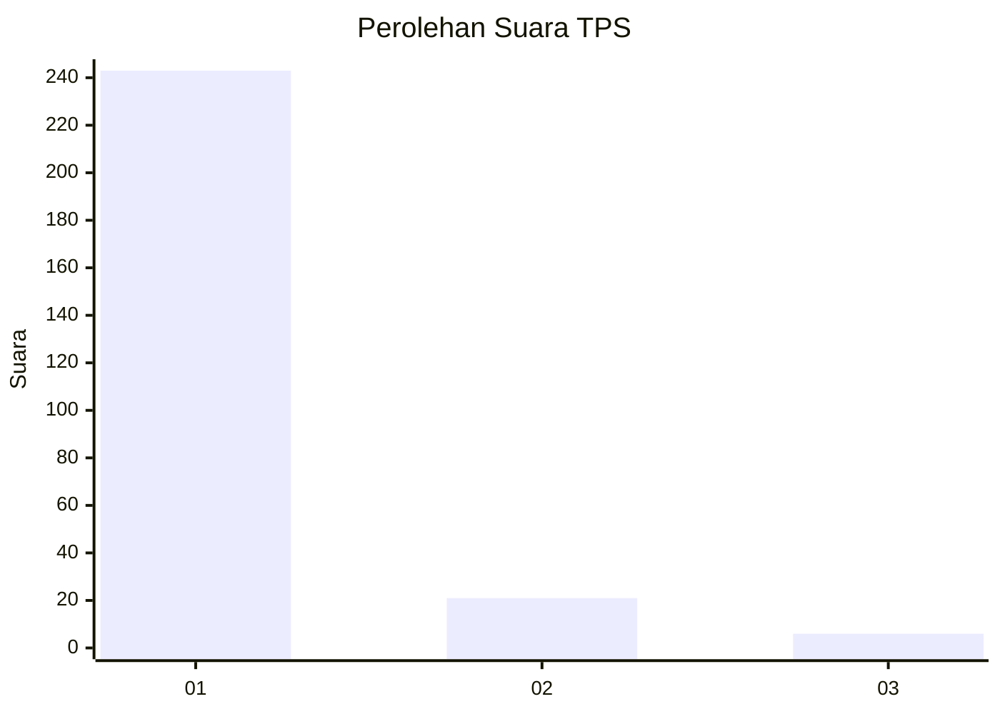
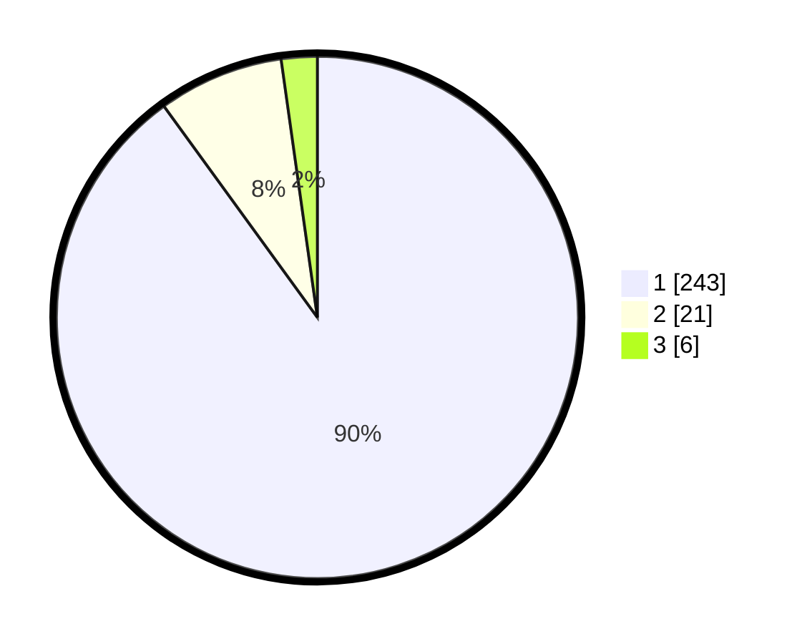

# Hasil

## Grafik

## Tabel

| No. | Nama Paslon    | Suara | Suara (raw) | Persentase |
|:--- |:-------------- | -----:| -----------:| ----------:|
| 1   | ANIES MUHAIMIN | 243   | [243][p-1]  | 90,00      |
| 2   | PRABOWO GIBRAN | 21    | [21][p-2]   | 7,78       |
| 3   | GANJAR MAHFUD  | 6     | [6][p-3]    | 2,22       |

[p-1]: https://github.com/gigit-pemilu/pemilu-2024/blob/main/pilpres/hitung-suara/sub/35-jawa-timur/sub/28-pamekasan/sub/11-batumarmar/sub/2012-bujur-tengah/sub/018-tps/sub/paslon-1.txt
[p-2]: https://github.com/gigit-pemilu/pemilu-2024/blob/main/pilpres/hitung-suara/sub/35-jawa-timur/sub/28-pamekasan/sub/11-batumarmar/sub/2012-bujur-tengah/sub/018-tps/sub/paslon-2.txt
[p-3]: https://github.com/gigit-pemilu/pemilu-2024/blob/main/pilpres/hitung-suara/sub/35-jawa-timur/sub/28-pamekasan/sub/11-batumarmar/sub/2012-bujur-tengah/sub/018-tps/sub/paslon-3.txt

## Foto C Plano

https://sirekap-obj-formc.kpu.go.id/9722/pemilu/ppwp/35/28/11/20/12/3528112012018-20240217-090202--6bf819f0-7273-419d-9f9f-5be049088e8d.jpg

https://sirekap-obj-formc.kpu.go.id/9722/pemilu/ppwp/35/28/11/20/12/3528112012018-20240217-090417--0db2c46c-1f5b-496e-a246-9ab390c9f188.jpg

https://sirekap-obj-formc.kpu.go.id/9722/pemilu/ppwp/35/28/11/20/12/3528112012018-20240217-090602--b863b06a-2650-48dc-8e22-ce7034b8e183.jpg

## Metadata

| Key        | Value               |
| ---------- | ------------------- |
| Time Stamp | 2024-02-25 13:00:00 |

