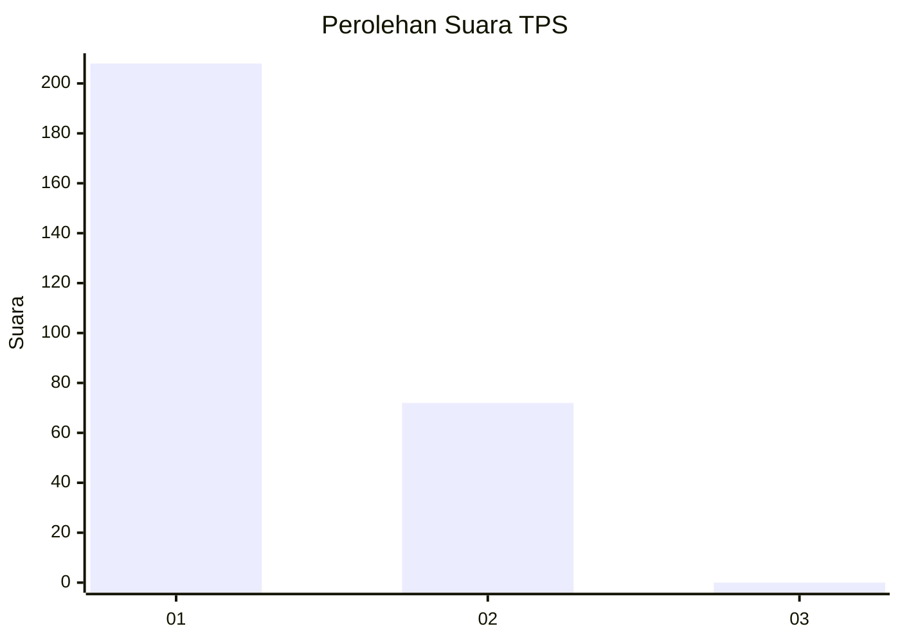
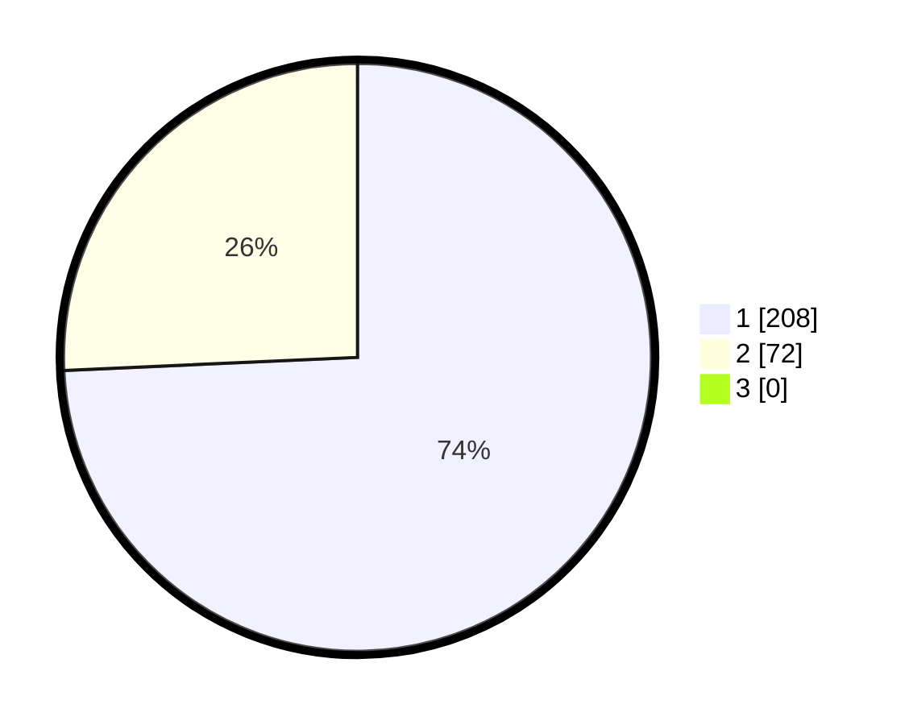

# Hasil

## Grafik

## Tabel

| No. | Nama Paslon    | Suara | Suara (raw) | Persentase |
|:--- |:-------------- | -----:| -----------:| ----------:|
| 1   | ANIES MUHAIMIN | 208   | [208][p-1]  | 74,29      |
| 2   | PRABOWO GIBRAN | 72    | [72][p-2]   | 25,71      |
| 3   | GANJAR MAHFUD  | 0     | [0][p-3]    | 0,00       |

[p-1]: https://github.com/gigit-pemilu/pemilu-2024/blob/main/pilpres/hitung-suara/sub/35-jawa-timur/sub/28-pamekasan/sub/11-batumarmar/sub/2012-bujur-tengah/sub/025-tps/sub/paslon-1.txt
[p-2]: https://github.com/gigit-pemilu/pemilu-2024/blob/main/pilpres/hitung-suara/sub/35-jawa-timur/sub/28-pamekasan/sub/11-batumarmar/sub/2012-bujur-tengah/sub/025-tps/sub/paslon-2.txt
[p-3]: https://github.com/gigit-pemilu/pemilu-2024/blob/main/pilpres/hitung-suara/sub/35-jawa-timur/sub/28-pamekasan/sub/11-batumarmar/sub/2012-bujur-tengah/sub/025-tps/sub/paslon-3.txt

## Foto C Plano

https://sirekap-obj-formc.kpu.go.id/580d/pemilu/ppwp/35/28/11/20/12/3528112012025-20240214-212033--740c6464-7dc0-4e11-abb8-aad2b9bc3d23.jpg

https://sirekap-obj-formc.kpu.go.id/580d/pemilu/ppwp/35/28/11/20/12/3528112012025-20240214-212114--26c65098-5be6-40a6-b93a-9a8d2535185a.jpg

https://sirekap-obj-formc.kpu.go.id/580d/pemilu/ppwp/35/28/11/20/12/3528112012025-20240214-212140--6de3890f-95d1-455c-92ce-6006c9fdd408.jpg

## Metadata

| Key        | Value               |
| ---------- | ------------------- |
| Time Stamp | 2024-02-15 19:30:26 |

## DATA PEMILIH TETAP

Jumlah pemilih dalam DPT: **282**.
 * L: **533**.
 * P: **643**.

## DATA PENGGUNA HAK PILIH

Jumlah pengguna hak pilih dalam DPT: **280**.
 * L: **627**.
 * P: **642**.

Jumlah pengguna hak pilih dalam DPTb: **884**.
 * L: **808**.
 * P: **888**.

Jumlah pengguna hak pilih dalam DPK: **888**.
 * L: **888**.
 * P: **888**.

Jumlah pengguna hak pilih: **280**.
 * L: **237**.
 * P: **693**.

## JUMLAH SUARA SAH DAN TIDAK SAH

JUMLAH SELURUH SUARA SAH: **280**.

JUMLAH SUARA TIDAK SAH: **0**.

JUMLAH SELURUH SUARA SAH DAN SUARA TIDAK SAH: **280**.

