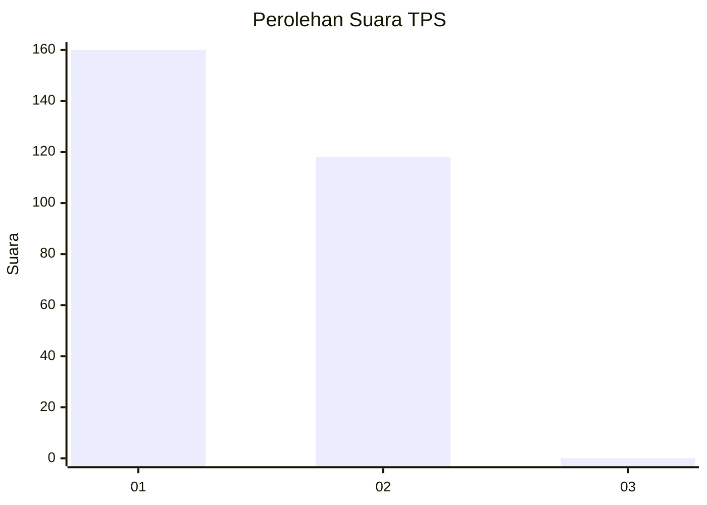
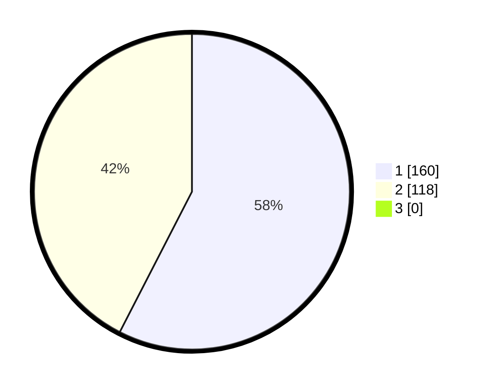

# Hasil

## Grafik

## Tabel

| No. | Nama Paslon    | Suara | Suara (raw) | Persentase |
|:--- |:-------------- | -----:| -----------:| ----------:|
| 1   | ANIES MUHAIMIN | 160   | [160][p-1]  | 57,55      |
| 2   | PRABOWO GIBRAN | 118   | [118][p-2]  | 42,45      |
| 3   | GANJAR MAHFUD  | 0     | [0][p-3]    | 0,00       |

[p-1]: https://github.com/gigit-pemilu/pemilu-2024/blob/main/pilpres/hitung-suara/sub/35-jawa-timur/sub/28-pamekasan/sub/11-batumarmar/sub/2012-bujur-tengah/sub/026-tps/sub/paslon-1.txt
[p-2]: https://github.com/gigit-pemilu/pemilu-2024/blob/main/pilpres/hitung-suara/sub/35-jawa-timur/sub/28-pamekasan/sub/11-batumarmar/sub/2012-bujur-tengah/sub/026-tps/sub/paslon-2.txt
[p-3]: https://github.com/gigit-pemilu/pemilu-2024/blob/main/pilpres/hitung-suara/sub/35-jawa-timur/sub/28-pamekasan/sub/11-batumarmar/sub/2012-bujur-tengah/sub/026-tps/sub/paslon-3.txt

## Foto C Plano

https://sirekap-obj-formc.kpu.go.id/5649/pemilu/ppwp/35/28/11/20/12/3528112012026-20240215-080328--7b06556a-12fe-4284-9bda-d57b48ddf0e8.jpg

https://sirekap-obj-formc.kpu.go.id/5649/pemilu/ppwp/35/28/11/20/12/3528112012026-20240215-080404--a872c69a-f5db-49e5-b621-85880e500e59.jpg

https://sirekap-obj-formc.kpu.go.id/5649/pemilu/ppwp/35/28/11/20/12/3528112012026-20240215-080410--f90c924e-cf15-4142-9621-e3b29b5f74ce.jpg

## Metadata

| Key        | Value               |
| ---------- | ------------------- |
| Time Stamp | 2024-02-20 11:00:00 |

