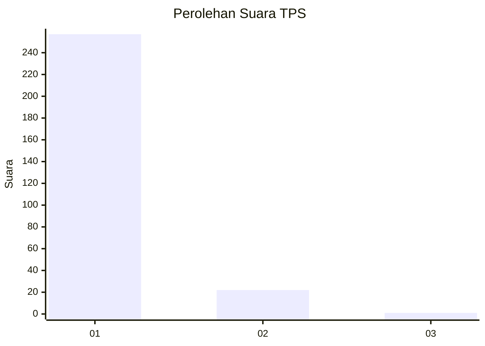
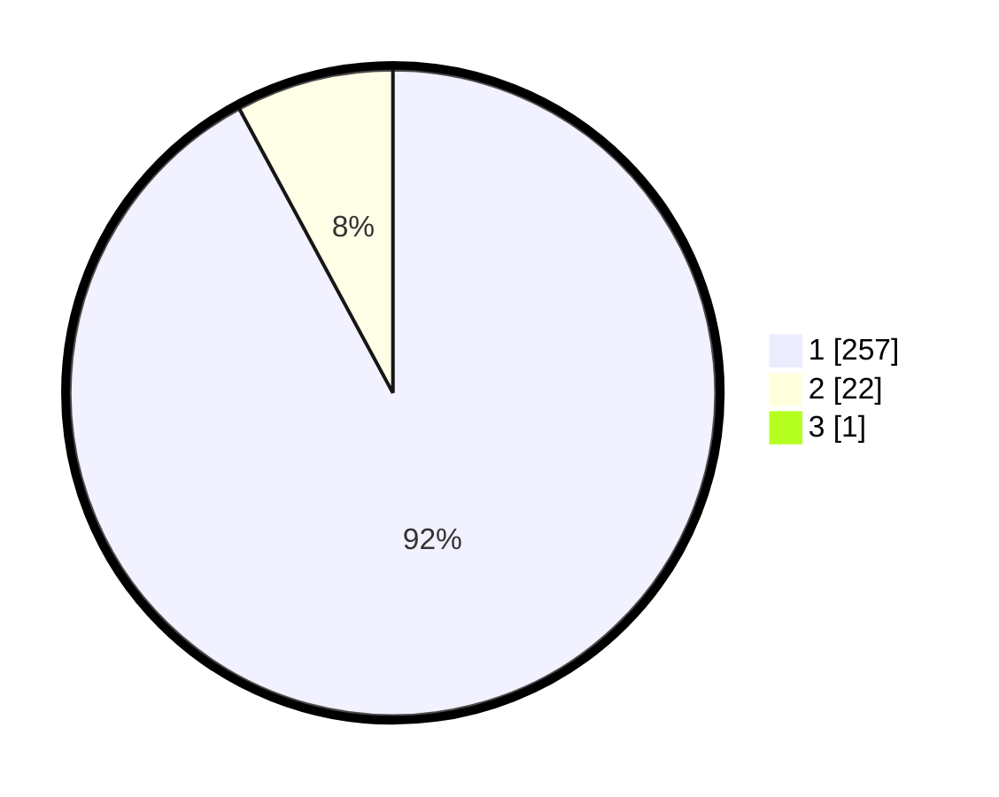

# Hasil

## Grafik

## Tabel

| No. | Nama Paslon    | Suara | Suara (raw) | Persentase |
|:--- |:-------------- | -----:| -----------:| ----------:|
| 1   | ANIES MUHAIMIN | 257   | [257][p-1]  | 91,79      |
| 2   | PRABOWO GIBRAN | 22    | [22][p-2]   | 7,86       |
| 3   | GANJAR MAHFUD  | 1     | [1][p-3]    | 0,36       |

[p-1]: https://github.com/gigit-pemilu/pemilu-2024-35-jawa-timur/blob/main/pilpres/hitung-suara/sub/35-jawa-timur/sub/28-pamekasan/sub/11-batumarmar/sub/2013-bujur-timur/sub/004-tps/sub/paslon-1.txt
[p-2]: https://github.com/gigit-pemilu/pemilu-2024-35-jawa-timur/blob/main/pilpres/hitung-suara/sub/35-jawa-timur/sub/28-pamekasan/sub/11-batumarmar/sub/2013-bujur-timur/sub/004-tps/sub/paslon-2.txt
[p-3]: https://github.com/gigit-pemilu/pemilu-2024-35-jawa-timur/blob/main/pilpres/hitung-suara/sub/35-jawa-timur/sub/28-pamekasan/sub/11-batumarmar/sub/2013-bujur-timur/sub/004-tps/sub/paslon-3.txt

## Foto C Plano

https://sirekap-obj-formc.kpu.go.id/48a5/pemilu/ppwp/35/28/11/20/13/3528112013004-20240215-062021--508984b2-87d3-4b43-92fe-13f1a88e2888.jpg

https://sirekap-obj-formc.kpu.go.id/48a5/pemilu/ppwp/35/28/11/20/13/3528112013004-20240215-062111--98e4ad09-bc13-4d09-9095-30263b2724bf.jpg

https://sirekap-obj-formc.kpu.go.id/48a5/pemilu/ppwp/35/28/11/20/13/3528112013004-20240215-062158--c6c0ed01-ca30-4b3e-8349-4187042e84e3.jpg

## Metadata

| Key        | Value               |
| ---------- | ------------------- |
| Time Stamp | 2024-02-17 17:30:00 |

