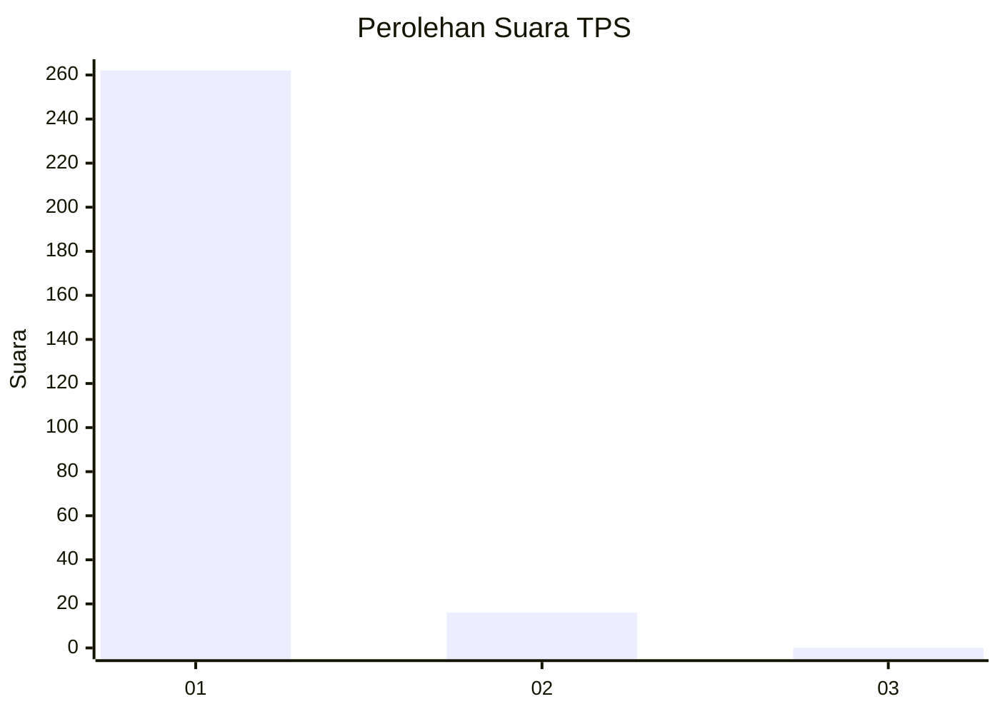
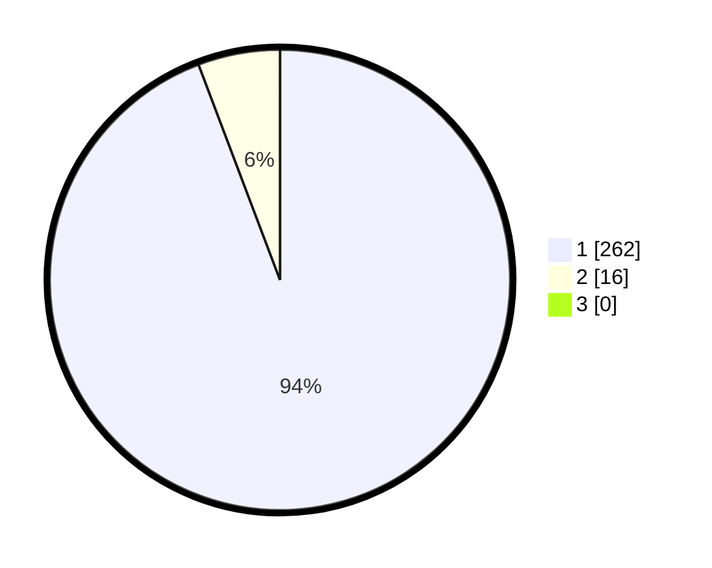

# Hasil

## Grafik

## Tabel

| No. | Nama Paslon    | Suara | Suara (raw) | Persentase |
|:--- |:-------------- | -----:| -----------:| ----------:|
| 1   | ANIES MUHAIMIN | 262   | [262][p-1]  | 94,24      |
| 2   | PRABOWO GIBRAN | 16    | [16][p-2]   | 5,76       |
| 3   | GANJAR MAHFUD  | 0     | [0][p-3]    | 0,00       |

[p-1]: https://github.com/gigit-pemilu/pemilu-2024-35-jawa-timur/blob/main/pilpres/hitung-suara/sub/35-jawa-timur/sub/28-pamekasan/sub/11-batumarmar/sub/2013-bujur-timur/sub/006-tps/sub/paslon-1.txt
[p-2]: https://github.com/gigit-pemilu/pemilu-2024-35-jawa-timur/blob/main/pilpres/hitung-suara/sub/35-jawa-timur/sub/28-pamekasan/sub/11-batumarmar/sub/2013-bujur-timur/sub/006-tps/sub/paslon-2.txt
[p-3]: https://github.com/gigit-pemilu/pemilu-2024-35-jawa-timur/blob/main/pilpres/hitung-suara/sub/35-jawa-timur/sub/28-pamekasan/sub/11-batumarmar/sub/2013-bujur-timur/sub/006-tps/sub/paslon-3.txt

## Foto C Plano

https://sirekap-obj-formc.kpu.go.id/e134/pemilu/ppwp/35/28/11/20/13/3528112013006-20240214-202955--07f01048-4a7a-4367-92b1-490802c092e9.jpg

https://sirekap-obj-formc.kpu.go.id/e134/pemilu/ppwp/35/28/11/20/13/3528112013006-20240214-202620--82de313d-4131-458a-b01e-32bd04b920db.jpg

https://sirekap-obj-formc.kpu.go.id/e134/pemilu/ppwp/35/28/11/20/13/3528112013006-20240214-202741--2ed4b8bf-1146-4d57-ae89-5fcabca56f4e.jpg

## Metadata

| Key        | Value               |
| ---------- | ------------------- |
| Time Stamp | 2024-02-17 17:30:00 |

