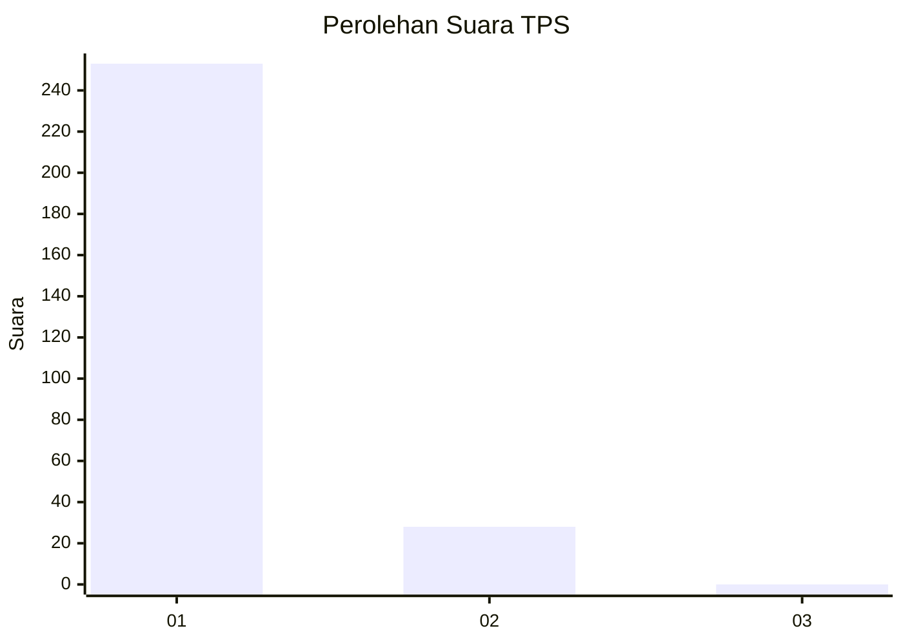
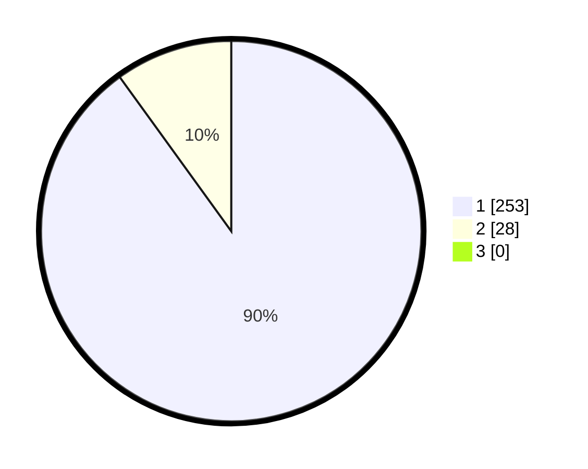

# Hasil

## Grafik

## Tabel

| No. | Nama Paslon    | Suara | Suara (raw) | Persentase |
|:--- |:-------------- | -----:| -----------:| ----------:|
| 1   | ANIES MUHAIMIN | 253   | [253][p-1]  | 90,04      |
| 2   | PRABOWO GIBRAN | 28    | [28][p-2]   | 9,96       |
| 3   | GANJAR MAHFUD  | 0     | [0][p-3]    | 0,00       |

[p-1]: https://github.com/gigit-pemilu/pemilu-2024/blob/main/pilpres/hitung-suara/sub/35-jawa-timur/sub/28-pamekasan/sub/11-batumarmar/sub/2013-bujur-timur/sub/007-tps/sub/paslon-1.txt
[p-2]: https://github.com/gigit-pemilu/pemilu-2024/blob/main/pilpres/hitung-suara/sub/35-jawa-timur/sub/28-pamekasan/sub/11-batumarmar/sub/2013-bujur-timur/sub/007-tps/sub/paslon-2.txt
[p-3]: https://github.com/gigit-pemilu/pemilu-2024/blob/main/pilpres/hitung-suara/sub/35-jawa-timur/sub/28-pamekasan/sub/11-batumarmar/sub/2013-bujur-timur/sub/007-tps/sub/paslon-3.txt

## Foto C Plano

https://sirekap-obj-formc.kpu.go.id/0016/pemilu/ppwp/35/28/11/20/13/3528112013007-20240214-201719--745fea0a-066a-4c6c-889e-beb59436b355.jpg

https://sirekap-obj-formc.kpu.go.id/0016/pemilu/ppwp/35/28/11/20/13/3528112013007-20240214-201726--eecd8d0a-d270-4842-ac14-b9b508e939a4.jpg

https://sirekap-obj-formc.kpu.go.id/0016/pemilu/ppwp/35/28/11/20/13/3528112013007-20240214-201732--2a3d2fc2-1eb2-4697-8840-cccb107deecf.jpg

## Metadata

| Key        | Value               |
| ---------- | ------------------- |
| Time Stamp | 2024-02-19 06:16:00 |

