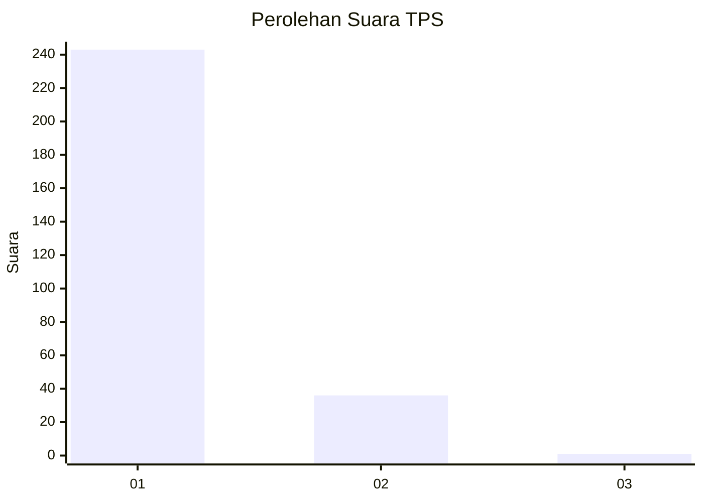
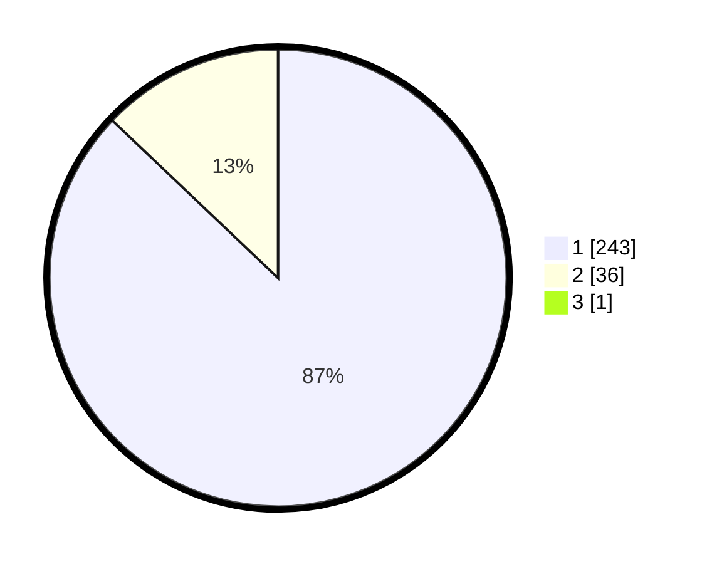

# Hasil

## Grafik

## Tabel

| No. | Nama Paslon    | Suara | Suara (raw) | Persentase |
|:--- |:-------------- | -----:| -----------:| ----------:|
| 1   | ANIES MUHAIMIN | 243   | [243][p-1]  | 86,79      |
| 2   | PRABOWO GIBRAN | 36    | [36][p-2]   | 12,86      |
| 3   | GANJAR MAHFUD  | 1     | [1][p-3]    | 0,36       |

[p-1]: https://github.com/gigit-pemilu/pemilu-2024-35-jawa-timur/blob/main/pilpres/hitung-suara/sub/35-jawa-timur/sub/28-pamekasan/sub/11-batumarmar/sub/2013-bujur-timur/sub/008-tps/sub/paslon-1.txt
[p-2]: https://github.com/gigit-pemilu/pemilu-2024-35-jawa-timur/blob/main/pilpres/hitung-suara/sub/35-jawa-timur/sub/28-pamekasan/sub/11-batumarmar/sub/2013-bujur-timur/sub/008-tps/sub/paslon-2.txt
[p-3]: https://github.com/gigit-pemilu/pemilu-2024-35-jawa-timur/blob/main/pilpres/hitung-suara/sub/35-jawa-timur/sub/28-pamekasan/sub/11-batumarmar/sub/2013-bujur-timur/sub/008-tps/sub/paslon-3.txt

## Foto C Plano

https://sirekap-obj-formc.kpu.go.id/d435/pemilu/ppwp/35/28/11/20/13/3528112013008-20240214-203252--6efc7887-bf91-4869-bcd8-4d863b2bdaae.jpg

https://sirekap-obj-formc.kpu.go.id/d435/pemilu/ppwp/35/28/11/20/13/3528112013008-20240214-203705--898cd2c9-84f7-4b45-97fe-2497edae193c.jpg

https://sirekap-obj-formc.kpu.go.id/d435/pemilu/ppwp/35/28/11/20/13/3528112013008-20240214-204026--34f25ab0-0239-49cf-8ff8-1c4bab238af9.jpg

## Metadata

| Key        | Value               |
| ---------- | ------------------- |
| Time Stamp | 2024-02-19 06:16:00 |

