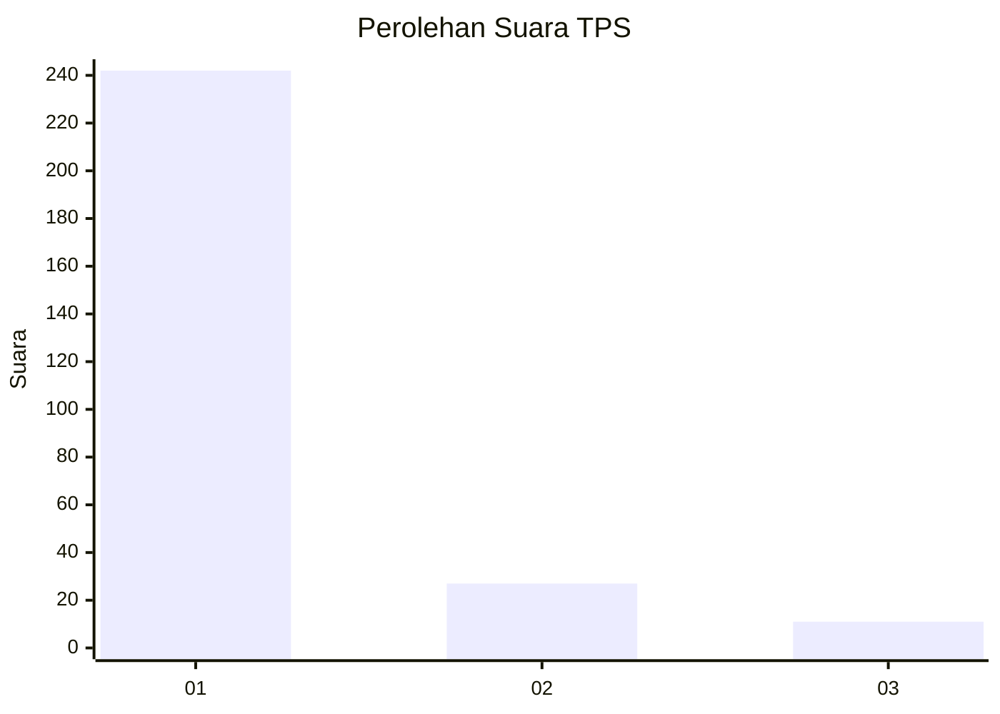
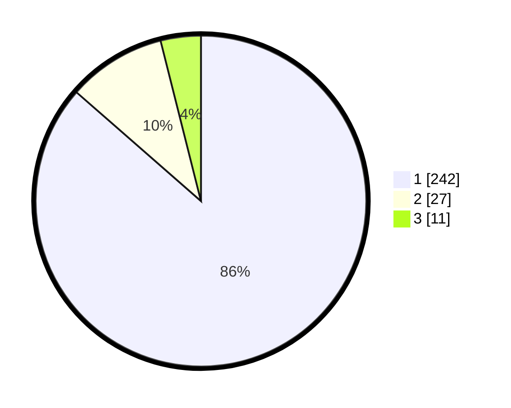

# Hasil

## Grafik

## Tabel

| No. | Nama Paslon    | Suara | Suara (raw) | Persentase |
|:--- |:-------------- | -----:| -----------:| ----------:|
| 1   | ANIES MUHAIMIN | 242   | [242][p-1]  | 86,43      |
| 2   | PRABOWO GIBRAN | 27    | [27][p-2]   | 9,64       |
| 3   | GANJAR MAHFUD  | 11    | [11][p-3]   | 3,93       |

[p-1]: https://github.com/gigit-pemilu/pemilu-2024-35-jawa-timur/blob/main/pilpres/hitung-suara/sub/35-jawa-timur/sub/28-pamekasan/sub/11-batumarmar/sub/2013-bujur-timur/sub/009-tps/sub/paslon-1.txt
[p-2]: https://github.com/gigit-pemilu/pemilu-2024-35-jawa-timur/blob/main/pilpres/hitung-suara/sub/35-jawa-timur/sub/28-pamekasan/sub/11-batumarmar/sub/2013-bujur-timur/sub/009-tps/sub/paslon-2.txt
[p-3]: https://github.com/gigit-pemilu/pemilu-2024-35-jawa-timur/blob/main/pilpres/hitung-suara/sub/35-jawa-timur/sub/28-pamekasan/sub/11-batumarmar/sub/2013-bujur-timur/sub/009-tps/sub/paslon-3.txt

## Foto C Plano

https://sirekap-obj-formc.kpu.go.id/29bf/pemilu/ppwp/35/28/11/20/13/3528112013009-20240215-084433--0af4c545-3235-4dbd-b68d-2596f5e65bce.jpg

https://sirekap-obj-formc.kpu.go.id/29bf/pemilu/ppwp/35/28/11/20/13/3528112013009-20240215-084534--e5a13fe2-70a3-462f-a1d6-7b1bfcdf3819.jpg

https://sirekap-obj-formc.kpu.go.id/29bf/pemilu/ppwp/35/28/11/20/13/3528112013009-20240215-084632--84e63b5c-52d0-40b5-837f-8fd294c548ac.jpg

## Metadata

| Key        | Value               |
| ---------- | ------------------- |
| Time Stamp | 2024-02-19 06:16:00 |

