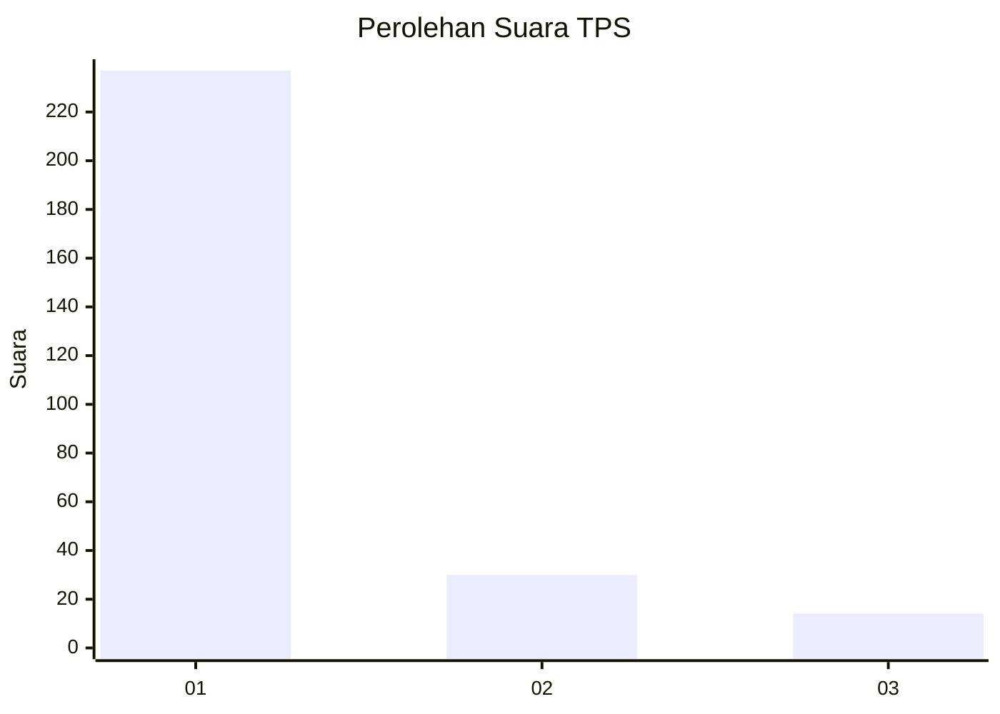
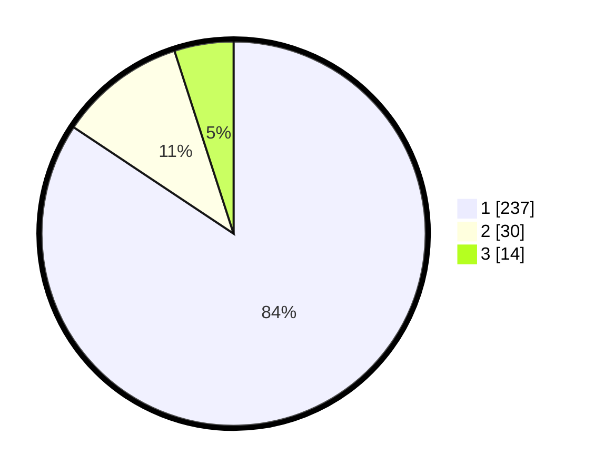

# Hasil

## Grafik

## Tabel

| No. | Nama Paslon    | Suara | Suara (raw) | Persentase |
|:--- |:-------------- | -----:| -----------:| ----------:|
| 1   | ANIES MUHAIMIN | 237   | [237][p-1]  | 84,34      |
| 2   | PRABOWO GIBRAN | 30    | [30][p-2]   | 10,68      |
| 3   | GANJAR MAHFUD  | 14    | [14][p-3]   | 4,98       |

[p-1]: https://github.com/gigit-pemilu/pemilu-2024-35-jawa-timur/blob/main/pilpres/hitung-suara/sub/35-jawa-timur/sub/28-pamekasan/sub/11-batumarmar/sub/2013-bujur-timur/sub/010-tps/sub/paslon-1.txt
[p-2]: https://github.com/gigit-pemilu/pemilu-2024-35-jawa-timur/blob/main/pilpres/hitung-suara/sub/35-jawa-timur/sub/28-pamekasan/sub/11-batumarmar/sub/2013-bujur-timur/sub/010-tps/sub/paslon-2.txt
[p-3]: https://github.com/gigit-pemilu/pemilu-2024-35-jawa-timur/blob/main/pilpres/hitung-suara/sub/35-jawa-timur/sub/28-pamekasan/sub/11-batumarmar/sub/2013-bujur-timur/sub/010-tps/sub/paslon-3.txt

## Foto C Plano

https://sirekap-obj-formc.kpu.go.id/264a/pemilu/ppwp/35/28/11/20/13/3528112013010-20240215-100612--5545c602-56cb-4adf-bb92-c9301b3b5746.jpg

https://sirekap-obj-formc.kpu.go.id/264a/pemilu/ppwp/35/28/11/20/13/3528112013010-20240215-100850--bd1ce349-3b8a-4171-ae52-ae26faf2bb3a.jpg

https://sirekap-obj-formc.kpu.go.id/264a/pemilu/ppwp/35/28/11/20/13/3528112013010-20240215-100956--f977bfae-1b84-4908-84d7-1dcd30e126a4.jpg

## Metadata

| Key        | Value               |
| ---------- | ------------------- |
| Time Stamp | 2024-02-17 12:00:00 |

