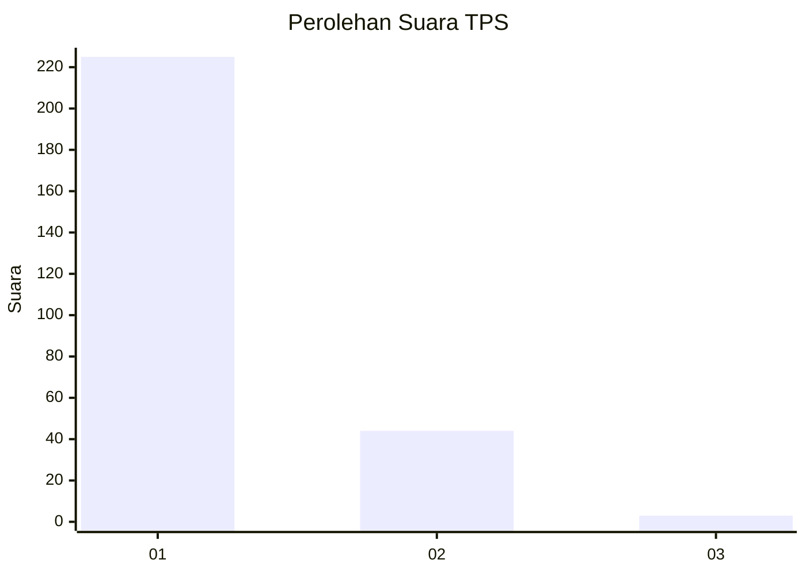
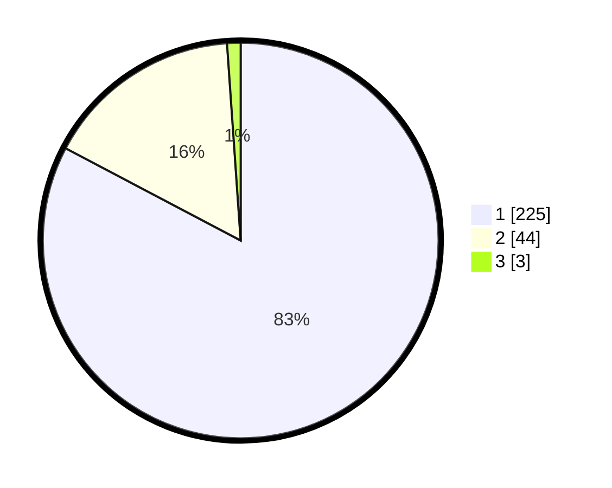

# Hasil

## Grafik

## Tabel

| No. | Nama Paslon    | Suara | Suara (raw) | Persentase |
|:--- |:-------------- | -----:| -----------:| ----------:|
| 1   | ANIES MUHAIMIN | 225   | [225][p-1]  | 82,72      |
| 2   | PRABOWO GIBRAN | 44    | [44][p-2]   | 16,18      |
| 3   | GANJAR MAHFUD  | 3     | [3][p-3]    | 1,10       |

[p-1]: https://github.com/gigit-pemilu/pemilu-2024/blob/main/pilpres/hitung-suara/sub/35-jawa-timur/sub/28-pamekasan/sub/11-batumarmar/sub/2013-bujur-timur/sub/011-tps/sub/paslon-1.txt
[p-2]: https://github.com/gigit-pemilu/pemilu-2024/blob/main/pilpres/hitung-suara/sub/35-jawa-timur/sub/28-pamekasan/sub/11-batumarmar/sub/2013-bujur-timur/sub/011-tps/sub/paslon-2.txt
[p-3]: https://github.com/gigit-pemilu/pemilu-2024/blob/main/pilpres/hitung-suara/sub/35-jawa-timur/sub/28-pamekasan/sub/11-batumarmar/sub/2013-bujur-timur/sub/011-tps/sub/paslon-3.txt

## Foto C Plano

https://sirekap-obj-formc.kpu.go.id/c7a0/pemilu/ppwp/35/28/11/20/13/3528112013011-20240215-001027--a40c0694-ec23-4eb8-8f91-eea8fbb163c8.jpg

https://sirekap-obj-formc.kpu.go.id/c7a0/pemilu/ppwp/35/28/11/20/13/3528112013011-20240215-001335--f211ab5f-3934-48cb-b72c-366b1fe17d68.jpg

https://sirekap-obj-formc.kpu.go.id/c7a0/pemilu/ppwp/35/28/11/20/13/3528112013011-20240215-002143--1f7f9870-ce38-404c-8d2f-1aa4e8d202d9.jpg

## Metadata

| Key        | Value               |
| ---------- | ------------------- |
| Time Stamp | 2024-02-24 22:31:28 |

