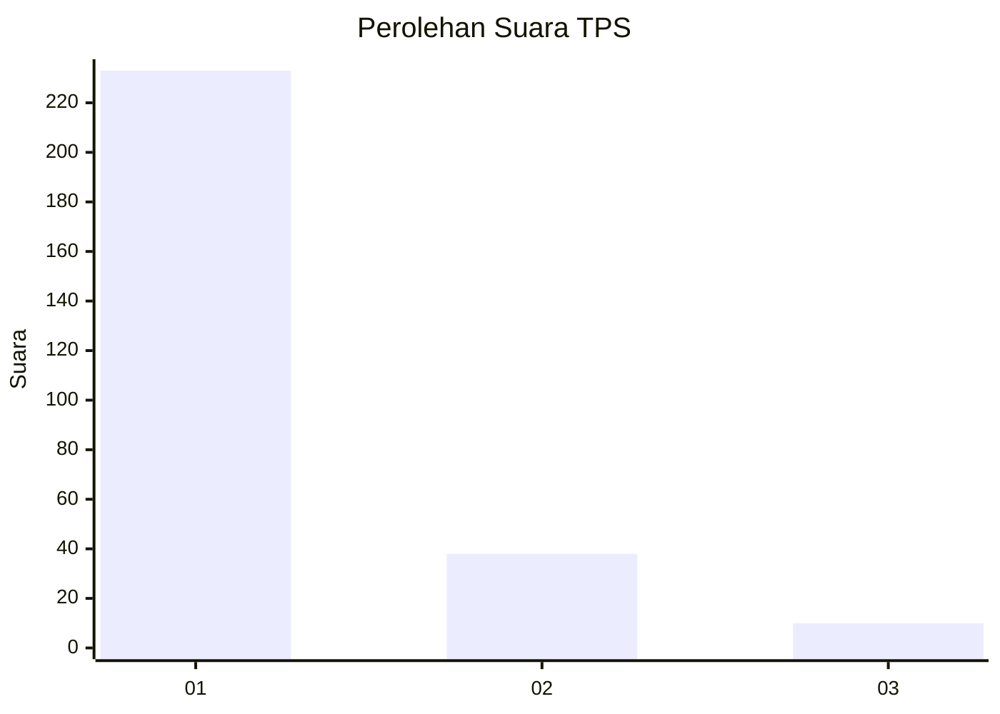
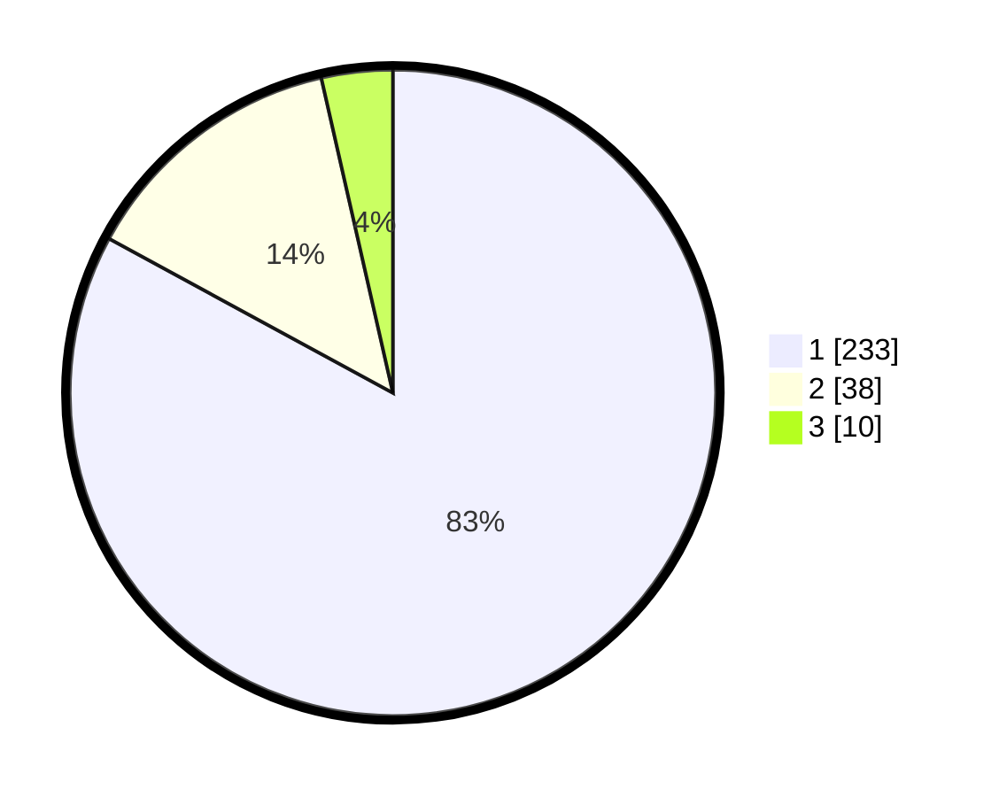

# Hasil

## Grafik

## Tabel

| No. | Nama Paslon    | Suara | Suara (raw) | Persentase |
|:--- |:-------------- | -----:| -----------:| ----------:|
| 1   | ANIES MUHAIMIN | 233   | [233][p-1]  | 82,92      |
| 2   | PRABOWO GIBRAN | 38    | [38][p-2]   | 13,52      |
| 3   | GANJAR MAHFUD  | 10    | [10][p-3]   | 3,56       |

[p-1]: https://github.com/gigit-pemilu/pemilu-2024-35-jawa-timur/blob/main/pilpres/hitung-suara/sub/35-jawa-timur/sub/28-pamekasan/sub/11-batumarmar/sub/2013-bujur-timur/sub/012-tps/sub/paslon-1.txt
[p-2]: https://github.com/gigit-pemilu/pemilu-2024-35-jawa-timur/blob/main/pilpres/hitung-suara/sub/35-jawa-timur/sub/28-pamekasan/sub/11-batumarmar/sub/2013-bujur-timur/sub/012-tps/sub/paslon-2.txt
[p-3]: https://github.com/gigit-pemilu/pemilu-2024-35-jawa-timur/blob/main/pilpres/hitung-suara/sub/35-jawa-timur/sub/28-pamekasan/sub/11-batumarmar/sub/2013-bujur-timur/sub/012-tps/sub/paslon-3.txt

## Foto C Plano

https://sirekap-obj-formc.kpu.go.id/0cd0/pemilu/ppwp/35/28/11/20/13/3528112013012-20240215-055921--88d67e2f-b0af-4853-b4c8-2d18191c045b.jpg

https://sirekap-obj-formc.kpu.go.id/0cd0/pemilu/ppwp/35/28/11/20/13/3528112013012-20240215-060047--7d2d0930-88ae-4e0d-986a-884b38fc1635.jpg

https://sirekap-obj-formc.kpu.go.id/0cd0/pemilu/ppwp/35/28/11/20/13/3528112013012-20240215-060143--c6b91d4f-608b-4197-b6cc-f0c938c884cd.jpg

## Metadata

| Key        | Value               |
| ---------- | ------------------- |
| Time Stamp | 2024-02-19 06:16:00 |

