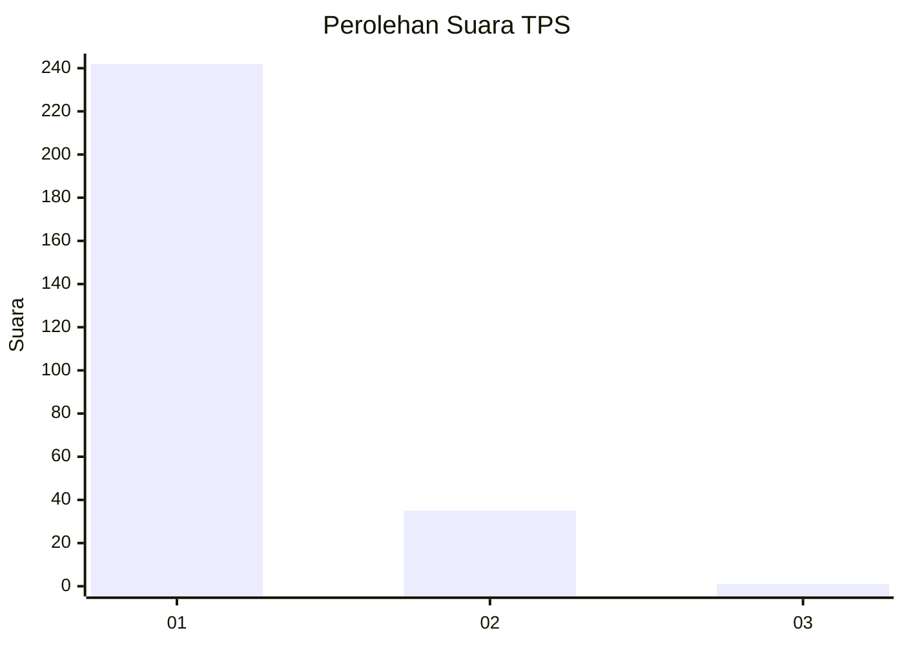
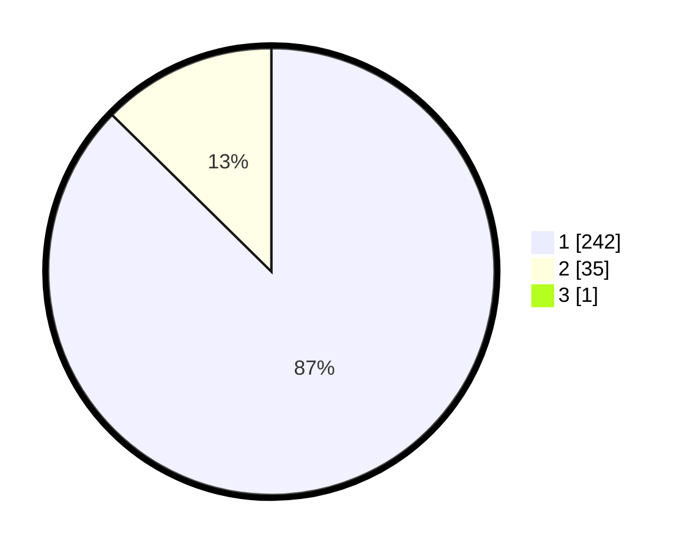

# Hasil

## Grafik

## Tabel

| No. | Nama Paslon    | Suara | Suara (raw) | Persentase |
|:--- |:-------------- | -----:| -----------:| ----------:|
| 1   | ANIES MUHAIMIN | 242   | [242][p-1]  | 87,05      |
| 2   | PRABOWO GIBRAN | 35    | [35][p-2]   | 12,59      |
| 3   | GANJAR MAHFUD  | 1     | [1][p-3]    | 0,36       |

[p-1]: https://github.com/gigit-pemilu/pemilu-2024/blob/main/pilpres/hitung-suara/sub/35-jawa-timur/sub/28-pamekasan/sub/11-batumarmar/sub/2013-bujur-timur/sub/016-tps/sub/paslon-1.txt
[p-2]: https://github.com/gigit-pemilu/pemilu-2024/blob/main/pilpres/hitung-suara/sub/35-jawa-timur/sub/28-pamekasan/sub/11-batumarmar/sub/2013-bujur-timur/sub/016-tps/sub/paslon-2.txt
[p-3]: https://github.com/gigit-pemilu/pemilu-2024/blob/main/pilpres/hitung-suara/sub/35-jawa-timur/sub/28-pamekasan/sub/11-batumarmar/sub/2013-bujur-timur/sub/016-tps/sub/paslon-3.txt

## Foto C Plano

https://sirekap-obj-formc.kpu.go.id/3200/pemilu/ppwp/35/28/11/20/13/3528112013016-20240215-062138--ae3f326c-81f7-4302-8cc3-5b5e4fd724eb.jpg

https://sirekap-obj-formc.kpu.go.id/3200/pemilu/ppwp/35/28/11/20/13/3528112013016-20240215-062337--dc7fbb15-2df5-4377-a605-2e5d50c50823.jpg

https://sirekap-obj-formc.kpu.go.id/3200/pemilu/ppwp/35/28/11/20/13/3528112013016-20240215-062444--c8e89acb-1113-49a4-882e-bc44af1d9648.jpg

## Metadata

| Key        | Value               |
| ---------- | ------------------- |
| Time Stamp | 2024-02-19 06:16:00 |

