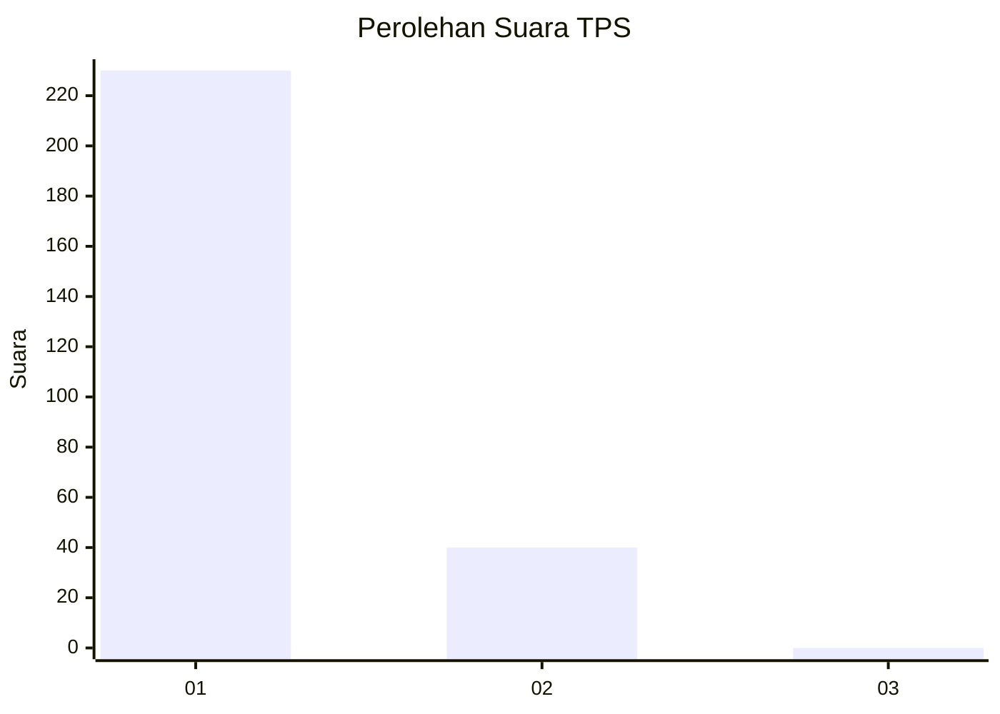
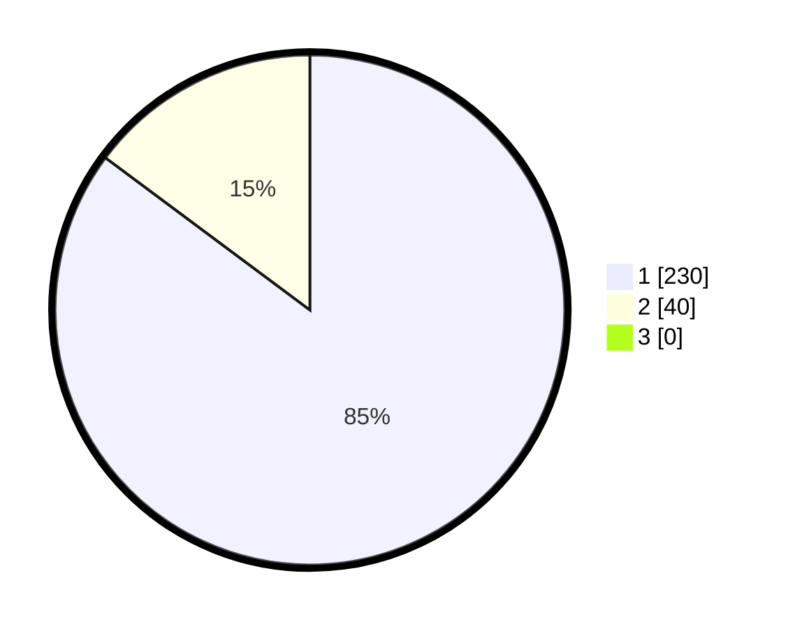

# Hasil

## Grafik

## Tabel

| No. | Nama Paslon    | Suara | Suara (raw) | Persentase |
|:--- |:-------------- | -----:| -----------:| ----------:|
| 1   | ANIES MUHAIMIN | 230   | [230][p-1]  | 85,19      |
| 2   | PRABOWO GIBRAN | 40    | [40][p-2]   | 14,81      |
| 3   | GANJAR MAHFUD  | 0     | [0][p-3]    | 0,00       |

[p-1]: https://github.com/gigit-pemilu/pemilu-2024-35-jawa-timur/blob/main/pilpres/hitung-suara/sub/35-jawa-timur/sub/28-pamekasan/sub/11-batumarmar/sub/2013-bujur-timur/sub/018-tps/sub/paslon-1.txt
[p-2]: https://github.com/gigit-pemilu/pemilu-2024-35-jawa-timur/blob/main/pilpres/hitung-suara/sub/35-jawa-timur/sub/28-pamekasan/sub/11-batumarmar/sub/2013-bujur-timur/sub/018-tps/sub/paslon-2.txt
[p-3]: https://github.com/gigit-pemilu/pemilu-2024-35-jawa-timur/blob/main/pilpres/hitung-suara/sub/35-jawa-timur/sub/28-pamekasan/sub/11-batumarmar/sub/2013-bujur-timur/sub/018-tps/sub/paslon-3.txt

## Foto C Plano

https://sirekap-obj-formc.kpu.go.id/cc66/pemilu/ppwp/35/28/11/20/13/3528112013018-20240215-060115--24e3e5f5-5f02-41da-9f50-c0e348a140fa.jpg

https://sirekap-obj-formc.kpu.go.id/cc66/pemilu/ppwp/35/28/11/20/13/3528112013018-20240215-060156--c60e3bf8-308a-46d4-8f02-b0570342e180.jpg

https://sirekap-obj-formc.kpu.go.id/cc66/pemilu/ppwp/35/28/11/20/13/3528112013018-20240215-060226--7d010a17-6cde-49ea-af23-1529747082bb.jpg

## Metadata

| Key        | Value               |
| ---------- | ------------------- |
| Time Stamp | 2024-02-17 12:00:00 |

