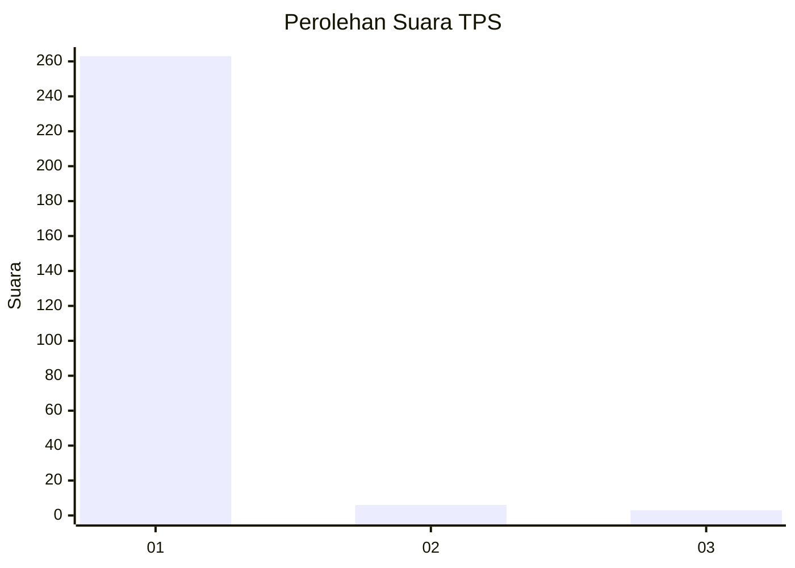
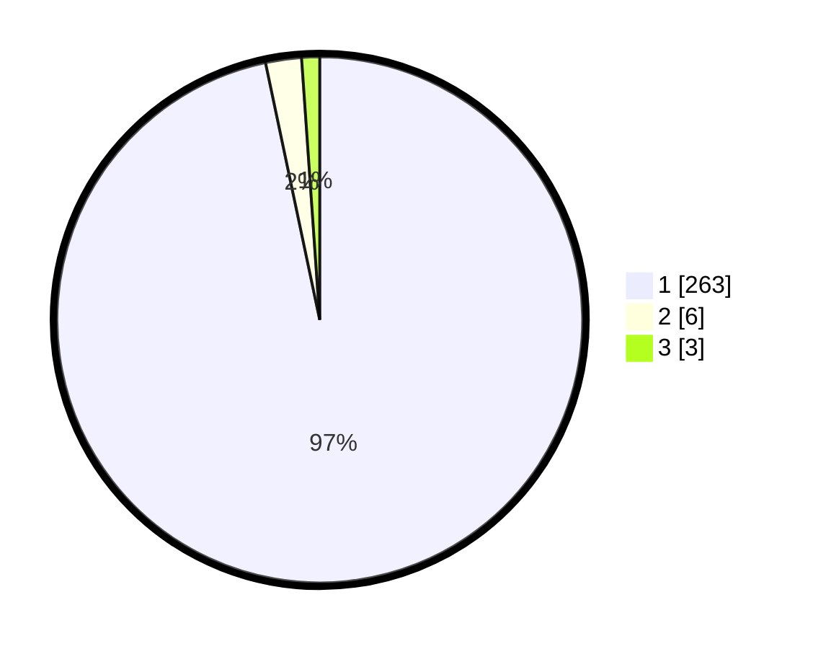

# Hasil

## Grafik

## Tabel

| No. | Nama Paslon    | Suara | Suara (raw) | Persentase |
|:--- |:-------------- | -----:| -----------:| ----------:|
| 1   | ANIES MUHAIMIN | 263   | [263][p-1]  | 96,69      |
| 2   | PRABOWO GIBRAN | 6     | [6][p-2]    | 2,21       |
| 3   | GANJAR MAHFUD  | 3     | [3][p-3]    | 1,10       |

[p-1]: https://github.com/gigit-pemilu/pemilu-2024-35-jawa-timur/blob/main/pilpres/hitung-suara/sub/35-jawa-timur/sub/28-pamekasan/sub/11-batumarmar/sub/2013-bujur-timur/sub/019-tps/sub/paslon-1.txt
[p-2]: https://github.com/gigit-pemilu/pemilu-2024-35-jawa-timur/blob/main/pilpres/hitung-suara/sub/35-jawa-timur/sub/28-pamekasan/sub/11-batumarmar/sub/2013-bujur-timur/sub/019-tps/sub/paslon-2.txt
[p-3]: https://github.com/gigit-pemilu/pemilu-2024-35-jawa-timur/blob/main/pilpres/hitung-suara/sub/35-jawa-timur/sub/28-pamekasan/sub/11-batumarmar/sub/2013-bujur-timur/sub/019-tps/sub/paslon-3.txt

## Foto C Plano

https://sirekap-obj-formc.kpu.go.id/14f1/pemilu/ppwp/35/28/11/20/13/3528112013019-20240214-221006--ac0f0c81-4240-49cb-bb45-fa2220921c0a.jpg

https://sirekap-obj-formc.kpu.go.id/14f1/pemilu/ppwp/35/28/11/20/13/3528112013019-20240214-221046--d054d546-84e6-4447-b227-27c91bcd2040.jpg

https://sirekap-obj-formc.kpu.go.id/14f1/pemilu/ppwp/35/28/11/20/13/3528112013019-20240214-221126--b0a283cb-f4ab-4785-bc13-d53aceee922b.jpg

## Metadata

| Key        | Value               |
| ---------- | ------------------- |
| Time Stamp | 2024-02-17 12:00:00 |

