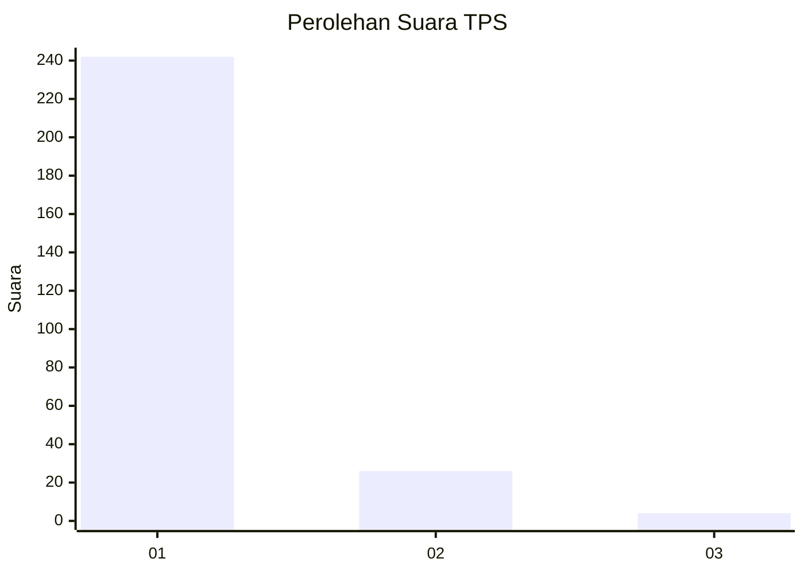
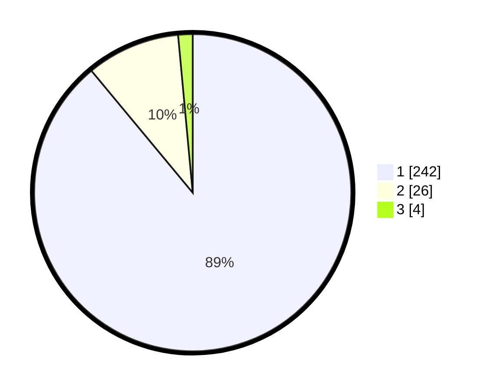

# Hasil

## Grafik

## Tabel

| No. | Nama Paslon    | Suara | Suara (raw) | Persentase |
|:--- |:-------------- | -----:| -----------:| ----------:|
| 1   | ANIES MUHAIMIN | 242   | [242][p-1]  | 88,97      |
| 2   | PRABOWO GIBRAN | 26    | [26][p-2]   | 9,56       |
| 3   | GANJAR MAHFUD  | 4     | [4][p-3]    | 1,47       |

[p-1]: https://github.com/gigit-pemilu/pemilu-2024/blob/main/pilpres/hitung-suara/sub/35-jawa-timur/sub/28-pamekasan/sub/11-batumarmar/sub/2013-bujur-timur/sub/020-tps/sub/paslon-1.txt
[p-2]: https://github.com/gigit-pemilu/pemilu-2024/blob/main/pilpres/hitung-suara/sub/35-jawa-timur/sub/28-pamekasan/sub/11-batumarmar/sub/2013-bujur-timur/sub/020-tps/sub/paslon-2.txt
[p-3]: https://github.com/gigit-pemilu/pemilu-2024/blob/main/pilpres/hitung-suara/sub/35-jawa-timur/sub/28-pamekasan/sub/11-batumarmar/sub/2013-bujur-timur/sub/020-tps/sub/paslon-3.txt

## Foto C Plano

https://sirekap-obj-formc.kpu.go.id/ac13/pemilu/ppwp/35/28/11/20/13/3528112013020-20240214-203142--43b5b47b-e888-4e37-9aa8-712c5b786809.jpg

https://sirekap-obj-formc.kpu.go.id/ac13/pemilu/ppwp/35/28/11/20/13/3528112013020-20240214-203255--85ad050b-67e5-43c2-bb6f-5af71a935900.jpg

https://sirekap-obj-formc.kpu.go.id/ac13/pemilu/ppwp/35/28/11/20/13/3528112013020-20240214-203358--f9e5811f-414e-4f34-a084-2089c93d67a0.jpg

## Metadata

| Key        | Value               |
| ---------- | ------------------- |
| Time Stamp | 2024-02-19 06:16:00 |

