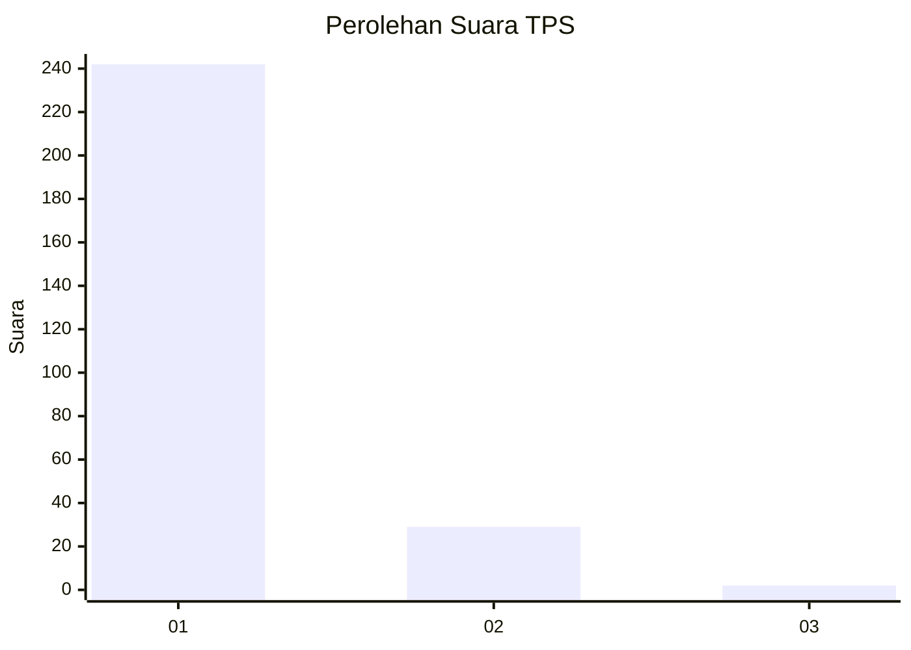
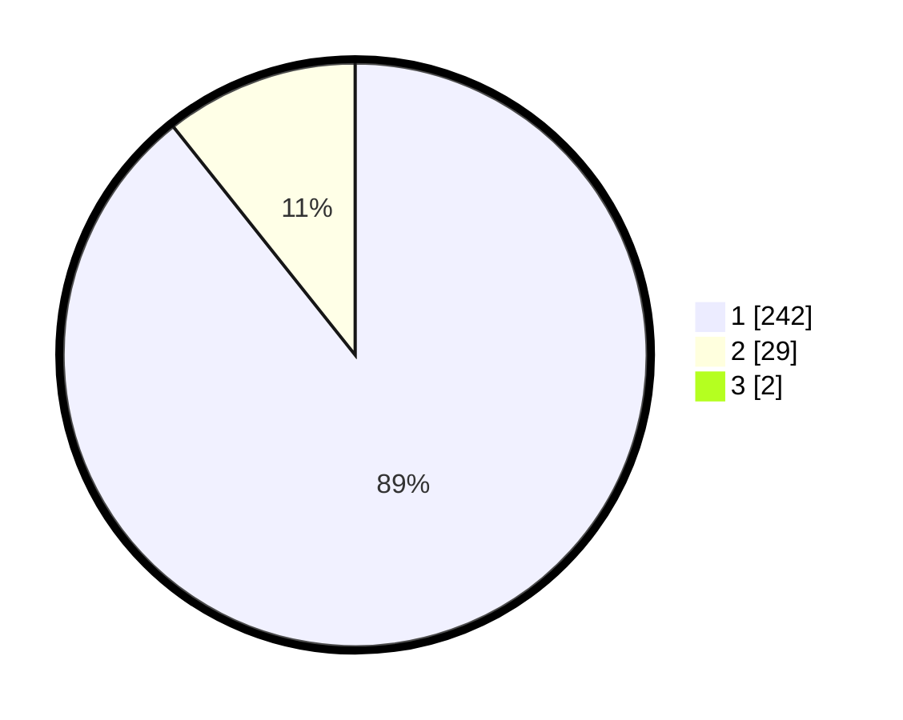

# Hasil

## Grafik

## Tabel

| No. | Nama Paslon    | Suara | Suara (raw) | Persentase |
|:--- |:-------------- | -----:| -----------:| ----------:|
| 1   | ANIES MUHAIMIN | 242   | [242][p-1]  | 88,64      |
| 2   | PRABOWO GIBRAN | 29    | [29][p-2]   | 10,62      |
| 3   | GANJAR MAHFUD  | 2     | [2][p-3]    | 0,73       |

[p-1]: https://github.com/gigit-pemilu/pemilu-2024-35-jawa-timur/blob/main/pilpres/hitung-suara/sub/35-jawa-timur/sub/28-pamekasan/sub/11-batumarmar/sub/2013-bujur-timur/sub/024-tps/sub/paslon-1.txt
[p-2]: https://github.com/gigit-pemilu/pemilu-2024-35-jawa-timur/blob/main/pilpres/hitung-suara/sub/35-jawa-timur/sub/28-pamekasan/sub/11-batumarmar/sub/2013-bujur-timur/sub/024-tps/sub/paslon-2.txt
[p-3]: https://github.com/gigit-pemilu/pemilu-2024-35-jawa-timur/blob/main/pilpres/hitung-suara/sub/35-jawa-timur/sub/28-pamekasan/sub/11-batumarmar/sub/2013-bujur-timur/sub/024-tps/sub/paslon-3.txt

## Foto C Plano

https://sirekap-obj-formc.kpu.go.id/3e3e/pemilu/ppwp/35/28/11/20/13/3528112013024-20240215-065603--9f1ff42a-89f8-4cc9-b225-3e8edc6062f8.jpg

https://sirekap-obj-formc.kpu.go.id/3e3e/pemilu/ppwp/35/28/11/20/13/3528112013024-20240215-065638--cdfd2dd0-a1e7-474e-a10a-eaf4f6af3b45.jpg

https://sirekap-obj-formc.kpu.go.id/3e3e/pemilu/ppwp/35/28/11/20/13/3528112013024-20240215-065807--9955a8b5-ad65-4260-9fe5-d4017b18ad14.jpg

## Metadata

| Key        | Value               |
| ---------- | ------------------- |
| Time Stamp | 2024-02-24 22:31:28 |

