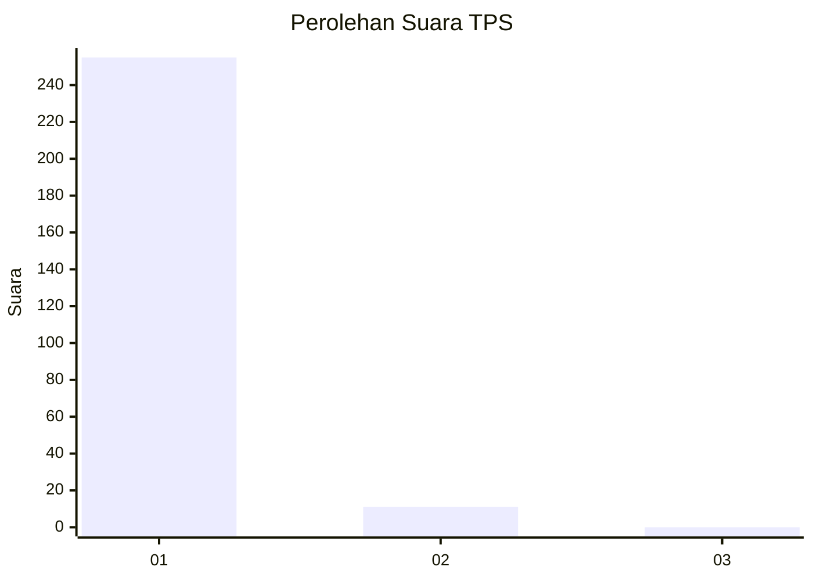
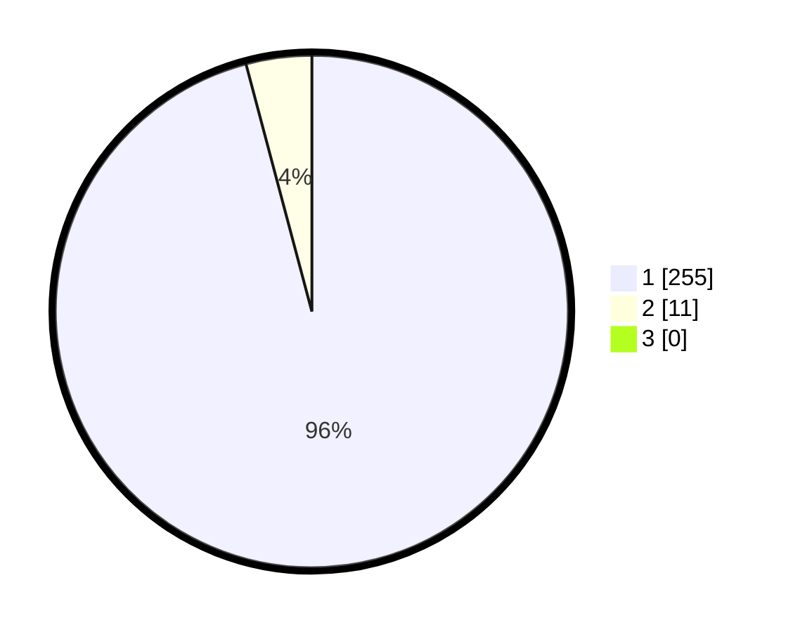

# Hasil

## Grafik

## Tabel

| No. | Nama Paslon    | Suara | Suara (raw) | Persentase |
|:--- |:-------------- | -----:| -----------:| ----------:|
| 1   | ANIES MUHAIMIN | 255   | [255][p-1]  | 95,86      |
| 2   | PRABOWO GIBRAN | 11    | [11][p-2]   | 4,14       |
| 3   | GANJAR MAHFUD  | 0     | [0][p-3]    | 0,00       |

[p-1]: https://github.com/gigit-pemilu/pemilu-2024-35-jawa-timur/blob/main/pilpres/hitung-suara/sub/35-jawa-timur/sub/28-pamekasan/sub/11-batumarmar/sub/2013-bujur-timur/sub/025-tps/sub/paslon-1.txt
[p-2]: https://github.com/gigit-pemilu/pemilu-2024-35-jawa-timur/blob/main/pilpres/hitung-suara/sub/35-jawa-timur/sub/28-pamekasan/sub/11-batumarmar/sub/2013-bujur-timur/sub/025-tps/sub/paslon-2.txt
[p-3]: https://github.com/gigit-pemilu/pemilu-2024-35-jawa-timur/blob/main/pilpres/hitung-suara/sub/35-jawa-timur/sub/28-pamekasan/sub/11-batumarmar/sub/2013-bujur-timur/sub/025-tps/sub/paslon-3.txt

## Foto C Plano

https://sirekap-obj-formc.kpu.go.id/b896/pemilu/ppwp/35/28/11/20/13/3528112013025-20240214-235358--fa31a6d5-4c7f-4d78-b899-322ca3812b21.jpg

https://sirekap-obj-formc.kpu.go.id/b896/pemilu/ppwp/35/28/11/20/13/3528112013025-20240214-192235--233d061a-0569-4489-ab0f-7ba5aacb083e.jpg

https://sirekap-obj-formc.kpu.go.id/b896/pemilu/ppwp/35/28/11/20/13/3528112013025-20240214-212955--743a10a8-7298-4a0b-8568-a5f5c8629526.jpg

## Metadata

| Key        | Value               |
| ---------- | ------------------- |
| Time Stamp | 2024-02-19 06:16:00 |

