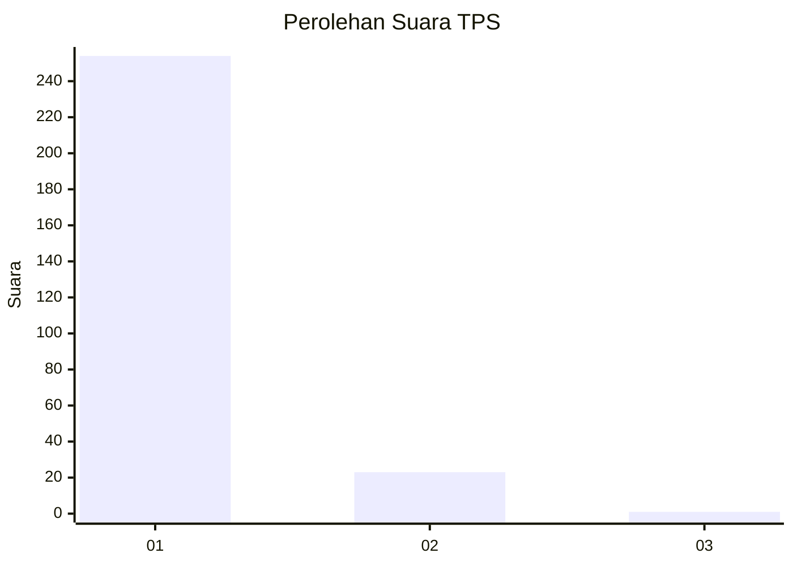
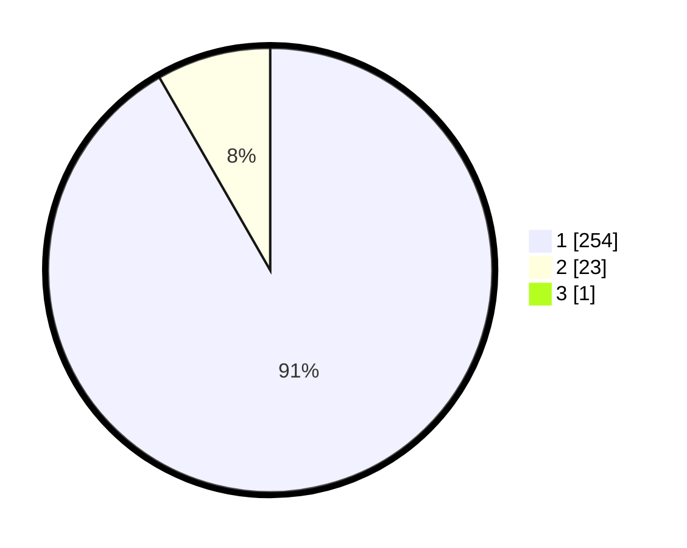

# Hasil

## Grafik

## Tabel

| No. | Nama Paslon    | Suara | Suara (raw) | Persentase |
|:--- |:-------------- | -----:| -----------:| ----------:|
| 1   | ANIES MUHAIMIN | 254   | [254][p-1]  | 91,37      |
| 2   | PRABOWO GIBRAN | 23    | [23][p-2]   | 8,27       |
| 3   | GANJAR MAHFUD  | 1     | [1][p-3]    | 0,36       |

[p-1]: https://github.com/gigit-pemilu/pemilu-2024-35-jawa-timur/blob/main/pilpres/hitung-suara/sub/35-jawa-timur/sub/28-pamekasan/sub/11-batumarmar/sub/2013-bujur-timur/sub/026-tps/sub/paslon-1.txt
[p-2]: https://github.com/gigit-pemilu/pemilu-2024-35-jawa-timur/blob/main/pilpres/hitung-suara/sub/35-jawa-timur/sub/28-pamekasan/sub/11-batumarmar/sub/2013-bujur-timur/sub/026-tps/sub/paslon-2.txt
[p-3]: https://github.com/gigit-pemilu/pemilu-2024-35-jawa-timur/blob/main/pilpres/hitung-suara/sub/35-jawa-timur/sub/28-pamekasan/sub/11-batumarmar/sub/2013-bujur-timur/sub/026-tps/sub/paslon-3.txt

## Foto C Plano

https://sirekap-obj-formc.kpu.go.id/1f75/pemilu/ppwp/35/28/11/20/13/3528112013026-20240214-205916--8b84b8a3-931a-4d40-8309-b579b884c79a.jpg

https://sirekap-obj-formc.kpu.go.id/1f75/pemilu/ppwp/35/28/11/20/13/3528112013026-20240214-210125--e6850cc9-af95-4283-ada6-7096a25bb8e6.jpg

https://sirekap-obj-formc.kpu.go.id/1f75/pemilu/ppwp/35/28/11/20/13/3528112013026-20240214-210157--647d47ca-d352-42b9-89b2-73d002aa9f3c.jpg

## Metadata

| Key        | Value               |
| ---------- | ------------------- |
| Time Stamp | 2024-02-25 12:00:00 |

