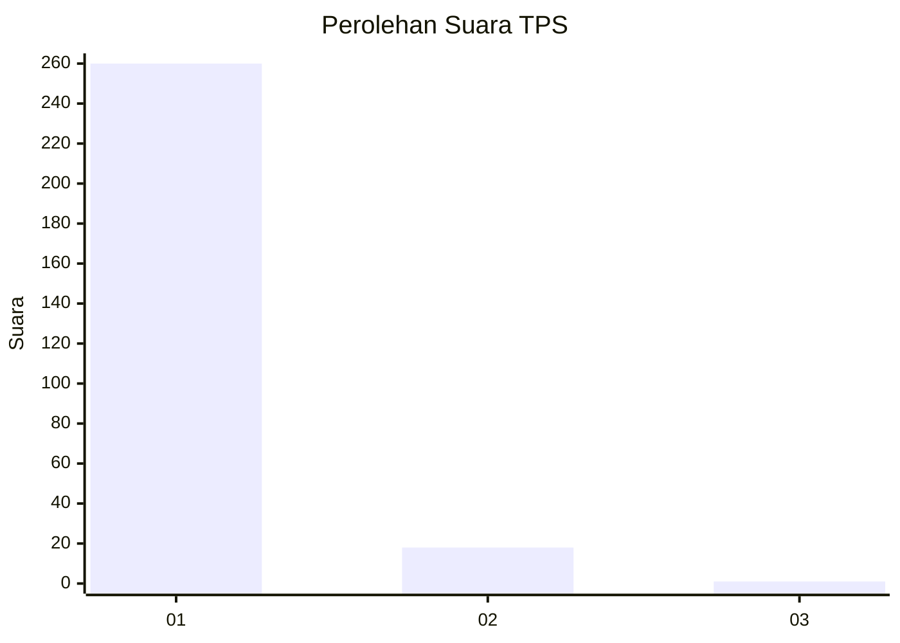
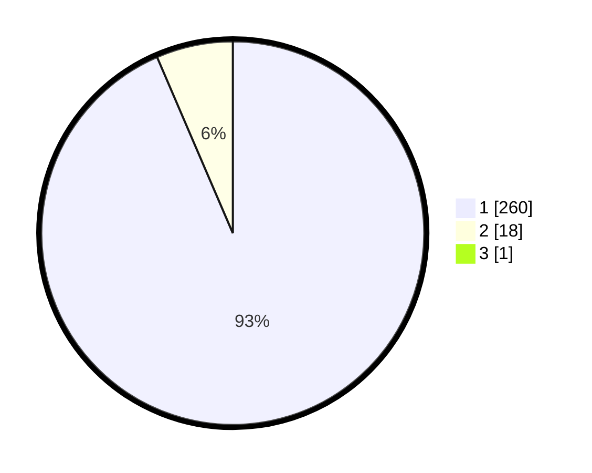

# Hasil

## Grafik

## Tabel

| No. | Nama Paslon    | Suara | Suara (raw) | Persentase |
|:--- |:-------------- | -----:| -----------:| ----------:|
| 1   | ANIES MUHAIMIN | 260   | [260][p-1]  | 93,19      |
| 2   | PRABOWO GIBRAN | 18    | [18][p-2]   | 6,45       |
| 3   | GANJAR MAHFUD  | 1     | [1][p-3]    | 0,36       |

[p-1]: https://github.com/gigit-pemilu/pemilu-2024/blob/main/pilpres/hitung-suara/sub/35-jawa-timur/sub/28-pamekasan/sub/11-batumarmar/sub/2013-bujur-timur/sub/029-tps/sub/paslon-1.txt
[p-2]: https://github.com/gigit-pemilu/pemilu-2024/blob/main/pilpres/hitung-suara/sub/35-jawa-timur/sub/28-pamekasan/sub/11-batumarmar/sub/2013-bujur-timur/sub/029-tps/sub/paslon-2.txt
[p-3]: https://github.com/gigit-pemilu/pemilu-2024/blob/main/pilpres/hitung-suara/sub/35-jawa-timur/sub/28-pamekasan/sub/11-batumarmar/sub/2013-bujur-timur/sub/029-tps/sub/paslon-3.txt

## Foto C Plano

https://sirekap-obj-formc.kpu.go.id/cb4b/pemilu/ppwp/35/28/11/20/13/3528112013029-20240214-223345--e97eacc1-6557-4a29-8391-630de5400628.jpg

https://sirekap-obj-formc.kpu.go.id/cb4b/pemilu/ppwp/35/28/11/20/13/3528112013029-20240214-223458--6edcb340-8e93-4a6d-9e95-e65ca18123cd.jpg

https://sirekap-obj-formc.kpu.go.id/cb4b/pemilu/ppwp/35/28/11/20/13/3528112013029-20240214-223601--de0f44e6-963e-4ffa-9f80-ac394285915e.jpg

## Metadata

| Key        | Value               |
| ---------- | ------------------- |
| Time Stamp | 2024-02-17 12:00:00 |

