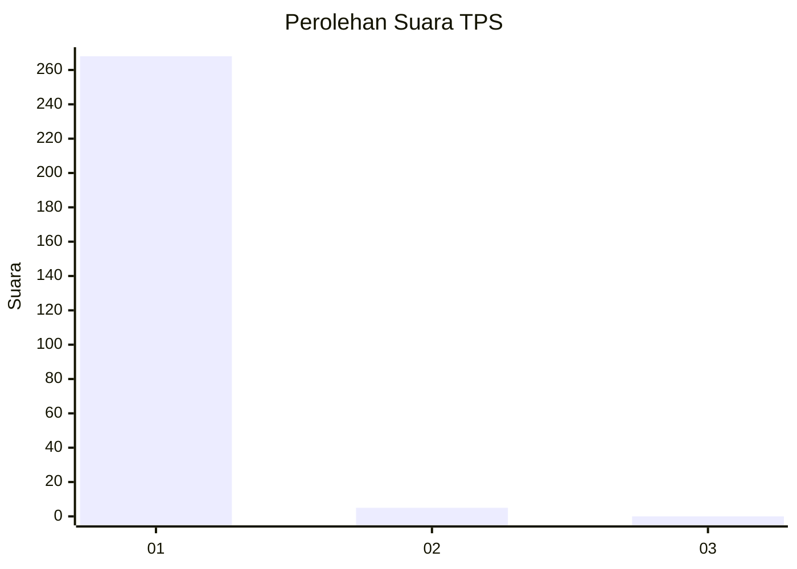
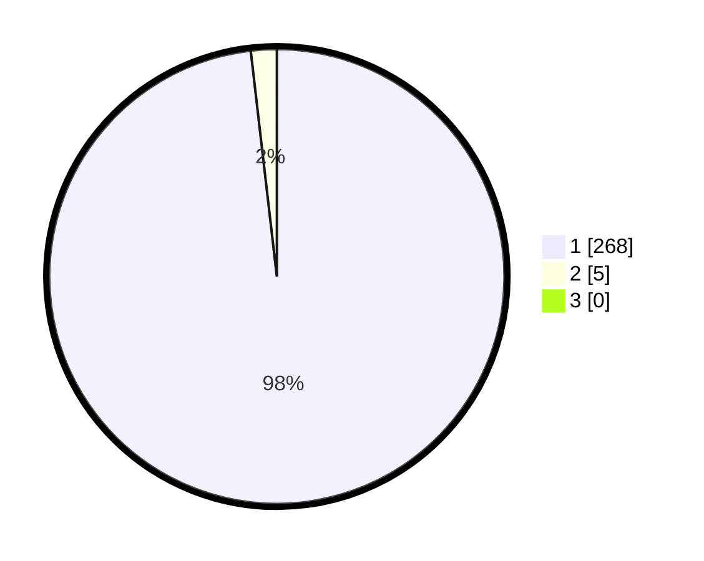

# Hasil

## Grafik

## Tabel

| No. | Nama Paslon    | Suara | Suara (raw) | Persentase |
|:--- |:-------------- | -----:| -----------:| ----------:|
| 1   | ANIES MUHAIMIN | 268   | [268][p-1]  | 98,17      |
| 2   | PRABOWO GIBRAN | 5     | [5][p-2]    | 1,83       |
| 3   | GANJAR MAHFUD  | 0     | [0][p-3]    | 0,00       |

[p-1]: https://github.com/gigit-pemilu/pemilu-2024-35-jawa-timur/blob/main/pilpres/hitung-suara/sub/35-jawa-timur/sub/28-pamekasan/sub/11-batumarmar/sub/2013-bujur-timur/sub/030-tps/sub/paslon-1.txt
[p-2]: https://github.com/gigit-pemilu/pemilu-2024-35-jawa-timur/blob/main/pilpres/hitung-suara/sub/35-jawa-timur/sub/28-pamekasan/sub/11-batumarmar/sub/2013-bujur-timur/sub/030-tps/sub/paslon-2.txt
[p-3]: https://github.com/gigit-pemilu/pemilu-2024-35-jawa-timur/blob/main/pilpres/hitung-suara/sub/35-jawa-timur/sub/28-pamekasan/sub/11-batumarmar/sub/2013-bujur-timur/sub/030-tps/sub/paslon-3.txt

## Foto C Plano

https://sirekap-obj-formc.kpu.go.id/599c/pemilu/ppwp/35/28/11/20/13/3528112013030-20240215-021043--57a0715e-e23c-41a7-aa0c-7079b3771f8e.jpg

https://sirekap-obj-formc.kpu.go.id/599c/pemilu/ppwp/35/28/11/20/13/3528112013030-20240215-020923--90867d2f-7355-4c7b-a36d-b403435162e0.jpg

https://sirekap-obj-formc.kpu.go.id/599c/pemilu/ppwp/35/28/11/20/13/3528112013030-20240215-021239--e5260a8e-766c-442f-9ded-8df7f5868184.jpg

## Metadata

| Key        | Value               |
| ---------- | ------------------- |
| Time Stamp | 2024-02-19 06:16:00 |

