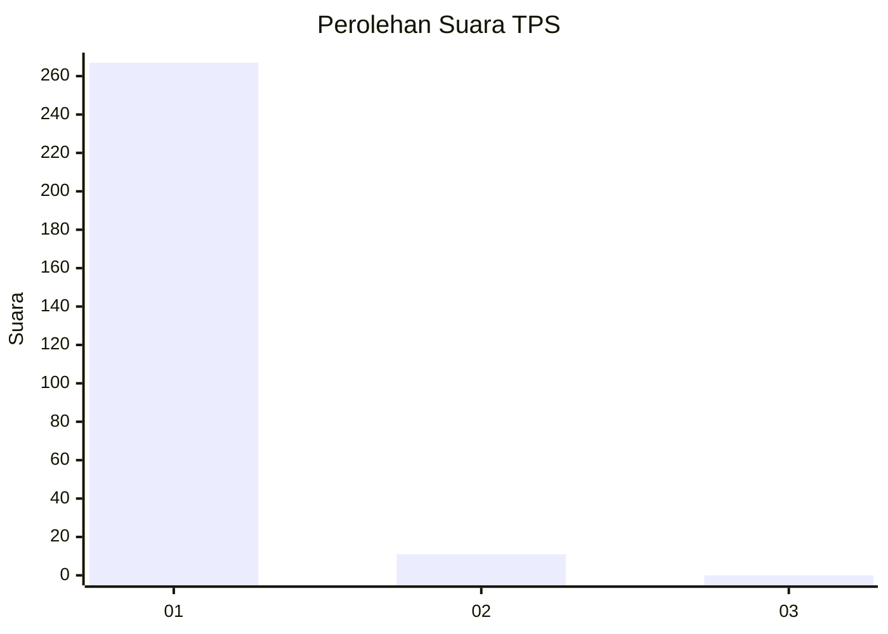
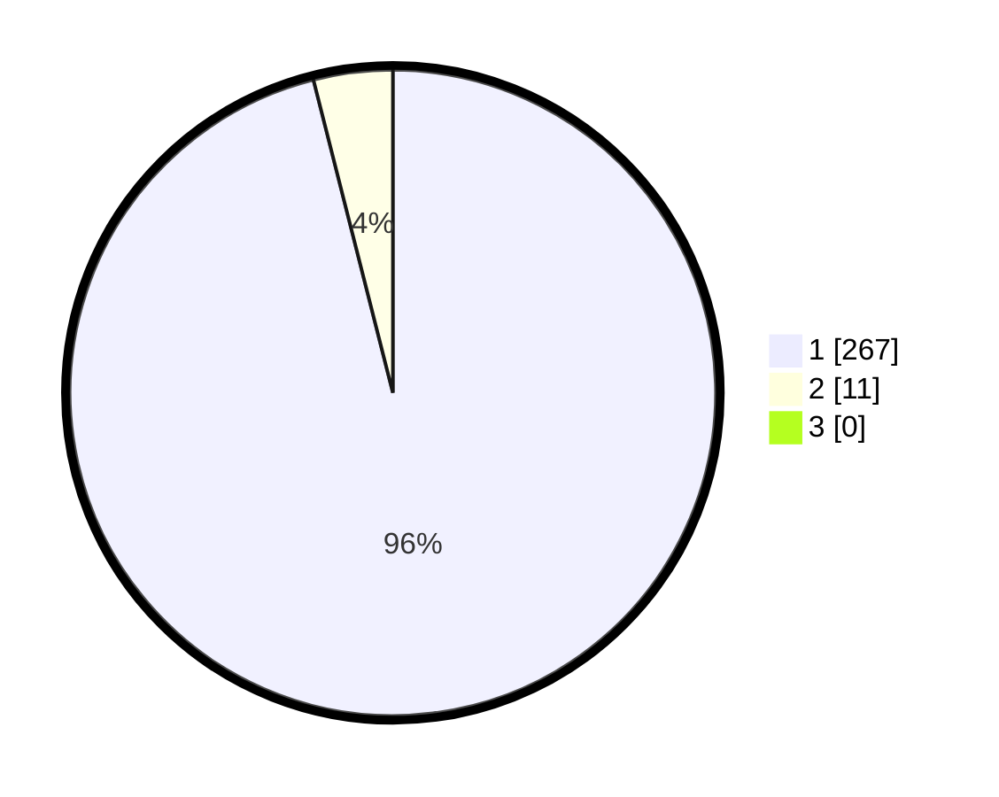

# Hasil

## Grafik

## Tabel

| No. | Nama Paslon    | Suara | Suara (raw) | Persentase |
|:--- |:-------------- | -----:| -----------:| ----------:|
| 1   | ANIES MUHAIMIN | 267   | [267][p-1]  | 96,04      |
| 2   | PRABOWO GIBRAN | 11    | [11][p-2]   | 3,96       |
| 3   | GANJAR MAHFUD  | 0     | [0][p-3]    | 0,00       |

[p-1]: https://github.com/gigit-pemilu/pemilu-2024/blob/main/pilpres/hitung-suara/sub/35-jawa-timur/sub/28-pamekasan/sub/11-batumarmar/sub/2013-bujur-timur/sub/031-tps/sub/paslon-1.txt
[p-2]: https://github.com/gigit-pemilu/pemilu-2024/blob/main/pilpres/hitung-suara/sub/35-jawa-timur/sub/28-pamekasan/sub/11-batumarmar/sub/2013-bujur-timur/sub/031-tps/sub/paslon-2.txt
[p-3]: https://github.com/gigit-pemilu/pemilu-2024/blob/main/pilpres/hitung-suara/sub/35-jawa-timur/sub/28-pamekasan/sub/11-batumarmar/sub/2013-bujur-timur/sub/031-tps/sub/paslon-3.txt

## Foto C Plano

https://sirekap-obj-formc.kpu.go.id/becd/pemilu/ppwp/35/28/11/20/13/3528112013031-20240215-030954--9a2fa469-065e-42e7-8c3b-a145f7a8e0de.jpg

https://sirekap-obj-formc.kpu.go.id/becd/pemilu/ppwp/35/28/11/20/13/3528112013031-20240215-031018--6243b6f9-d91d-4c3c-8375-b481d1e11e77.jpg

https://sirekap-obj-formc.kpu.go.id/becd/pemilu/ppwp/35/28/11/20/13/3528112013031-20240215-031040--ec35cca7-f75e-4cfe-bc0f-3dd9416be873.jpg

## Metadata

| Key        | Value               |
| ---------- | ------------------- |
| Time Stamp | 2024-02-25 15:00:00 |

