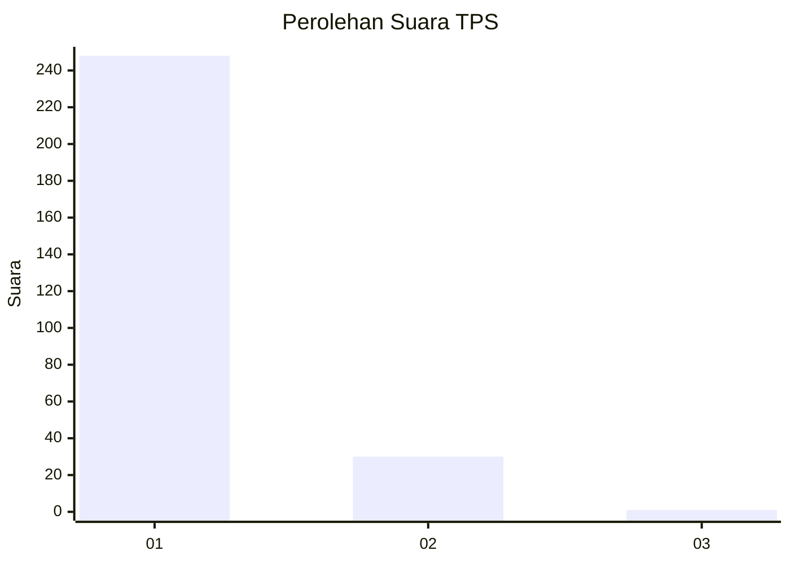
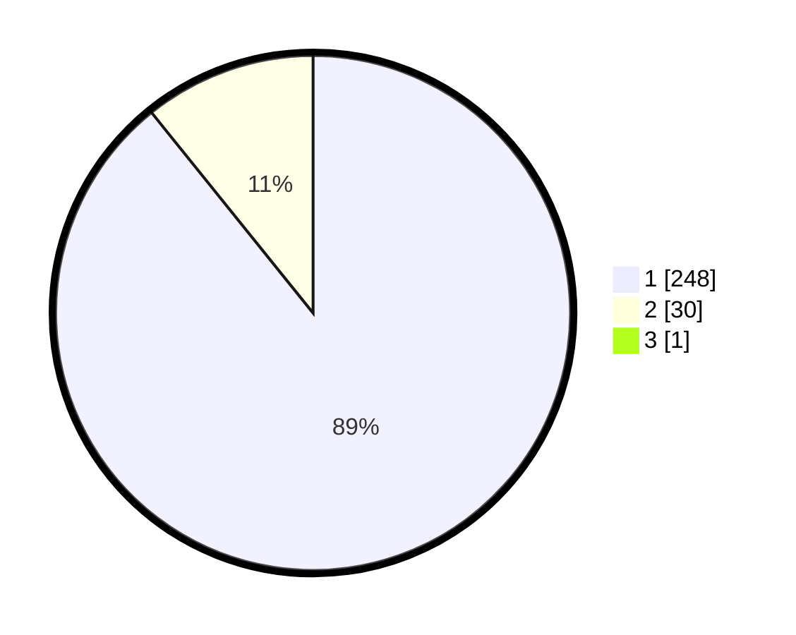

# Hasil

## Grafik

## Tabel

| No. | Nama Paslon    | Suara | Suara (raw) | Persentase |
|:--- |:-------------- | -----:| -----------:| ----------:|
| 1   | ANIES MUHAIMIN | 248   | [248][p-1]  | 88,89      |
| 2   | PRABOWO GIBRAN | 30    | [30][p-2]   | 10,75      |
| 3   | GANJAR MAHFUD  | 1     | [1][p-3]    | 0,36       |

[p-1]: https://github.com/gigit-pemilu/pemilu-2024/blob/main/pilpres/hitung-suara/sub/35-jawa-timur/sub/28-pamekasan/sub/11-batumarmar/sub/2013-bujur-timur/sub/032-tps/sub/paslon-1.txt
[p-2]: https://github.com/gigit-pemilu/pemilu-2024/blob/main/pilpres/hitung-suara/sub/35-jawa-timur/sub/28-pamekasan/sub/11-batumarmar/sub/2013-bujur-timur/sub/032-tps/sub/paslon-2.txt
[p-3]: https://github.com/gigit-pemilu/pemilu-2024/blob/main/pilpres/hitung-suara/sub/35-jawa-timur/sub/28-pamekasan/sub/11-batumarmar/sub/2013-bujur-timur/sub/032-tps/sub/paslon-3.txt

## Foto C Plano

https://sirekap-obj-formc.kpu.go.id/7442/pemilu/ppwp/35/28/11/20/13/3528112013032-20240214-202606--10ef9397-4bb4-4f31-af1f-f9211df46c1b.jpg

https://sirekap-obj-formc.kpu.go.id/7442/pemilu/ppwp/35/28/11/20/13/3528112013032-20240214-202735--47bfe1b1-030e-479d-bcb5-507f5cd84b62.jpg

https://sirekap-obj-formc.kpu.go.id/7442/pemilu/ppwp/35/28/11/20/13/3528112013032-20240214-202639--6f212070-4ba2-4772-9a1a-fc4f7ba7af58.jpg

## Metadata

| Key        | Value               |
| ---------- | ------------------- |
| Time Stamp | 2024-02-19 06:16:00 |

