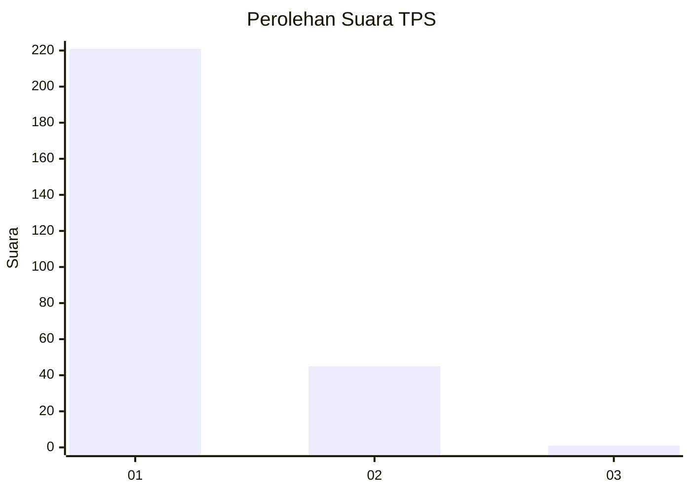
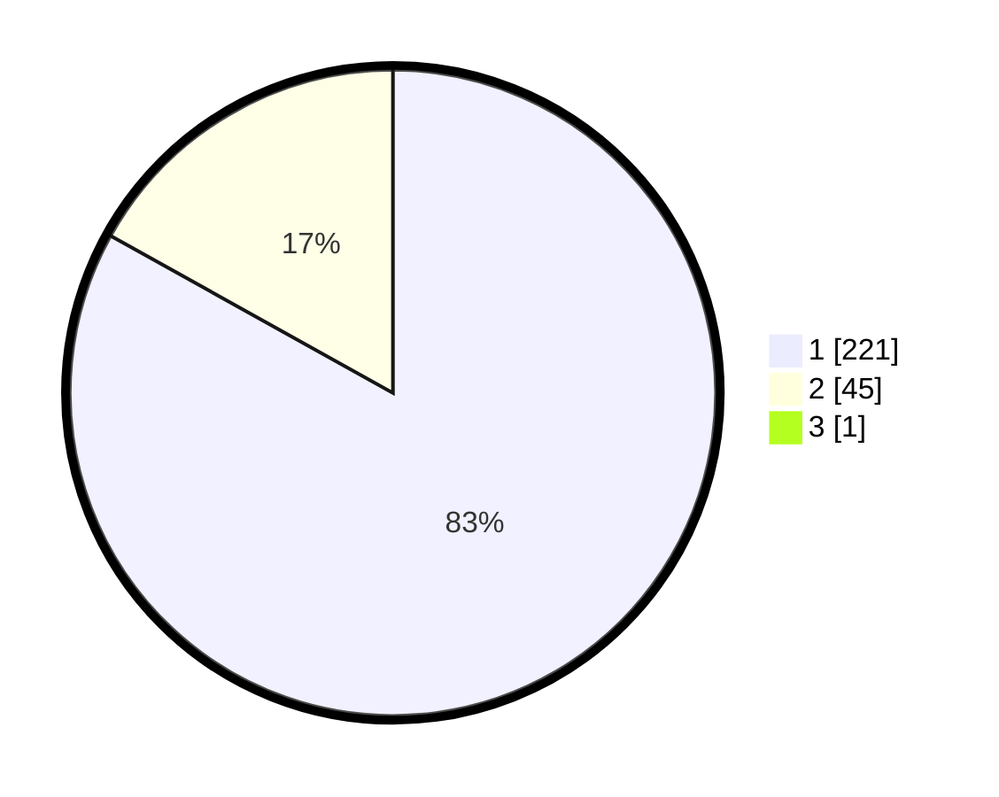

# Hasil

## Grafik

## Tabel

| No. | Nama Paslon    | Suara | Suara (raw) | Persentase |
|:--- |:-------------- | -----:| -----------:| ----------:|
| 1   | ANIES MUHAIMIN | 221   | [221][p-1]  | 82,77      |
| 2   | PRABOWO GIBRAN | 45    | [45][p-2]   | 16,85      |
| 3   | GANJAR MAHFUD  | 1     | [1][p-3]    | 0,37       |

[p-1]: https://github.com/gigit-pemilu/pemilu-2024-35-jawa-timur/blob/main/pilpres/hitung-suara/sub/35-jawa-timur/sub/28-pamekasan/sub/11-batumarmar/sub/2013-bujur-timur/sub/034-tps/sub/paslon-1.txt
[p-2]: https://github.com/gigit-pemilu/pemilu-2024-35-jawa-timur/blob/main/pilpres/hitung-suara/sub/35-jawa-timur/sub/28-pamekasan/sub/11-batumarmar/sub/2013-bujur-timur/sub/034-tps/sub/paslon-2.txt
[p-3]: https://github.com/gigit-pemilu/pemilu-2024-35-jawa-timur/blob/main/pilpres/hitung-suara/sub/35-jawa-timur/sub/28-pamekasan/sub/11-batumarmar/sub/2013-bujur-timur/sub/034-tps/sub/paslon-3.txt

## Foto C Plano

https://sirekap-obj-formc.kpu.go.id/a2d5/pemilu/ppwp/35/28/11/20/13/3528112013034-20240214-225945--a484c9fe-9873-481c-94ce-6055956980e4.jpg

https://sirekap-obj-formc.kpu.go.id/a2d5/pemilu/ppwp/35/28/11/20/13/3528112013034-20240214-230054--974761cc-06f6-44b2-93a2-b4a5a48205c6.jpg

https://sirekap-obj-formc.kpu.go.id/a2d5/pemilu/ppwp/35/28/11/20/13/3528112013034-20240214-230126--a33b0ef1-b109-4e15-b102-29d959135d0b.jpg

## Metadata

| Key        | Value               |
| ---------- | ------------------- |
| Time Stamp | 2024-02-19 06:16:00 |

